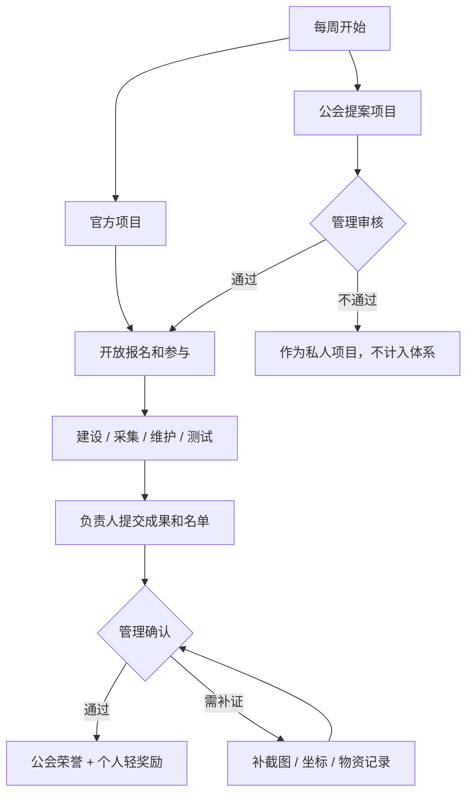

# Guild Project Daily Activity Requirements

## Summary

为 YuHua 服务器建立一套纯净服日活体系：每周通过“1 个官方项目 + 1 个公会提案项目”组织玩家以公会为单位参与公共建设。体系不统计自动公会贡献分，不走战斗力成长，由管理人工确认参与名单，并用荣誉、展示、署名和少量非战斗奖励形成持续上线理由。

---

## Problem Frame

服务器定位是纯净生存、生电友好、红石可玩，不希望出现逆天武器、免费飞行或战力差距。玩家每天上线需要理由，但这个理由不能变成刷等级、刷装备或刷数值。

“公会贡献”方向成立，因为玩家是群居的。真正能留住人的不是个人数值膨胀，而是一起完成公共工程、在服务器里留下名字、让公会有存在感。当前无法可靠自动统计公会贡献，因此 v1 要把问题从“精确计分”改成“项目参与确认”。

---

## Key Decisions

- **Project system over contribution score:** v1 不做自动公会贡献值，避免被不可验证的统计口径卡住。
- **Manual confirmation over automatic tracking:** 管理人工确认参与名单，因为红石、生电、公共工程贡献无法用方块数或在线时长准确代表。
- **Guild identity over combat growth:** 奖励以公会身份、项目署名、展示权益和少量补给为主，不提供伤害、防御、飞行、神装或高效率工具。
- **Hybrid project source:** 每周同时保留官方方向和公会主动性，采用“1 个官方项目 + 1 个公会提案项目”。
- **Use mature plugins as support, not product shape:** BetterTeams 承载轻公会身份，Quests 承载每日/每周任务入口；v1 玩法规则不照搬 RPG、城镇战、职业等级或战力化插件包。

---

## Actors

- A1. **普通玩家:** 参与项目、提交成果、获得个人参与记录和轻奖励。
- A2. **公会:** 组织成员参与公共项目，积累项目记录、荣誉展示和服务器内身份。
- A3. **管理:** 发布官方项目，审核公会提案，确认参与名单，发放非战斗奖励。
- A4. **项目负责人:** 可以是管理或公会成员，负责描述项目目标、验收条件和参与名单草案。

---

## Requirements

**Activity Model**

- R1. 体系必须以公会项目为主，而不是以个人战斗力、个人等级或自动贡献分为主。
- R2. 每周默认开放 2 个项目：1 个官方项目和 1 个公会提案项目。
- R3. 项目必须服务于公共建设、公共资源、红石生电、建筑美化、新手支持或服务器秩序。
- R4. 项目必须有明确目标、完成标准、负责人和参与名单确认方式。
- R5. 玩家可以个人参与项目，但项目记录优先归属到公会或公共项目，而不是个人刷分榜。

**Project Types**

- R6. 交通类项目覆盖主城道路、地狱交通、公共传送点整理和路线标识。
- R7. 资源类项目覆盖公共仓库、红石材料池、木材、石材、食物和常用消耗品补给。
- R8. 生电类项目覆盖刷铁机、村民交易所、刷怪塔、农场维护、红石材料供应和机器测试。
- R9. 建筑类项目覆盖主城建筑、地标、公共区域装饰和服务器展示空间。
- R10. 新手类项目覆盖带新人、修新手村、补教程牌、整理规则说明和入门物资。

**Confirmation and Rewards**

- R11. 项目完成后由管理确认参与名单，确认依据可以是现场观察、负责人名单、截图、坐标、物资记录或项目成果。
- R12. 公会奖励必须优先给荣誉展示、项目署名、公会展示墙、公会称号、公共传送点申请资格或摊位资格。
- R13. 个人奖励只能给参与记录、称号、纪念物和少量消耗补给。
- R14. 奖励不得提供伤害、防御、免费飞行、创造权限、管理权限、神装、高效率工具或破坏生存平衡的资源。
- R15. 排行榜如果出现，只能按项目完成数、参与项目数或月度荣誉展示排序，不按无限刷分排序。

**Operations**

- R16. 每个项目发布时必须写清项目名、目标、地点、验收标准、报名方式、负责人和截止时间。
- R17. 每周项目数量默认保持小规模，避免管理审核负担过高。
- R18. 公会提案项目必须由管理审核后才算入日活体系，防止私人项目伪装成公共贡献。
- R19. 项目结果必须在服务器内可见，例如告示牌署名、菜单入口、公告、展示墙、TAB/聊天称号或后续地图标记。
- R20. v1 使用公告、菜单说明、告示牌、BetterTeams 轻公会身份、Quests 轻任务入口和人工记录跑通流程；插件不能替代管理验收。

---

## Key Flows

- F1. **Weekly official project**
  - **Trigger:** 新的一周开始。
  - **Actors:** A2, A3, A4
  - **Steps:** 管理发布 1 个官方公共项目；公会报名；成员参与建设或维护；负责人整理参与名单；管理验收并确认奖励。
  - **Outcome:** 项目完成后进入公会项目记录，参与者获得非战斗奖励。
  - **Covered by:** R2, R3, R4, R11, R12, R13

- F2. **Guild proposal project**
  - **Trigger:** 公会希望主动发起项目。
  - **Actors:** A2, A3, A4
  - **Steps:** 公会提交项目目标和公共价值；管理审核是否计入本周项目；项目通过后开放报名；完成后按人工名单确认。
  - **Outcome:** 公会获得主动建设荣誉，服务器获得玩家自驱内容。
  - **Covered by:** R2, R4, R18, R19

- F3. **Participation confirmation**
  - **Trigger:** 项目负责人申请验收。
  - **Actors:** A1, A3, A4
  - **Steps:** 负责人提交成果和参与名单；管理检查项目是否达标；有争议时按成果记录、截图、坐标或现场确认补证；确认后发放奖励。
  - **Outcome:** 参与记录可靠但不追求精确贡献计量。
  - **Covered by:** R11, R13, R14, R15

---

## Reward Boundaries

| Allowed | Examples |
| --- | --- |
| 身份奖励 | 公会名、聊天前缀、项目称号、参与称号 |
| 展示奖励 | 公会展示墙、项目署名、主城告示牌、月度荣誉 |
| 公共权益 | 公会基地传送点申请、摊位资格、项目优先提案权 |
| 纪念奖励 | 命名纸、纪念书、装饰头颅、烟花 |
| 少量补给 | 食物、火把、普通烟花、少量经验瓶、普通建材 |

| Not Allowed | Reason |
| --- | --- |
| 逆天武器或护甲 | 会制造战力差距 |
| 免费或长期飞行 | 破坏生存和交通建设 |
| 创造、WorldEdit、CoreProtect 等权限 | 属于管理或建筑组能力 |
| 高效率工具和大量稀缺资源 | 会削弱采集、生电和交易生态 |
| 无限刷分兑换 | 会把项目体系变成机械刷任务 |

---

## Acceptance Examples

- AE1. Given 本周开始，When 管理发布项目，Then 同时存在 1 个官方项目和最多 1 个公会提案项目可计入本周日活体系。
- AE2. Given 一个公会提交“私人基地装修”提案，When 该项目没有公共价值，Then 管理可以拒绝计入公会项目贡献体系。
- AE3. Given 一个公会完成地狱交通路线，When 管理确认路线可用且参与名单可信，Then 公会获得项目记录和署名，成员获得参与记录和轻奖励。
- AE4. Given 一个玩家只在线挂机，When 没有参与项目，Then 他不能因为在线时长自动获得公会贡献记录。
- AE5. Given 一个项目奖励待发放，When 奖励包含飞行、神装或高效率工具，Then 该奖励必须被替换为荣誉、展示或少量消耗品。
- AE6. Given 多个公会同周参与，When 展示月榜，Then 榜单按项目完成或参与记录展示，不按无限刷分值展示。

---

## Success Criteria

- 每周至少有 1 个项目被发布并进入验收流程。
- 玩家能在服务器内看到本周项目、参与方式和项目完成后的署名。
- 管理可以在不依赖自动贡献统计的情况下确认参与名单。
- 奖励不会改变普通玩家的战斗力、飞行能力或管理权限。
- 公会能通过项目记录形成身份感，而不是只获得一次性物资。

---

## Scope Boundaries

**Deferred for later**

- 重新启用地图展示后，把公会基地、公共项目和路线标记到地图。
- 对物资提交类项目做半自动统计。

**Outside v1**

- mcMMO、AuraSkills、Jobs Reborn 这类个人等级/职业成长体系。
- Towny 式重城镇、国家、战争、税收和土地政治体系。
- 自动公会贡献值、自动贡献排行榜和无限刷分兑换商店。
- 任何战力、飞行、创造、管理权限或破坏纯净生存平衡的奖励。

---

## Dependencies and Assumptions

- 当前服务器已有菜单、权限、基础命令、在线奖励、领地和 TAB 展示能力，v1 可以先用现有能力承载入口和展示。
- 管理愿意每周维护少量项目，并人工确认参与名单。
- 玩家接受“项目记录和荣誉”是主要奖励，而不是数值变强。
- 如果后续插件自动化能力与纯净服边界冲突，优先保留玩法边界。
- BetterTeams 只作为轻公会身份和队聊底座；Quests 只作为每日/每周入口任务，不作为贡献结算真相源。

---

## Sources and Research

- `README.md` — 当前服务器定位、普通玩家权限、菜单、CMI、Residence、TAB 和已安装插件。
- `VERSION_MANIFEST.md` — 当前插件清单和运行策略。
- `docs/research/2026-06-08-gui-plugin-selection.md` — CommandGUI 当前作为轻菜单底座，复杂任务菜单可后续评估。
- `docs/research/2026-06-09-guild-project-plugin-selection.md` — BetterTeams + Quests 的边界化选型记录。
- [Quests by PikaMug](https://github.com/PikaMug/Quests) — 当前用于每日/每周轻任务入口。
- [BetterTeams](https://github.com/booksaw/BetterTeams) — 当前用于轻公会身份和队聊。
- [Towny Advanced](https://github.com/TownyAdvanced/Towny) — 成熟城镇插件生态，但 v1 不采用重城镇/战争/税收方向。
- [BetonQuest](https://modrinth.com/plugin/betonquest) — 强任务和对话系统，适合复杂剧情，不作为当前纯净服 v1 默认方向。
