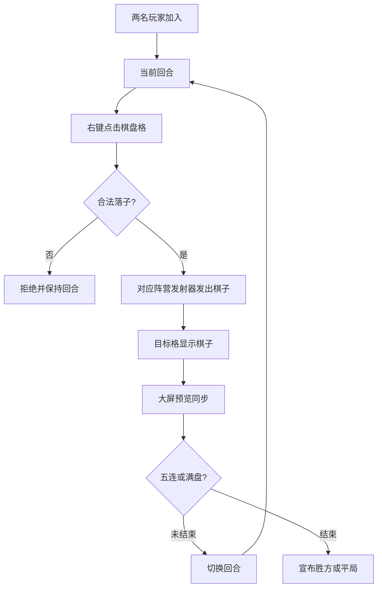

# Gomoku MVP Plugin Requirements

## Summary

为 YuHua 服务器做一个可摆在主城里的五子棋 MVP 插件：两名玩家加入一局后，轮流右键点击实体棋盘格落子。当前阵营的固定发射器把黑/白棋子发射到目标格，落定后同步更新棋盘和大屏预览，并自动判定五连胜负。

---

## Problem Frame

这个玩法要先成为一个能被玩家自然围观和上手的主城互动装置，而不是赛事系统或奖励系统。服务器当前偏纯净生存和轻活动，MVP 应该尽快跑通“看到棋盘、加入对局、点击落子、看见棋子飞入、判定胜负”的闭环。

玩家最关心的是操作直观和反馈明确。插件需要接管棋盘格状态，避免玩家通过手动放置、拆除或背包材料干扰规则。

---

## Key Decisions

- **Casual match first:** v1 只做双人休闲对局，不做报名、排队、积分、排行榜或奖励。
- **Right-click grid input:** 玩家点击棋盘格触发落子，插件负责校验回合、空位和棋子落定。
- **Fixed emitters:** 黑白双方各有固定发射器，棋子从对应阵营侧飞向目标格，强化装置感。
- **Visual fill, no inventory cost:** “拿方块填充”在 MVP 中表现为棋子视觉填充棋盘，不消耗玩家背包方块。
- **Simple Gomoku rules:** v1 采用无禁手规则，横、竖、斜任意方向连续五子即胜。

---

## Actors

- A1. **黑方玩家:** 先手玩家，轮到黑方时点击空格落黑子。
- A2. **白方玩家:** 后手玩家，轮到白方时点击空格落白子。
- A3. **围观玩家:** 从棋盘和大屏预览观察对局，不能影响棋局。
- A4. **管理:** 放置和配置棋盘、发射器和预览区，必要时重置对局。

---

## Requirements

**Game Model**

- R1. 插件必须支持一块标准 15x15 五子棋棋盘，每个棋盘格对应一个可点击落子的实体位置。
- R2. 每局必须只有两名正式玩家，第一名玩家为黑方，第二名玩家为白方。
- R3. 黑方必须先手，双方必须交替落子。
- R4. 当任一方向出现连续五个同色棋子时，插件必须结束对局并宣布胜方。
- R5. 当棋盘被填满且没有胜方时，插件必须结束对局并宣布平局。

**Player Interaction**

- R6. 玩家必须通过右键点击棋盘空格落子，而不是直接手动放置棋子方块。
- R7. 插件必须拒绝非当前回合玩家、围观玩家和已占用格子的落子请求。
- R8. 合法落子必须触发对应阵营固定发射器的棋子飞行动作。
- R9. 棋子落定后，目标棋盘格必须显示当前阵营的黑/白棋子状态。
- R10. 玩家背包里的方块不得作为落子消耗品。

**Preview and Board State**

- R11. 大屏预览必须是棋盘状态的只读同步展示，不作为玩家输入区。
- R12. 每次合法落子后，大屏预览必须与实体棋盘保持同一格位、同一颜色的状态。
- R13. 棋盘、发射器和大屏预览必须能被管理摆放成主城互动装置。
- R14. 对局结束后，棋盘必须进入不可继续落子的结束状态，直到被重置或开启新局。

**Operations**

- R15. 管理必须能初始化一块棋盘，并指定黑方发射器、白方发射器和大屏预览区域。
- R16. 管理必须能重置当前对局，清空棋盘状态并恢复可开局状态。
- R17. 插件必须保护棋盘区的落子格，防止普通玩家通过破坏或放置方块篡改棋局。
- R18. MVP 必须能在没有赛事、积分、经济和奖励系统的情况下独立可玩。

---

## Key Flows

- F1. **Board setup**
  - **Trigger:** 管理准备在主城放置五子棋装置。
  - **Actors:** A4
  - **Steps:** 管理摆好 15x15 棋盘，设置黑白双方发射器，设置大屏预览区域，并初始化棋盘。
  - **Outcome:** 棋盘进入可开局状态。
  - **Covered by:** R1, R11, R13, R15

- F2. **Casual match start**
  - **Trigger:** 两名玩家准备对局。
  - **Actors:** A1, A2
  - **Steps:** 第一名玩家加入为黑方，第二名玩家加入为白方；插件宣布黑方先手。
  - **Outcome:** 对局开始，棋盘等待黑方落子。
  - **Covered by:** R2, R3

- F3. **Legal move**
  - **Trigger:** 当前回合玩家右键点击一个空棋盘格。
  - **Actors:** A1 or A2
  - **Steps:** 插件校验玩家身份、回合和空位；对应阵营发射器发出棋子；棋子落到目标格；大屏预览同步更新；插件检查胜负。
  - **Outcome:** 若未结束，对局切换到另一方回合；若五连成立，对局结束。
  - **Covered by:** R4, R6, R8, R9, R12

- F4. **Invalid move**
  - **Trigger:** 非当前玩家、围观玩家或当前玩家点击已占用格子。
  - **Actors:** A1, A2, A3
  - **Steps:** 插件拒绝落子，不触发发射器，不改变棋盘和预览状态。
  - **Outcome:** 当前回合保持不变。
  - **Covered by:** R7, R11, R17

---

## Acceptance Examples

- AE1. Given 棋盘处于空闲状态，When 两名玩家依次加入，Then 第一名玩家成为黑方，第二名玩家成为白方，黑方先手。
- AE2. Given 黑方回合，When 白方或围观玩家点击空格，Then 插件拒绝落子，棋盘和大屏不变化。
- AE3. Given 当前玩家点击空格，When 落子合法，Then 对应阵营发射器发出棋子，目标格落定，并同步更新大屏预览。
- AE4. Given 当前玩家点击已有棋子的格子，When 插件处理点击，Then 不触发发射器，不覆盖原棋子，不切换回合。
- AE5. Given 黑方或白方形成横、竖或斜向连续五子，When 最新棋子落定，Then 插件宣布胜方并阻止继续落子。
- AE6. Given 棋盘满格且没有连续五子，When 最后一格落定，Then 插件宣布平局。
- AE7. Given 普通玩家尝试破坏或手动放置棋盘格，When 该位置属于棋盘区，Then 插件阻止棋局状态被篡改。

---

## Success Criteria

- 两名普通玩家无需管理员介入即可完成一局从开局到胜负判定的对局。
- 玩家点击空格后的反馈明确，能看见对应阵营棋子从固定发射器进入目标格。
- 实体棋盘和大屏预览在每次合法落子后保持一致。
- 非法点击不会改变棋局状态，也不会打乱当前回合。
- 管理可以清空棋盘并重新开启下一局。

---

## Scope Boundaries

**Deferred for later**

- 报名、排队、房间大厅、多棋盘同时运行。
- 积分、排行榜、赛季、奖励和经济系统。
- 观战席、裁判工具、悔棋、复盘和棋谱记录。
- AI 对战、人机难度和教学提示。
- 禁手规则、超时读秒和复杂计时赛制。
- 更复杂的发射动画、粒子特效和音效包装。

**Outside MVP**

- 消耗玩家背包里的真实方块作为落子成本。
- 允许玩家手动放置或破坏棋子来影响规则。
- 把五子棋结果接入战斗力、权限、免费飞行或高价值资源奖励。

---

## Dependencies and Assumptions

- 当前服务器是 Leaf/Paper 系服务端，MVP 作为独立 Bukkit/Paper 插件交付。
- 棋盘会放在主城或受控公共区域，避免普通生存建筑和红石机器干扰。
- 发射器、大屏预览和棋盘材料的具体选择在实施计划阶段确定。
- 活跃对局在服务端重启后可以重置为未开始状态；MVP 不要求恢复重启前的棋局。
- 现有菜单系统后续可以增加入口，但五子棋 MVP 不依赖菜单才能开始对局。

---

## Sources and Research

- `README.md` — 当前服务器定位、基础插件生态、玩家菜单和权限边界。
- `docs/brainstorms/2026-06-09-guild-project-daily-activity-requirements.md` — 当前服务器活动设计倾向轻玩法、非战力奖励和主城展示。
- `plugins/` — 当前服务器插件目录，确认这是 Leaf/Paper 服务器运行环境而不是独立应用仓库。
