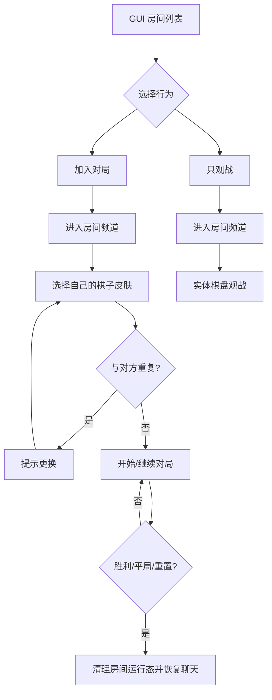

# Gomoku V2 Iteration Requirements

## Summary

五子棋 v2 要把当前可玩的多房间 MVP，推进成能长期放在服务器里的房间玩法：房间列表仍由 GUI 进入，普通玩家只负责加入、观战、选择房间主题和棋子皮肤；管理负责创建、删除、刷新、重置和释放房间。棋盘不再依赖玩家手持方块或大屏预览墙，改成管理用放置锚点按面朝方向生成完整棋盘房间，并用房间频道承载玩家和观众聊天。

这轮是迭代需求，不覆盖 MVP 记录。MVP 文档保留在 `docs/brainstorms/2026-06-10-gomoku-mvp-plugin-requirements.md`，v2 以当前房间平台为基线继续演进。

---

## Current Baseline

- 当前已有 Leaf/Paper 插件 `LeafGomoku`，支持多房间、GUI 房间列表、房间详情、加入对局、只观战、状态输出、管理创建/删除/重置/刷新、统计、排行榜和变量查询。
- 当前房间生成会从管理当前位置和当前朝向生成布局，并包含棋盘、席位、观众点、发射器、安全地板、玻璃边界和大屏预览。
- 当前棋盘/预览/棋子材料主要来自房间配置，普通玩家不能在房间区直接破坏或放置。
- 当前合法落子会写入实体棋盘和预览墙，并向全服广播房间消息。

---

## Problem Frame

当前 MVP 已经能跑通玩法，但还不像一个可长期运营的小游戏系统。主要问题是：

- 大屏预览墙占空间且对观众价值不高，房间多了以后会增加布局负担。
- 全服播报会打扰不在房间里的玩家，多个房间同时运行时会更吵。
- 棋盘主题和棋子皮肤还没有成为可运营的外观系统，积分兑换缺少明确边界。
- 玩家选择棋子皮肤时，如果黑白双方外观重复，会直接破坏对局辨识度。
- 棋盘创建需要更像管理工具行为，而不是依赖手持方块或玩家背包材料。

v2 的目标不是做大型赛事系统，而是把“多房间 + GUI + 外观 + 房间频道 + 可维护布局”这条主链路做稳。

---

## Key Decisions

- **另开 v2 文档:** MVP 文档保留，v2 记录改进需求和新边界。
- **普通玩家不创建房间:** 普通玩家只加入、观战、选择房间主题、选择棋子方块皮肤；房间创建和释放仍归管理层。
- **管理放置锚点生成棋盘:** 管理右键放置工具/锚点生成棋盘，按管理玩家面朝方向确定棋盘正面。
- **不消耗玩家方块:** 棋盘生成和落子都不读取、不消耗玩家背包里的方块，也不把手持方块当主题参考物。
- **删除大屏预览墙:** v2 不再生成、同步或保护独立观众预览屏；观众通过实体棋盘观战。
- **房间频道替代全服播报:** 玩家和观众进入房间后临时切到该房间频道，离开、结束、释放或删除房间时恢复原聊天状态。
- **基础外观默认开放:** 默认棋盘主题和基础棋子皮肤开箱可用，保证新房间不用先兑换也能开局。
- **部分外观积分兑换:** 高级棋盘主题和部分棋子皮肤可以用五子棋积分兑换。
- **棋子皮肤由玩家各自选择:** 玩家选择自己的棋子外观，但最终只作用于当前房间/当前对局。
- **同局黑白不能重复:** 同一房间同一局内，黑白双方棋子方块不能相同，也不能落成无法区分的组合。

---

## Actors

- A1. **参赛玩家:** 通过 GUI 加入某个房间，占用黑方或白方席位，选择自己的棋子皮肤并按规则落子。
- A2. **观众:** 通过 GUI 只观战某个房间，进入房间频道和观众位置，但不能落子或占用参赛席位。
- A3. **管理/OP:** 创建、删除、初始化、刷新、重置、释放房间，配置默认外观、兑换外观和房间边界。
- A4. **服务器运营:** 通过积分兑换和排行榜，把五子棋变成轻量长期活动，而不是战力奖励系统。

---

## Requirements

**Room and GUI**

- R1. GUI 必须继续提供房间列表，支持多个房间分页展示。
- R2. 房间详情必须区分 `加入对局` 和 `只观战`，观众不能误占参赛席位。
- R3. 普通玩家不得创建、删除、初始化、刷新、强制重置或释放房间。
- R4. 普通玩家可以在允许的房间内选择棋盘主题和自己的棋子皮肤。
- R5. 管理必须能创建、删除、初始化、刷新、重置、开关和释放房间。
- R6. 删除房间必须清理该房间的玩家、观众、临时频道状态和房间内运行态，不能留下残留聊天频道或席位占用。

**Board Placement and Layout**

- R7. 管理必须通过右键放置工具/锚点生成棋盘房间，而不是要求携带真实棋盘材料。
- R8. 棋盘生成必须按管理玩家面朝方向确定正面和行列方向。
- R9. 棋盘生成必须使用服务器配置的主题材料，不读取玩家手持方块作为棋盘材料或参考物。
- R10. 默认棋盘底材必须改为 `STRIPPED_BIRCH_LOG` 和 `STRIPPED_SPRUCE_LOG` 搭配，形成清晰棋盘底。
- R11. 棋盘主题必须可配置，允许以后增加更多棋盘搭配。
- R12. 房间仍需要玻璃边界和安全地板，避免玩家掉落死亡或误出界。
- R13. 房间初始化、刷新和重置必须只影响该房间范围，不能误刷相邻房间。

**Preview Removal**

- R14. v2 必须删除独立大屏预览墙，不再生成预览区域。
- R15. 合法落子只需要同步实体棋盘，不再写入预览墙。
- R16. 保护范围必须随预览墙删除而收窄，避免无意义保护远处空区域。
- R17. GUI 和管理状态可以显示房间状态，但不能把预览屏作为必需组成部分。

**Piece Skins**

- R18. 每个玩家可以选择自己的棋子方块皮肤。
- R19. 棋子皮肤必须在当前房间/当前对局生效，不能作为全局房间材料把其他房间污染掉。
- R20. 同一局黑白双方棋子皮肤不得相同。
- R21. 如果第二名参赛玩家选择了已被对方占用的棋子皮肤，系统必须拒绝并提示更换。
- R22. 已开局后，参赛玩家不得切换本局棋子皮肤，避免棋盘中途混色。
- R23. 棋子皮肤目录必须包含默认免费皮肤，保证未兑换玩家也能正常对局。
- R24. 高级棋子皮肤可以通过积分兑换解锁。
- R25. 兑换到的皮肤只代表玩家可选择资格，不代表进入某个房间后可以绕过同局不重复校验。

**Piece Placement**

- R26. 参赛玩家必须通过右键点击实体棋盘格落子，不能手动放置棋子方块。
- R27. 合法点击后，系统必须从当前阵营/席位对应的发射点发射棋子到被点击格。
- R28. 棋子飞行结束后，必须精确落到玩家点击的棋盘格位置。
- R29. 落地后，该格必须写入当前玩家在本局选择的棋子皮肤材料。
- R30. 非当前回合玩家、观众、非房间玩家和已占用格子的点击必须被拒绝，且不能触发发射或改变棋盘。
- R31. 棋子放置不得消耗玩家背包物品，也不得把玩家手持物作为棋子材料。
- R32. 发射动画不能只做视觉假象；最终棋盘状态必须以服务端规则状态为准，防止动画失败后棋局不同步。

**Board Themes and Points**

- R33. 基础棋盘主题必须默认开放。
- R34. 部分高级棋盘主题可以用五子棋积分兑换。
- R35. 房间主题选择必须有可用默认值，不能因为没有人兑换主题导致房间无法开局。
- R36. 主题切换必须以房间为单位生效，且不能影响正在进行的对局。
- R37. 积分兑换必须只消耗五子棋相关积分，不接入战斗力、飞行权限或高价值生存资源奖励。

**Room Chat Channel**

- R38. 参赛玩家加入房间后，必须临时进入该房间聊天频道。
- R39. 观众进入房间后，也必须临时进入该房间聊天频道。
- R40. 房间频道内的玩家聊天和系统消息只发给该房间的参赛玩家与观众。
- R41. 玩家离开房间、观战结束、对局自动释放、房间重置或删除时，必须恢复原聊天状态。
- R42. 多个房间同时运行时，A 房间消息不得发送到 B 房间频道。
- R43. 关键事件仍可在房间频道内播报，包括加入、离开、落子、胜利、平局、判负、重置和删除。
- R44. 全服公共聊天不应再收到每步五子棋落子播报。

**Lifecycle and Effects**

- R45. 胜利后必须锁定本局，播放胜利烟花，并在配置时间后自动重置或释放房间。
- R46. 重置必须清理棋盘、席位、观众、临时频道和本局皮肤选择。
- R47. 管理强制重置或删除活跃房间时，必须有权限保护，普通玩家不能触发。
- R48. 统计层必须继续记录正常胜负、平局和积分变化。
- R49. 中止、强制刷新和不计分重置不得误写胜负统计。
- R50. 变量层必须继续能查询房间数量、房间状态、席位、观众数量、玩家积分和排行榜数据。

---

## Key Flows

### F1. Admin Places A Room

- **Trigger:** 管理准备新增一个五子棋房间。
- **Actors:** A3
- **Steps:** 管理站在目标位置，面向棋盘正面，右键放置工具/锚点；系统用默认主题生成棋盘、席位、观众点、安全地板和玻璃边界。
- **Outcome:** 新房间进入可初始化或可开放状态。
- **Covered by:** R5, R7, R8, R9, R10, R12

### F2. Player Joins And Chooses Piece Skin

- **Trigger:** 玩家从 GUI 选择房间并加入对局。
- **Actors:** A1
- **Steps:** 系统分配黑/白席位；玩家进入房间频道；玩家选择自己的棋子皮肤；系统校验该皮肤是否与对方重复。
- **Outcome:** 两名玩家都就绪后开局，黑方先手。
- **Covered by:** R1, R2, R18, R20, R21, R38

### F3. Spectator Watches Only

- **Trigger:** 玩家只想看某个房间。
- **Actors:** A2
- **Steps:** 玩家从 GUI 点击 `只观战`；系统传送到观众位置；玩家进入该房间频道；玩家点击棋盘格时被拒绝。
- **Outcome:** 玩家能看实体棋盘和聊天，但不能影响对局。
- **Covered by:** R2, R30, R39, R40, R42

### F4. Legal Move Without Preview Wall

- **Trigger:** 当前回合玩家点击空棋盘格。
- **Actors:** A1
- **Steps:** 当前回合玩家右键点击实体棋盘空格；系统校验身份、回合、空位和本局皮肤；从对应发射点发射该玩家选择的棋子；棋子飞到被点击格并落地写入棋盘；系统在房间频道播报下一回合。
- **Outcome:** 棋盘更新，预览墙不再更新，因为 v2 已删除预览墙。
- **Covered by:** R14, R15, R18, R22, R26, R27, R28, R29, R30, R40, R44

### F5. Match End And Cleanup

- **Trigger:** 出现五连、平局、判负或管理重置。
- **Actors:** A1, A2, A3
- **Steps:** 系统锁定本局；正常胜利播放烟花并写统计；到达释放时机后清理棋盘、席位、观众、频道和皮肤选择。
- **Outcome:** 房间回到可加入状态，玩家聊天恢复到原状态。
- **Covered by:** R41, R45, R46, R47, R48, R49

---

## Acceptance Examples

- AE1. Given 管理站在目标位置并面向南方，When 右键放置五子棋房间锚点，Then 棋盘正面按管理面朝方向生成，且不读取管理手持方块作为材料。
- AE2. Given 新房间使用默认主题，When 管理初始化房间，Then 棋盘底材使用去皮白桦原木和去皮云杉原木搭配。
- AE3. Given 玩家 A 已选黑色混凝土作为棋子皮肤，When 玩家 B 试图选择同一个方块作为棋子皮肤，Then 系统拒绝并提示更换。
- AE4. Given 黑方回合且黑方已选择棋子皮肤，When 黑方右键点击空棋盘格，Then 对应发射点发射该皮肤棋子，棋子飞到被点击格并写入该格。
- AE5. Given 白方或观众点击棋盘空格，When 当前不是他们的合法落子机会，Then 系统拒绝，不发射棋子，不改变棋盘。
- AE6. Given 玩家进入某房间观战，When 玩家在聊天栏发言，Then 只有该房间参赛玩家和观众收到消息。
- AE7. Given A 房间和 B 房间同时进行，When A 房间玩家落子，Then B 房间玩家和公共聊天不收到这步落子播报。
- AE8. Given 对局已开始，When 玩家尝试切换自己的棋子皮肤，Then 系统拒绝，棋盘已有棋子不改变。
- AE9. Given 对局胜利，When 系统完成胜利处理，Then 房间频道播报胜方，播放烟花，写入统计，并在释放时恢复玩家聊天状态。
- AE10. Given 房间被管理删除，When 删除完成，Then 该房间从 GUI 列表消失，房间频道解散，参赛玩家和观众不再留在临时频道。
- AE11. Given v2 房间已生成，When 管理或玩家查看房间，Then 不存在独立大屏预览墙，也不要求预览区域配置才能开局。

---

## Success Criteria

- 多房间同时运行时，聊天和播报不会互相串房，也不会刷公共聊天。
- 普通玩家能通过 GUI 完成加入、观战、选择棋盘主题和选择棋子皮肤。
- 默认外观足够开局，高级外观可以通过积分兑换形成长期目标。
- 玩家点击棋盘格后，能看到棋子从对应发射点飞到被点击位置，且最终棋盘状态准确落在该格。
- 黑白双方棋子始终清晰可区分，不会因为玩家皮肤选择导致棋局不可读。
- 管理可以用右键锚点快速生成房间，不需要摆真实材料或手动配置预览墙。
- 删除预览墙后，房间更紧凑，布局更适合多个房间并存。
- 胜利、重置、删除和离开都能完整释放房间运行态和聊天状态。

---

## Scope Boundaries

**Included in v2**

- 默认棋盘主题和可配置主题目录。
- 部分棋盘主题、棋子皮肤积分兑换。
- 玩家各自选择棋子皮肤，并做同局不重复校验。
- 房间临时聊天频道。
- 删除独立大屏预览墙。
- 管理右键锚点按面朝方向生成房间。
- 保留多房间 GUI、观战、统计、变量、排行榜和管理生命周期操作。

**Deferred for later**

- 玩家自行创建房间。
- 自动赛事报名、排队、锦标赛和赛季赛制。
- 棋谱复盘、悔棋、读秒、禁手和 AI 对战。
- 复杂商城、跨玩法货币和网页管理后台。
- 房间布局蓝图编辑器。

**Outside v2**

- 消耗玩家背包方块作为棋盘或棋子成本。
- 允许玩家手动放置、破坏或替换棋子影响规则。
- 把五子棋奖励接入战斗力、飞行权限或高价值生存资源。
- 让一个玩家的棋子皮肤全局覆盖所有房间。
- 保留大屏预览墙作为必需组件。

---

## Dependencies and Assumptions

- 当前服务器继续使用 Leaf/Paper 插件形态交付。
- 当前多房间、GUI、权限、统计和变量能力作为 v2 基线保留。
- 五子棋积分已有或继续由本插件统计层提供；兑换外观只依赖五子棋积分。
- 聊天频道需要与服务器现有聊天系统兼容；如果外部聊天插件拦截聊天，v2 计划阶段需要先确认接管点。
- 默认主题和默认棋子皮肤必须足够清晰，保证未兑换玩家也能正常玩。
- 房间仍位于主城或受控公共区域，避免生成到复杂生存建筑或危险地形。

---

## Sources and Research

- `docs/brainstorms/2026-06-10-gomoku-mvp-plugin-requirements.md` — MVP 第一版需求基线。
- `docs/operations/gomoku/2026-06-10-runtime-smoke-test.md` — 当前房间平台、GUI、管理生命周期、统计和变量的运行验收口径。
- `src/LeafGomoku/src/main/resources/plugin.yml` — 当前命令和权限分层。
- `src/LeafGomoku/src/main/resources/config.yml` — 当前房间材料、预览墙、生命周期和烟花配置。
- `src/LeafGomoku/src/main/java/net/leafmc/gomoku/RoomLayoutFactory.java` — 当前按管理位置和朝向生成房间布局的基线。
