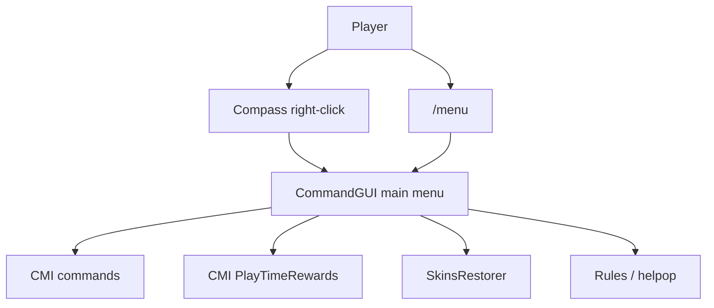

# feat: Add clock player menu

## Summary

为普通玩家增加一套轻量快捷菜单：玩家可以输入 `/menu`，也可以右键菜单钟打开同一个 GUI。第一版只整合已经存在的生存便利命令、在线奖励、飞行充能、皮肤、规则和联系管理，不把领地入口纳入菜单。

这不是客户端快捷键方案。纯服务端无法绑定玩家键盘按键，所以用“菜单钟物品 + `/menu` 备用命令”覆盖大多数玩家场景。

---

## Problem Frame

当前普通玩家已经拥有 `/spawn`、`/back`、`/home`、`/tpa`、`/prewards`、`/flyc`、`/flightcharge`、`/skin`、`/rules` 等权限，但新玩家需要记住很多命令。玩家也反馈希望有快捷入口和 GUI 菜单，降低使用门槛。

这台服的定位是纯净生存、生电友好、离线登录、跨版本；菜单应该减少指令记忆成本，不应该引入破坏性权限、复杂经济体系或客户端强依赖。

---

## Requirements

**Menu Access**

- R1. 普通玩家可以通过 `/menu` 打开玩家主菜单。
- R2. 普通玩家可以通过右键菜单钟打开同一个玩家主菜单。
- R3. 没有菜单钟或菜单钟丢失时，玩家仍能用 `/menu` 进入菜单。
- R4. 菜单入口必须在 AuthMe 登录后可用，不能让未登录玩家绕过登录保护执行命令。

**Menu Content**

- R5. 主菜单提供出生点、死亡返回、家、公共地标、传送请求、私聊、在线奖励、飞行充能、皮肤、规则和联系管理入口。
- R6. 需要输入参数的命令只提供快捷说明或打开原命令入口，不把 GUI 伪装成完整表单。
- R7. 在线奖励入口复用现有 `/prewards`，其中飞行充能每 30 分钟自动发放，幻翼膜由玩家手动领取。
- R8. 飞行入口只使用 `/flyc`、`/flightcharge` 和玩家可用的 `/flyspeed`，不得开放 `/fly` 或给别人飞行的权限。

**Permission Safety**

- R9. 普通玩家只获得 CommandGUI 的使用权限和取回菜单钟权限，不获得 reload、give-other、bypass、管理类权限。
- R10. 菜单不得暴露 WorldEdit、CoreProtect 回滚、创造、强制传送、封禁、清背包、经济发钱等管理或破坏性命令。
- R11. 菜单第一版不包含 GriefPrevention 领地入口，后续如果玩家仍需要，再单独规划。

**Operational**

- R12. 新增插件和配置必须进入 `VERSION_MANIFEST.md`、`CHECKSUMS.txt`、`README.md` 和 `CHANGELOG.md`。
- R13. 上线提示要简短，说明“右键菜单钟或输入 `/menu`”，避免每次登录刷屏。
- R14. 跨版本玩家需要能正常打开库存 GUI；若旧客户端无法显示个别图标，菜单仍要能执行命令。

---

## High-Level Technical Design



第一版只做一个主菜单，使用 CommandGUI 调用现有命令。菜单不重新实现传送、奖励、飞行、皮肤逻辑，避免新增玩法状态和权限边界。

建议菜单项：

| 区域 | 图标建议 | 点击行为 | 备注 |
| --- | --- | --- | --- |
| 出生点 | `BEACON` | `spawn` | 直接执行。 |
| 返回死亡点 | `ENDER_PEARL` | `back` | 保留现有死亡返回体验。 |
| 我的家 | `RED_BED` | `homes` 或 `home` | 优先打开 CMI 家列表。 |
| 设置家 | `OAK_DOOR` | 提示 `/sethome 名字` | 避免 GUI 无参数直接创建错误家名。 |
| 公共地标 | `NETHER_STAR` | `warps` | 复用 `spawn`、`nether`、`end`。 |
| 传送请求 | `PLAYER_HEAD` | 提示 `/tpa 玩家名` | 需要玩家名输入。 |
| 私聊 | `WRITABLE_BOOK` | 提示 `/msg 玩家名 内容` | 需要玩家名和内容输入。 |
| 在线奖励 | `EXPERIENCE_BOTTLE` | `prewards` | 幻翼膜从这里领。 |
| 飞行开关 | `FEATHER` | `flyc` | 消耗 flight charge。 |
| 飞行能量 | `SUNFLOWER` | `flightcharge` | 查看剩余能量。 |
| 飞行速度 | `SUGAR` | 提示 `/flyspeed 1-3` | 玩家最高 3 档。 |
| 皮肤 | `LEATHER_CHESTPLATE` | 提示 `/skin set 正版玩家名` 和 `/skins` | SkinsRestorer 接管。 |
| 规则 | `BOOK` | `rules` | 同步中文规则文案。 |
| 联系管理 | `BELL` | 提示 `/helpop 内容` | 让玩家知道怎么找管理。 |

---

## Key Technical Decisions

- KTD1. 使用 CommandGUI 作为第一版 GUI 插件：它当前提供 Spigot/Paper 命令 GUI、可配置物品、`/commandgui`、`/commandgui tool`、`commandgui.use`、`commandgui.tool` 等能力，并且 Hangar 页面显示 Paper `1.21-1.21.11` 下载，匹配当前 Leaf 1.21.11。
- KTD2. 菜单钟是快捷入口，`/menu` 是稳定兜底：物品可能丢失、被玩家放箱子或被清理，所以菜单不能只依赖菜单钟。
- KTD3. 菜单只调用现有命令：当前 CMI、SkinsRestorer、LuckPerms 和 PlayTimeRewards 已经承载玩法规则，CommandGUI 只负责入口聚合。
- KTD4. 需要参数的能力不做假表单：`/tpa`、`/msg`、`/skin set`、`/helpop` 都需要玩家继续输入，菜单点击后应给出清晰用法或打开对应原生命令入口。
- KTD5. 第一版排除领地入口：用户已明确“领地暂时不考虑”，所以菜单不出现 claim、trust、abandonclaim 等按钮。
- KTD6. 菜单钟发放走低打扰策略：优先提供玩家自助取回命令，首次上线只发一条提示；是否自动给物品在实施时根据 CommandGUI 与 AuthMe 登录后行为验证后决定。

---

## Implementation Units

### U1. Add CommandGUI Dependency

- **Goal:** 把 CommandGUI 作为菜单插件加入服务端包，并确认版本适配 Leaf 1.21.11。
- **Files:** `plugins/CommandGUI-<version>.jar`, `VERSION_MANIFEST.md`, `CHECKSUMS.txt`, `CHANGELOG.md`, `README.md`
- **Approach:** 从 Hangar 或 Modrinth 选当前支持 `1.21-1.21.11` 的版本。下载后记录版本、来源、SHA-256，并把插件加入 manifest 与 changelog。
- **Test Scenarios:** 
  - 默认启动后控制台显示 CommandGUI 加载成功。
  - 插件生成 `plugins/CommandGUI/config.yml`。
  - `/plugins` 或控制台插件列表中 CommandGUI 为启用状态。
  - 关闭服务端后 `CHECKSUMS.txt` 校验能覆盖新增 jar。

### U2. Configure Main Player Menu

- **Goal:** 配置一个玩家主菜单，聚合常用命令并保持清晰分类。
- **Files:** `plugins/CommandGUI/config.yml`
- **Approach:** 使用动态或固定 27 格库存菜单。第一版建议 27 格，按钮少但布局稳定；每个按钮都以玩家身份执行现有命令，禁止用控制台身份执行任何会绕过权限的普通功能。
- **Test Scenarios:**
  - 默认玩家输入 `/commandgui` 或 `/menu` 可以打开菜单。
  - 点击出生点执行 `/spawn`。
  - 点击返回执行 `/back`，无可返回位置时显示 CMI 原有提示。
  - 点击家入口能看到或进入 CMI 家相关行为。
  - 点击奖励入口打开 `/prewards`，能看到幻翼膜可领取状态。
  - 点击飞行开关只切换 `/flyc`，不会执行 `/fly`。
  - 点击皮肤、传送、私聊、helpop 这类需要参数的入口时，玩家收到简洁用法提示。

### U3. Provide Compass Shortcut

- **Goal:** 让菜单钟成为玩家可理解的菜单入口，同时保留 `/menu` 兜底。
- **Files:** `plugins/CommandGUI/config.yml`, `plugins/CMI/Settings/EventCommands.yml`, `README.md`
- **Approach:** 使用 CommandGUI 的 `gui-tool: "CLOCK"` 和 tool 命令能力。优先暴露一个“取回菜单钟”的玩家命令或菜单说明；如果实施验证确认 AuthMe 登录后事件可靠，再考虑首次加入自动给玩家工具。
- **Test Scenarios:**
  - 默认玩家拿到 CommandGUI 工具后右键能打开主菜单。
  - 玩家丢失菜单钟后仍可输入 `/menu` 打开主菜单。
  - 未登录状态下右键菜单钟不会绕过 AuthMe 执行菜单命令。
  - 普通钟和菜单钟的交互不会误触发重要原版玩法；如存在冲突，文档明确取回方式和使用边界。

### U4. Add Safe Permissions and Alias

- **Goal:** 给普通玩家开放菜单使用权限，同时保证管理能力不外泄。
- **Files:** `plugins/LuckPerms/yaml-storage/groups/default.yml`, `plugins/CMI/Settings/Alias.yml`, `README.md`
- **Approach:** 在 `default` 增加 `commandgui.use` 和 `commandgui.tool`。不要给 `commandgui.reload`、`commandgui.give`、`commandgui.bypass`。`/menu` 可以通过 CommandGUI alias、plugin alias 或 CMI 自定义 alias 指向打开菜单命令，实施时以插件实际支持方式为准。
- **Test Scenarios:**
  - `default` 玩家能打开菜单和取回自己的菜单钟。
  - `default` 玩家不能执行 `/commandgui reload`。
  - `default` 玩家不能给别人发菜单工具。
  - `default` 玩家仍不能执行 `/fly`、`/cmi flightcharge add`、CoreProtect 回滚、WorldEdit 或创造命令。
  - 执行 `/lp reloadconfig` 或重启后权限生效。

### U5. Improve Player-Facing Text

- **Goal:** 让玩家知道菜单入口、奖励、飞行能量和联系管理怎么用。
- **Files:** `plugins/CMI/CustomText/rules.txt`, `plugins/CMI/Settings/EventCommands.yml`, `README.md`
- **Approach:** 把 `rules.txt` 改为中文简洁规则，并加入常用入口：右键菜单钟、`/menu`、`/prewards`、`/flyc`、`/flightcharge`、`/helpop`。上线提示只建议首次进入或公告使用，不建议每次登录刷屏。
- **Test Scenarios:**
  - `/rules` 显示中文规则和菜单入口。
  - 新玩家第一次进入后能看到“右键菜单钟或输入 `/menu`”的提示。
  - 老玩家不会在每次登录都收到多行重复提示。
  - 提示文案不提领地菜单。

### U6. Update Operational Documentation

- **Goal:** 保证服务器包和上线说明与新增菜单一致。
- **Files:** `README.md`, `VERSION_MANIFEST.md`, `CHANGELOG.md`, `CHECKSUMS.txt`
- **Approach:** 在 README 增加“玩家快捷菜单”章节，写明 `/menu`、菜单钟、菜单功能和取回方式；在 manifest 中记录 CommandGUI；在 changelog 增加一个新 release 条目；重新生成校验。
- **Test Scenarios:**
  - README 可以直接给玩家或管理阅读，不需要看配置文件也知道怎么使用菜单。
  - manifest 中新增插件版本和 jar 路径准确。
  - changelog 描述本次变更不包含未实际做的领地菜单。
  - checksum 验证通过。

### U7. Manual Runtime Verification

- **Goal:** 上线前用真实玩家权限验证菜单行为，避免只凭配置推断。
- **Files:** `README.md`
- **Approach:** 使用一个普通测试号和一个管理号分别验证。普通测试号用于菜单权限和按钮行为，管理号用于确认 reload、give-other、admin-only 命令仍受限。
- **Test Scenarios:**
  - 普通测试号登录后 `/menu` 可用。
  - 普通测试号右键菜单钟可用。
  - 普通测试号每个按钮要么执行正确命令，要么显示正确用法提示。
  - 普通测试号看不到或用不了任何管理按钮。
  - 管理号能 reload CommandGUI，但默认玩家不能。
  - ViaVersion 跨版本客户端能打开菜单库存 GUI。

---

## Scope Boundaries

- Deferred for later: 领地入口、领地图形教程、多页高级菜单、自定义键盘按键、经济商店、每日任务、称号商店。
- Outside first version: 客户端模组按键绑定、给普通玩家 WorldEdit 或 CoreProtect、绕过 LuckPerms 的控制台命令按钮。
- Keep unchanged: 现有 CMI 飞行充能规则、幻翼膜领取规则、SkinsRestorer 命令归属、AuthMe 登录流程、ViaVersion 套组。

---

## System-Wide Impact

新增 CommandGUI 会影响普通玩家入口体验和权限组，但不应该改变底层玩法逻辑。实际风险集中在两处：一是按钮用控制台身份执行命令可能绕过权限；二是菜单钟工具与登录保护或玩家已有物品交互不符合预期。实施时必须以普通玩家测试号做完整验证。

---

## Risks And Dependencies

| Risk | Impact | Mitigation |
| --- | --- | --- |
| CommandGUI 配置字段与页面示例存在版本差异 | 菜单不加载或按钮失效 | 实施时先让插件生成默认配置，再按生成文件改。 |
| `/menu` alias 与其他插件冲突 | 玩家打不开菜单 | 优先使用 CommandGUI 自带 alias；冲突时用 CMI 自定义 alias 指向 `/commandgui`。 |
| 菜单按钮用控制台执行 | 普通玩家绕过权限 | 普通功能一律 `run-as-player`，只允许玩家已有权限命令。 |
| 菜单钟在 AuthMe 登录前可触发 | 未登录执行命令 | 用未登录测试号验证；必要时只保留 `/menu` 并在登录后提示取回工具。 |
| 老版本客户端图标显示异常 | 跨版本玩家体验差 | 图标失败不影响命令执行；选择常见原版物品作为图标。 |

---

## Acceptance Examples

- AE1. Given 一个 `default` 玩家已经登录，When 他输入 `/menu`，Then 打开玩家主菜单，且菜单内没有领地、WorldEdit、CoreProtect 或管理按钮。
- AE2. Given 一个 `default` 玩家持有菜单钟，When 他右键菜单钟，Then 打开与 `/menu` 相同的主菜单。
- AE3. Given 一个 `default` 玩家点击“在线奖励”，When CMI 打开 `/prewards`，Then 他可以看到可领取奖励或剩余等待时间。
- AE4. Given 一个 `default` 玩家点击“飞行开关”，When 他有 flight charge，Then `/flyc` 生效；When 没有 flight charge，Then CMI 显示无法继续飞行的原有提示。
- AE5. Given 一个 `default` 玩家点击“传送请求”，When 菜单项被触发，Then 玩家看到 `/tpa 玩家名` 用法提示，而不是执行缺少参数的失败命令。
- AE6. Given 一个 `default` 玩家尝试 `/commandgui reload`，When 权限检查发生，Then 命令被拒绝。

---

## Documentation And Rollout Notes

上线公告建议短句：

```text
玩家快捷菜单已上线：右键菜单钟，或输入 /menu。飞行能量用 /flightcharge 查看，在线 30 分钟自动获得 10000 点；幻翼膜在 /prewards 手动领取。
```

玩家说明建议放进 README 和 `/rules`：

```text
常用入口：/menu 打开快捷菜单。
菜单钟：右键打开快捷菜单，丢了也可以继续用 /menu。
飞行：/flyc 开关，/flightcharge 看能量，/flyspeed 1-3 调速度。
奖励：/prewards 领取在线奖励和幻翼膜。
联系管理：/helpop 内容。
```

部署顺序建议：

1. 停服并备份。
2. 放入 CommandGUI jar。
3. 启动一次生成配置后停服。
4. 写入菜单配置、权限和文案。
5. 更新 manifest、changelog、checksums。
6. 启服后用普通测试号验收。

---

## Sources And Research

- `README.md`：当前服务端定位、已安装插件、普通玩家命令范围、Git 运维方式。
- `plugins/LuckPerms/yaml-storage/groups/default.yml`：当前普通玩家已有 CMI、SkinsRestorer、飞行充能和基础命令权限。
- `plugins/CMI/Settings/PlayTimeRewards.yml`：当前 30 分钟自动发放 10000 flight charge，幻翼膜 30 分钟手动领取 20 个。
- `plugins/CMI/config.yml`：CMI FlightCharge 当前启用 bossbar、最大 60000、按飞行距离/悬停消耗。
- `plugins/CMI/CustomText/rules.txt`：当前规则文案仍是英文简短版，适合顺手中文化。
- [CommandGUI Hangar](https://hangar.papermc.io/Alfie51m/CommandGUI)：确认插件定位、命令、权限、tool、`gui-tool: "CLOCK"` 示例和 Paper `1.21-1.21.11` 下载信息。
- [CommandGUI Modrinth](https://modrinth.com/plugin/commandgui)：备用下载和项目信息来源。
