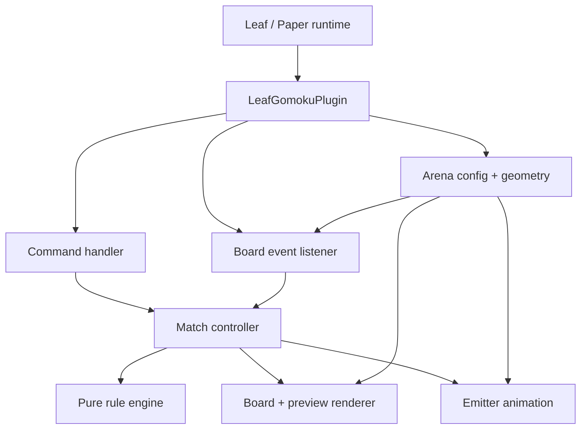
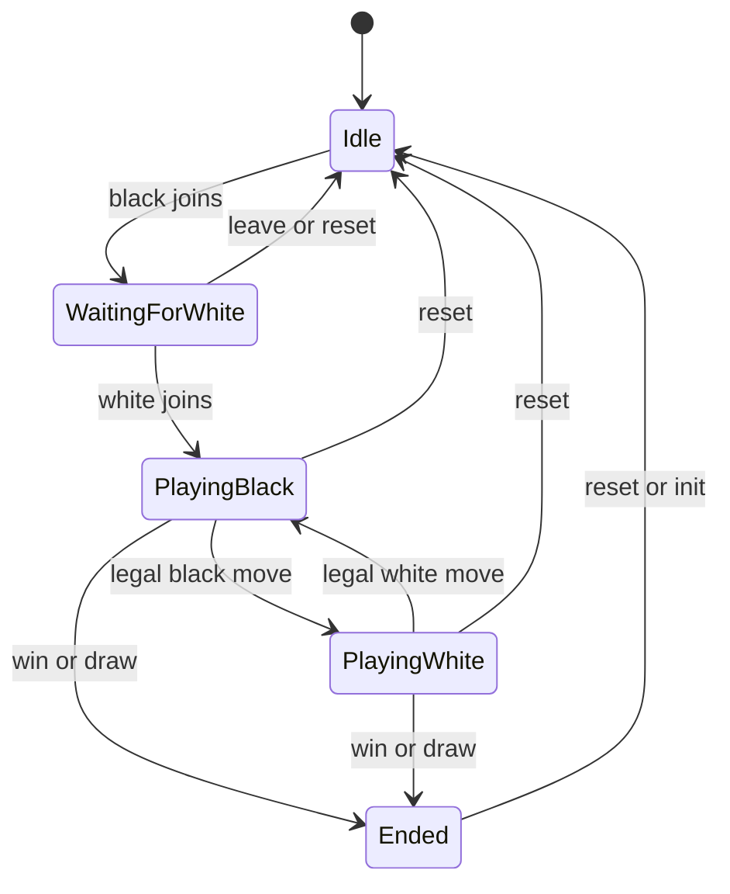
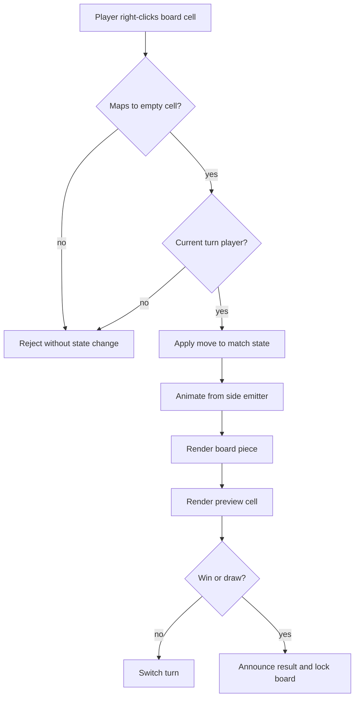

# feat: Add Gomoku MVP plugin

## Summary

Implement a standalone Leaf/Paper plugin named `LeafGomoku` that provides one MVP Gomoku arena: two players join, right-click a 15x15 board to play, fixed black/white emitters animate the move, the board and preview wall sync, and the plugin detects win/draw/reset states.

---

## Problem Frame

The brainstorm defines a主城互动装置, not a tournament or reward feature. The implementation should make the smallest reliable playable loop: setup one board, join two players, handle legal and illegal clicks, show a clear emission effect, sync a large preview, end the match, and let management reset.

The current repository is a Leaf 1.21.11 server directory with a prior custom plugin under `src/LeafResidenceWeb`. That plugin uses a lightweight shell build script, Paper API from `cache/`, `javac --release 21`, resource copying, and jar output into `plugins/`. The Gomoku plugin should follow that local convention before introducing a heavier build system.

---

## Requirements

**Plugin delivery**

- R1. Add `LeafGomoku` as a standalone Bukkit/Paper plugin targeting Leaf 1.21.11 and Java 21.
- R2. Build the plugin using the repository's existing lightweight script pattern and output the jar under `plugins/`.
- R3. Keep the plugin independent of DeluxeMenus, CMI, Quests, economy, and reward systems.

**Arena and game state**

- R4. Support one MVP arena with a 15x15 board, two fixed emitters, and one read-only preview area.
- R5. Track only one active match at a time for MVP, with idle, waiting, playing, and ended states.
- R6. Reset active match state on server restart instead of restoring unfinished games.
- R7. Enforce black first, white second, alternating turns, occupied-cell rejection, five-in-a-row win, and full-board draw.

**Player interaction and protection**

- R8. Accept moves only from the current turn player through right-clicking a mapped board cell.
- R9. Reject spectators, wrong-turn players, occupied cells, ended matches, and clicks outside the configured board.
- R10. Protect board, piece, preview, and emitter areas from ordinary block break/place edits that would alter the match.

**Rendering and operations**

- R11. Animate a legal move from the current side's fixed emitter to the target cell before or while final board state is applied.
- R12. Keep the physical board and large preview wall synchronized after every legal move and reset.
- R13. Provide management commands to reload config, reset the arena, and initialize a match-ready board.
- R14. Provide player-facing commands for joining, leaving, and checking the current match state.

---

## Key Technical Decisions

- **KTD1. Single-arena MVP:** Model one configured arena named `main`, because multi-arena routing would add scheduling and state isolation that the brainstorm deferred.
- **KTD2. Config-first setup:** Use `config.yml` for board origin, axes, emitters, preview origin, materials, and timings; an in-game setup wizard is deferred.
- **KTD3. Pure Java rule core:** Keep board state, winner detection, and coordinate mapping independent of Bukkit where practical so they can be tested without starting a server.
- **KTD4. BlockDisplay-based emission:** Use a transient display-style entity for the flying piece and write the final board/preview blocks as the source of truth. The local Paper API jar contains `BlockDisplay`, `Display`, `FallingBlock`, and `ItemDisplay`, so this is feasible on the current server API.
- **KTD5. Runtime state only:** Store active match state in memory and clear it on restart. Persistent games, replay, and recovery are outside MVP.
- **KTD6. Permission-gated commands:** Player commands are safe by default, while reset/reload/init commands require a plugin admin permission.
- **KTD7. Local runtime verification:** Unit tests cover pure rules and mapping; real Bukkit event wiring, permissions, animation, and visual sync require a server smoke test after implementation.

---

## High-Level Technical Design

### Component Topology



`Arena` answers "where is each cell"; `Match` answers "what state is the game in"; `Rules` answers "is this move legal and did it end the game"; `Renderer` and `Animation` are effects driven by accepted state changes.

### Match State



The command and click handlers should delegate transitions to one controller so invalid states are rejected consistently.

### Move Lifecycle



The rendered blocks are derived from the match state. If animation fails or is skipped because the plugin is disabled, the final board and preview state should still be correct.

---

## Output Structure

```text
src/LeafGomoku/
  src/main/java/net/leafmc/gomoku/
    LeafGomokuPlugin.java
    GomokuCommand.java
    BoardListener.java
    ArenaConfig.java
    BoardGeometry.java
    MatchController.java
    GomokuBoard.java
    GomokuRules.java
    BoardRenderer.java
    PieceAnimator.java
  src/main/resources/
    config.yml
    plugin.yml
  src/test/java/net/leafmc/gomoku/
    GomokuRulesTest.java
    BoardGeometryTest.java
    MatchControllerTest.java
scripts/
  build-leaf-gomoku.sh
  test-leaf-gomoku.sh
docs/operations/gomoku/
  2026-06-10-runtime-smoke-test.md
plugins/
  LeafGomoku-0.1.0.jar
```

The exact class split can adjust during implementation, but the plan assumes a separate rule core, geometry mapping, Bukkit listener, renderer, and animator.

---

## Implementation Units

### U1. Scaffold LeafGomoku plugin and build scripts

- **Goal:** Create the plugin directory, plugin metadata, default config, and lightweight build/test scripts.
- **Requirements:** R1, R2, R3, R13
- **Dependencies:** None
- **Files:** `src/LeafGomoku/src/main/resources/plugin.yml`, `src/LeafGomoku/src/main/resources/config.yml`, `src/LeafGomoku/src/main/java/net/leafmc/gomoku/LeafGomokuPlugin.java`, `scripts/build-leaf-gomoku.sh`, `scripts/test-leaf-gomoku.sh`, `plugins/LeafGomoku-0.1.0.jar`
- **Approach:** Mirror `scripts/build-leaf-residence-web.sh`: use `cache/paper-api-1.21.11-R0.1-SNAPSHOT.jar`, compile with `javac --release 21`, copy resources into a build directory, and create a deterministic jar. Declare `/gomoku` commands and `leafgomoku.admin` / `leafgomoku.play` permissions in `plugin.yml`.
- **Patterns to follow:** `scripts/build-leaf-residence-web.sh`; `src/LeafResidenceWeb/src/main/resources/plugin.yml`; `src/LeafResidenceWeb/src/main/java/net/leafmc/residenceweb/LeafResidenceWebPlugin.java`
- **Test scenarios:**
  - Running the build script produces `plugins/LeafGomoku-0.1.0.jar`.
  - The jar contains `plugin.yml`, `config.yml`, and compiled classes under `net/leafmc/gomoku/`.
  - The test script can compile and run pure Java tests without starting Leaf.
  - A static jar inspection confirms the plugin main class named in `plugin.yml` exists in the jar.
- **Verification:** The build artifact exists in `plugins/`, script paths are executable, and no Gradle/Maven project is introduced.

### U2. Implement pure Gomoku rules and match model

- **Goal:** Build the rule core for board occupancy, turn alternation, win detection, draw detection, and state transitions.
- **Requirements:** R5, R6, R7, R8, R9; origin F2, F3, F4; origin AE1, AE2, AE4, AE5, AE6
- **Dependencies:** U1
- **Files:** `src/LeafGomoku/src/main/java/net/leafmc/gomoku/GomokuBoard.java`, `src/LeafGomoku/src/main/java/net/leafmc/gomoku/GomokuRules.java`, `src/LeafGomoku/src/main/java/net/leafmc/gomoku/MatchController.java`, `src/LeafGomoku/src/test/java/net/leafmc/gomoku/GomokuRulesTest.java`, `src/LeafGomoku/src/test/java/net/leafmc/gomoku/MatchControllerTest.java`, `scripts/test-leaf-gomoku.sh`
- **Approach:** Keep the core free of Bukkit imports. Represent cells as a fixed 15x15 grid with empty, black, and white states; expose domain-level move results such as accepted, wrong turn, occupied, no match, ended, win, and draw. Keep player identity opaque in the core so the Bukkit layer can pass UUIDs without coupling the rule engine to server APIs.
- **Execution note:** Implement the rule core test-first; mistakes here are cheaper to catch outside the server.
- **Patterns to follow:** Plain Java data structures from the existing custom plugin; avoid plugin-specific APIs in the rule classes.
- **Test scenarios:**
  - Covers origin AE1. Joining two players assigns black first, white second, and starts with black's turn.
  - Covers origin AE2. A white move during black's turn returns a rejection and leaves the board unchanged.
  - Covers origin AE4. A move on an occupied cell returns a rejection and does not switch turns.
  - Covers origin AE5. Horizontal, vertical, diagonal-down, and diagonal-up five-in-a-row each produce a win.
  - Covers origin AE6. A full 15x15 board with no five-in-a-row produces a draw.
  - Reset clears players, cells, winner, draw state, and current turn.
- **Verification:** The test script runs all pure rule tests and fails on invalid state mutation or winner-detection regressions.

### U3. Implement arena config and board geometry mapping

- **Goal:** Map world block clicks to 15x15 board coordinates and map board coordinates to preview positions.
- **Requirements:** R4, R8, R9, R11, R12, R13; origin F1, F3
- **Dependencies:** U1, U2
- **Files:** `src/LeafGomoku/src/main/java/net/leafmc/gomoku/ArenaConfig.java`, `src/LeafGomoku/src/main/java/net/leafmc/gomoku/BoardGeometry.java`, `src/LeafGomoku/src/test/java/net/leafmc/gomoku/BoardGeometryTest.java`, `src/LeafGomoku/src/main/resources/config.yml`
- **Approach:** Define one arena with world name, board origin, row axis, column axis, cell spacing, black emitter, white emitter, preview origin, preview axes, materials, and animation timing. Make geometry mapping deterministic and reject coordinates outside the 15x15 footprint.
- **Patterns to follow:** `src/LeafResidenceWeb/src/main/resources/config.yml` for plain YAML defaults; `src/LeafResidenceWeb/src/main/java/net/leafmc/residenceweb/LeafResidenceWebPlugin.java` for config loading style.
- **Test scenarios:**
  - Mapping the configured board origin returns row 0, column 0.
  - Mapping the far corner returns row 14, column 14.
  - Mapping a block just outside each edge returns no cell.
  - Preview mapping for a known row/column returns the expected preview position.
  - Reversing one axis in config still maps rows/columns consistently.
  - Invalid config values fail closed and keep the arena disabled until corrected.
- **Verification:** Geometry tests pass without Bukkit runtime and the default config documents the coordinate convention clearly enough for management to fill in real coordinates.

### U4. Implement commands and permission boundaries

- **Goal:** Provide the player and admin command surface for joining, leaving, status, reset, reload, and initialization.
- **Requirements:** R5, R6, R13, R14; origin F2
- **Dependencies:** U1, U2, U3
- **Files:** `src/LeafGomoku/src/main/java/net/leafmc/gomoku/GomokuCommand.java`, `src/LeafGomoku/src/main/java/net/leafmc/gomoku/LeafGomokuPlugin.java`, `src/LeafGomoku/src/main/resources/plugin.yml`, `src/LeafGomoku/src/test/java/net/leafmc/gomoku/MatchControllerTest.java`
- **Approach:** Use one `/gomoku` command with subcommands for player actions and admin actions. Player commands should never grant admin control. Admin reset should clear state and render the empty board/preview. Reload should re-read config and fail safely if the arena cannot be mapped.
- **Patterns to follow:** `src/LeafResidenceWeb/src/main/java/net/leafmc/residenceweb/LeafResidenceWebPlugin.java` command handling and permission checks.
- **Test scenarios:**
  - A player with play permission can join as black when the match is idle.
  - A second player can join as white and start the match.
  - A third player cannot replace an active participant.
  - A participant leaving before the game starts returns the match to the correct waiting or idle state.
  - Admin reset clears match state even after a win.
  - Non-admin reset/reload requests are rejected.
- **Verification:** Command behavior is represented in pure controller tests where possible, and Bukkit command permission behavior is covered by runtime smoke testing.

### U5. Implement board click handling and protection

- **Goal:** Wire Bukkit interaction events to the match controller and protect configured Gomoku areas from manual edits.
- **Requirements:** R8, R9, R10; origin F3, F4; origin AE2, AE3, AE4, AE7
- **Dependencies:** U2, U3, U4
- **Files:** `src/LeafGomoku/src/main/java/net/leafmc/gomoku/BoardListener.java`, `src/LeafGomoku/src/main/java/net/leafmc/gomoku/LeafGomokuPlugin.java`, `docs/operations/gomoku/2026-06-10-runtime-smoke-test.md`
- **Approach:** Register listeners for player interaction and block break/place. Only right-clicks on mapped board cells should attempt a move. Protection should cover board cells, placed piece blocks, preview cells, and emitter locations. If config is invalid or the match has ended, clicks should be rejected without changing state.
- **Patterns to follow:** Bukkit listener registration from the Paper API; permission style from the existing custom plugin.
- **Test scenarios:**
  - Covers origin AE2. A spectator click on an empty cell is rejected and emits no piece.
  - Covers origin AE3. Current player right-clicking an empty mapped cell accepts the move and triggers render work.
  - Covers origin AE4. Current player right-clicking an occupied mapped cell is rejected.
  - Covers origin AE7. Ordinary break/place inside protected areas is cancelled.
  - Break/place outside Gomoku protected areas is not affected.
  - Clicks on the preview wall do not create moves.
- **Verification:** Runtime smoke test confirms listeners fire under a default player and do not block unrelated world interaction.

### U6. Implement board rendering, preview sync, and emitter animation

- **Goal:** Render accepted moves to the physical board and preview wall while showing a fixed-emitter piece animation.
- **Requirements:** R11, R12, R13; origin F1, F3; origin AE3, AE5, AE6
- **Dependencies:** U3, U5
- **Files:** `src/LeafGomoku/src/main/java/net/leafmc/gomoku/BoardRenderer.java`, `src/LeafGomoku/src/main/java/net/leafmc/gomoku/PieceAnimator.java`, `src/LeafGomoku/src/main/java/net/leafmc/gomoku/MatchController.java`, `src/LeafGomoku/src/main/resources/config.yml`, `docs/operations/gomoku/2026-06-10-runtime-smoke-test.md`
- **Approach:** Treat the match state as source of truth. On legal move, spawn a transient visual piece at the side emitter, move it toward the target cell over a short configured duration, then render the target board cell and preview cell with the side's configured material. Reset should clear all known board and preview cells back to configured empty materials.
- **Patterns to follow:** Scheduler usage from Bukkit/Paper API conventions; local plugin style of simple Java classes instead of framework dependencies.
- **Test scenarios:**
  - Covers origin AE3. A legal black move uses the black emitter and black material on board and preview.
  - A legal white move uses the white emitter and white material on board and preview.
  - Reset clears board pieces and preview cells to empty materials.
  - If a move ends the match, the final piece still renders before or alongside the win announcement.
  - Disabling or reloading the plugin removes transient animation entities it owns.
  - Animation failure does not leave match state out of sync with rendered board/preview.
- **Verification:** Runtime smoke test checks visible board/preview sync for at least two black moves and two white moves, plus one reset.

### U7. Update operations documentation and server metadata

- **Goal:** Document installation, permissions, setup, smoke testing, and package metadata for the new plugin.
- **Requirements:** R1, R2, R13, R14
- **Dependencies:** U1, U4, U5, U6
- **Files:** `README.md`, `VERSION_MANIFEST.md`, `CHANGELOG.md`, `CHECKSUMS.txt`, `docs/operations/gomoku/2026-06-10-runtime-smoke-test.md`
- **Approach:** Add a concise README section for五子棋 MVP commands, permissions, config setup, and operational limits. Update the manifest with plugin version and jar path. Add a smoke test that uses a default player and admin to verify join, move, illegal move, win/draw/reset, protection, and reload behavior.
- **Patterns to follow:** `README.md` plugin sections; `VERSION_MANIFEST.md` component table; `docs/operations/guild-projects/2026-06-09-runtime-smoke-test.md`
- **Test scenarios:**
  - Documentation lists player commands separately from admin commands.
  - Documentation states that the plugin does not provide rewards, rankings, multi-board lobbies, or inventory item costs.
  - Smoke test covers a legal move, wrong-turn rejection, occupied-cell rejection, board protection, preview sync, and reset.
  - `CHECKSUMS.txt` includes the new jar and changed config/docs files after implementation.
- **Verification:** A server operator can install and validate the plugin using only README, manifest, and the smoke test document.

---

## Scope Boundaries

### Deferred to Follow-Up Work

- Multi-arena support, lobbies, queueing, spectator seats, and tournament operations.
- Persistent match recovery, replays, move history export, and棋谱 review.
- In-game setup wizard with selection tools and visual coordinate helpers.
- Rich particles, sound design, UI polish, and complex animation variants.
- DeluxeMenus entry integration after the standalone plugin is working.

### Outside MVP

- Scoreboards, ranked ladders, seasonal points, economy rewards, and item prizes.
- AI opponents, hint systems,教学 modes, or forbidden-move rule variants.
- Consuming player inventory blocks as move cost.
- Allowing normal block place/break actions to become the rule source.
- Any connection from Gomoku results to combat power, flight, permissions, or high-value survival resources.

---

## System-Wide Impact

The plugin adds a new command namespace, new permissions, one jar, one config directory, and protected areas inside the world. It should not alter existing DeluxeMenus, CMI, Residence, Quests, LuckPerms behavior beyond adding optional permissions for the new command.

The main operational impact is area protection. If board or preview coordinates overlap normal public builds, ordinary players may be blocked from placing or breaking in those cells. The smoke test and README should make the configured arena footprint explicit before deployment.

---

## Risks and Dependencies

| Risk | Impact | Mitigation |
| --- | --- | --- |
| Board coordinate config is wrong | Clicks map to wrong cells or preview sync appears incorrect | Keep geometry tests pure and document origin/axis conventions in `config.yml`. |
| Animation entity cleanup fails | Temporary display entities remain in the world | Track spawned entities owned by the plugin and remove them on completion, reset, reload, and disable. |
| Protection area is too broad | Players cannot edit nearby public builds | Protect only mapped board, preview, emitter, and piece cells; include outside-area smoke tests. |
| Bukkit event behavior differs from pure tests | Unit tests pass but clicks or permissions fail in game | Require runtime smoke testing with a default player and admin after implementation. |
| Adding a custom jar increases deploy risk | Remote copy may miss the plugin jar or config | Update manifest, checksums, README, and copy package notes when implementation ships. |

---

## Acceptance Examples

- AE1. Given the arena is idle, When two players run the join flow, Then the first becomes black, the second becomes white, and black is prompted to move.
- AE2. Given it is black's turn, When white or a spectator clicks an empty board cell, Then no animation runs and no board or preview block changes.
- AE3. Given the current player clicks an empty mapped board cell, When the move is legal, Then the side emitter launches the piece, the target cell renders, and the preview cell matches it.
- AE4. Given a cell already contains a piece, When the current player clicks it, Then the move is rejected, the turn does not change, and the existing piece remains.
- AE5. Given a move creates five connected pieces horizontally, vertically, or diagonally, When the move is applied, Then the plugin announces the winner and locks further moves until reset.
- AE6. Given the board is full with no winner, When the final move is applied, Then the plugin announces a draw and locks further moves until reset.
- AE7. Given a default player tries to place or break inside the board or preview footprint, When the event reaches the plugin, Then the edit is cancelled and the match state is unchanged.

---

## Operational Notes

- Do not start by integrating the menu. The plugin must be usable through `/gomoku` before optional menu entry work.
- Do not rely on a live server for rule correctness. Keep win/draw/turn logic testable in pure Java.
- Runtime validation should be done on a stopped-and-backed-up server or a local copy because it changes world blocks inside the configured arena.
- The first deployment should use an obvious test arena before placing the final main-city build.

---

## Sources and Research

- `docs/brainstorms/2026-06-10-gomoku-mvp-plugin-requirements.md` — origin requirements, flows, acceptance examples, and scope boundaries.
- `README.md` — current Leaf 1.21.11 server positioning, plugin ecosystem, command/menu boundaries, and runtime verification expectations.
- `VERSION_MANIFEST.md` — Java 21 target, Leaf build, plugin list, and runtime policy.
- `scripts/build-leaf-residence-web.sh` — existing custom plugin build pattern to reuse.
- `src/LeafResidenceWeb/src/main/resources/plugin.yml` — local plugin metadata and command/permission declaration style.
- `src/LeafResidenceWeb/src/main/java/net/leafmc/residenceweb/LeafResidenceWebPlugin.java` — local JavaPlugin command/config pattern.
- `cache/paper-api-1.21.11-R0.1-SNAPSHOT.jar` — local API jar used to verify availability of Bukkit event classes and display entity classes.
