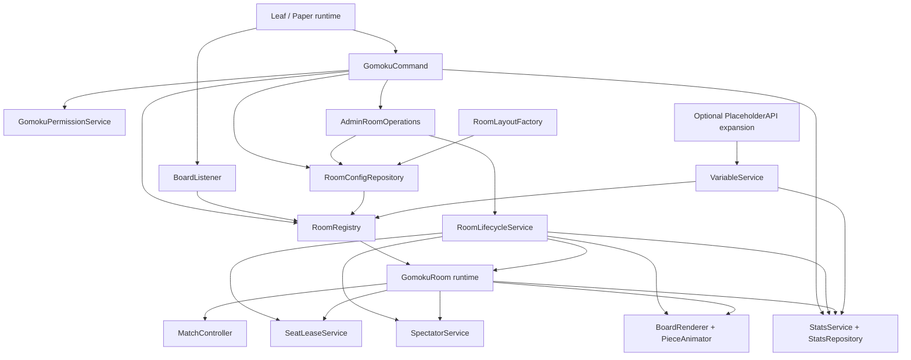
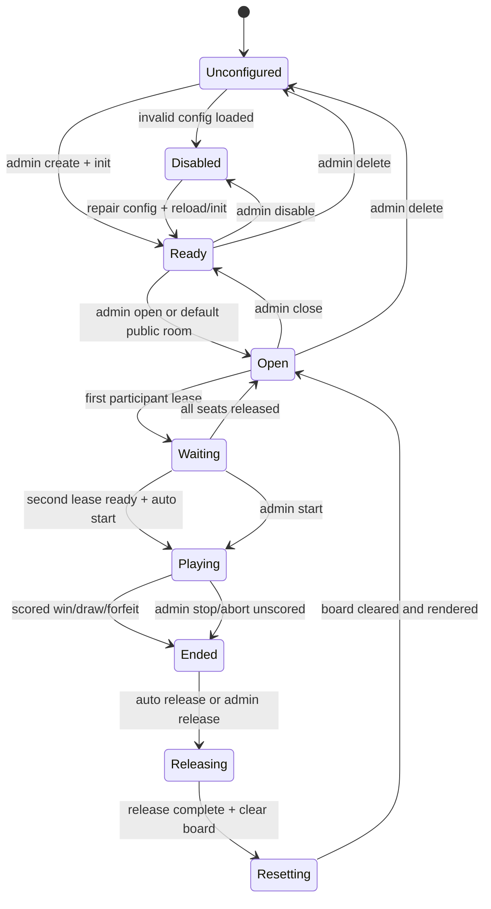
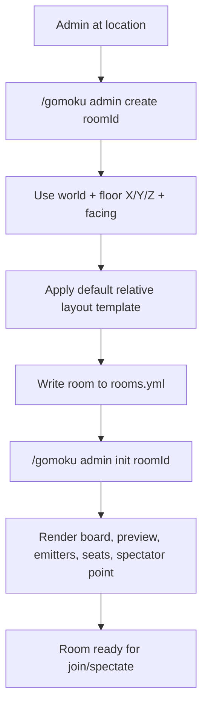

# feat: Evolve Gomoku into a configurable room platform

## Summary

Rework `LeafGomoku` from a single hardcoded arena into a configurable multi-room Gomoku platform. The next version should support permission layers, admin-created rooms from the operator's current location, room refresh/reset workflows, spectator positions, persistent player stats, leaderboards, and PlaceholderAPI-style variables without coupling results to economy or survival-power rewards.

---

## Problem Frame

The MVP proved the core play loop: two players can join, click a board, see animated stones, and finish a match. The current architecture is still shaped around one configured arena and one in-memory `MatchController`, so every new operational need would add more hardcoded branches.

The next step is to separate the plugin into durable layers: room configuration, room runtime state, permissions, positions, stats, variables, and operations. Admins should be able to create room N from their current location, initialize it at the current Y level, refresh or reset that room, and let players or spectators enter known positions without editing Java or hand-authoring every coordinate.

---

## Requirements

**Permissions and command surface**

- R1. The plugin must define a real permission taxonomy for player, spectator, stats, leaderboard, setup, room management, stat management, reload, and protection-bypass actions.
- R2. OP/admin permissions must be grouped under `leafgomoku.admin` while still exposing narrower child permissions for LuckPerms or future role tuning.
- R3. Player commands must never grant setup, refresh, stat-edit, or reload capability through aliases or missing permission checks.

**Rooms and operations**

- R4. The plugin must support N named rooms, with `main` as the migrated default room instead of the only supported room.
- R5. Admins must be able to create a room from their current in-game location, using the player's current world, X/Z, facing direction, and Y level as the layout anchor.
- R6. Admins must be able to initialize, refresh, reset, delete, reload, and inspect a specific room by id.
- R7. Runtime operations must distinguish `init` (build or rebuild configured blocks), `reset` (clear match state and board), and `refresh` (re-render from stored state/config without changing finished statistics).

**Room lifecycle and participant semantics**

- R19. Each room must track durable configuration state separately from volatile runtime state. Invalid config disables only that room; runtime reset must not delete room coordinates or stats.
- R20. Black and white participants must be represented as seat leases, not just two UUID fields. A lease stores player UUID, last known name, side, join time, ready state, connection state, and optional recovery deadline.
- R21. Match start policy must be explicit: auto-start when both seats are occupied and ready by default, with admin manual start available for managed events. Mid-game replacement is rejected unless an admin uses a release/forfeit/reset operation.
- R22. Match end policy must distinguish scored endings from administrative endings. Normal win, draw, and configured forfeit can write stats; admin abort, refresh, reload repair, and forced reset do not.
- R23. Seat release must be a first-class operation covering player leave, disconnect timeout, admin release, post-match auto-release, room reset, and room delete. Releasing a seat must not silently erase stats or delete room config.
- R24. Reset, refresh, release, stop, and delete must have different side effects: `refresh` re-renders only, `release` frees one or more leases, `stop` ends a match by policy, `reset` clears runtime board state and seats, and `delete` removes durable room config after safety checks.
- R25. Room operations that affect an active match must either be refused or require an explicit force-capable permission. The default behavior should protect active participants from accidental admin cleanup.

**Position and spectator layer**

- R8. Every room must store board, preview, emitter, black seat, white seat, and spectator spawn positions as room data rather than Java constants.
- R9. Spectators must be able to enter a room at the configured spectator position without becoming black or white.
- R10. Board click routing and protection must resolve the owning room from clicked blocks across all configured rooms.
- R26. Spectators must have room membership, capacity limits, spawn and optional exit positions, click rejection, status notifications, and variable counts separate from participants.
- R27. Room join must separate participant entry from spectator entry. A spectator cannot become black or white without running a participant join action, and an active participant cannot also occupy a spectator slot in the same or another room.

**Stats and ranking**

- R11. Finished matches must update persistent player statistics: games, wins, losses, draws, points, current streak, best streak, and last played timestamp.
- R12. Leaderboards must be queryable in-game for at least points, wins, and win rate, with a deterministic tie-breaker.
- R13. Admins must be able to reset or repair stats through permission-gated commands, but normal reset/refresh operations must not erase player history.

**Variables and integrations**

- R14. The plugin must expose variables for room state, player stats, leaderboard rows, current turn, participants, and spectator counts.
- R15. PlaceholderAPI integration must be optional: register variables when PlaceholderAPI exists and keep the plugin usable when it is absent.
- R16. A command-based variable query must exist so admins can inspect values without relying on another plugin.

**Compatibility and non-goals**

- R17. Existing MVP behavior for a single `main` room must continue after migration.
- R18. The feature must not add economy payouts, item prizes, flight rewards, combat power, AI opponents, or web UI.

---

## Key Technical Decisions

- KTD1. **Room-first model:** Replace the plugin-wide `ArenaConfig` and `MatchController` ownership with a `RoomRegistry` keyed by room id. This removes the single-room assumption before adding leaderboard, spectator, or variable features.
- KTD2. **YAML persistence first:** Store room definitions in `plugins/LeafGomoku/rooms.yml` and stats in `plugins/LeafGomoku/stats.yml`. The server already uses YAML-oriented plugin data, the expected Gomoku volume is low, and avoiding SQLite keeps the custom build path small.
- KTD3. **Template-based setup from player location:** `/gomoku admin create <room>` should derive a room layout from the admin's current location and facing direction. The current block Y is the board plane; relative offsets define emitters, seats, preview, and spectator spawn.
- KTD4. **Permission children in `plugin.yml`:** Keep `leafgomoku.admin` as the OP umbrella but declare child permissions such as `leafgomoku.admin.setup`, `leafgomoku.admin.room`, and `leafgomoku.admin.stats`. This supports both OP usage and future LuckPerms group tuning.
- KTD5. **Stats are match-result driven:** Only a terminal win or draw updates stats. Admin reset and refresh do not create wins, losses, draws, or points.
- KTD6. **PlaceholderAPI as soft integration:** Add PlaceholderAPI to the compile classpath and declare it as a soft dependency. At runtime, register the expansion only when the plugin is present.
- KTD7. **Backward-compatible migration:** Convert the current `arena:` config into a `main` room on first load when `rooms.yml` does not exist, then treat `rooms.yml` as the authoritative room source.
- KTD8. **Seat leases over direct assignment:** Model black and white occupancy as leases with lifecycle metadata. This makes leave, disconnect recovery, admin release, post-match cleanup, and forced reset explicit instead of hiding them inside `MatchController.reset()`.
- KTD9. **Room lifecycle policy as a service:** Centralize start, end, release, reset, refresh, reload, and delete rules in a lifecycle service. Command handlers and event listeners should request operations; they should not mutate room state directly.
- KTD10. **Result policy separates scoring from cleanup:** A finished match can produce a scored result, an unscored administrative result, or a non-result cleanup. StatsService only consumes scored results, while renderer, broadcast, and release services still react to all terminal paths.
- KTD11. **Spectators are sessions, not passive nearby players:** Track explicit spectator membership per room so capacity, teleport position, status messages, variables, and click rejection are deterministic.

---

## High-Level Technical Design

### Component Topology



`RoomRegistry` owns the active runtime map. `RoomConfigRepository` persists durable room definitions. `RoomLifecycleService` owns state transitions and refuses unsafe operations. `SeatLeaseService` owns black/white participant occupancy, while `SpectatorService` owns observer sessions. `StatsService` updates only when lifecycle policy emits a scored result. `VariableService` is the single read model for commands, PlaceholderAPI, and future menu text.

### Room Lifecycle



`refresh` is intentionally not a game-state transition. It re-renders blocks from stored room state/config without releasing seats, clearing the board, or recording a match result. `reset` is a state transition because it clears runtime board state and seat leases. `release` is narrower than reset: it frees participant or spectator sessions and then lifecycle policy decides whether the match remains waiting, becomes a forfeit, or must be aborted.

### Role and Action Matrix

| Layer | Owns | Allowed default actions | Explicitly not allowed |
| --- | --- | --- | --- |
| Spectator | A spectator session in one room | `/gomoku spectate <room>`, `/gomoku leave`, status/leaderboard queries, receive room broadcasts | Occupy black/white, make moves, release seats, reset rooms, bypass protection |
| Participant | One black or white seat lease | `/gomoku join <room>`, ready/unready if enabled, legal turn clicks, `/gomoku leave`, personal stats queries | Join another room while leased, spectate another room while active, edit board blocks, start/stop/reset/delete rooms |
| Room admin | A permission-scoped room operation | create/init/open/close/start/stop/release/forfeit/reset/refresh/inspect for permitted rooms | Edit stats unless also granted stats permission, bypass protection unless granted bypass permission |
| Stats admin | Persistent player records | repair/reset one player's stats, inspect match records | Create/delete rooms, force active match cleanup |
| OP umbrella | All `leafgomoku.admin.*` children | Emergency operations and initial setup | Should still go through lifecycle policy; OP is not a reason to mutate room internals directly |

### Operation Semantics

| Operation | Scope | Runtime effect | Stats effect | Safety rule |
| --- | --- | --- | --- | --- |
| `create <room>` | Durable config | Generates positions from admin current world, current Y, X/Z, and facing; room starts `Ready` after init | None | Reject duplicate ids unless overwrite is explicit |
| `init <room>` | Blocks/config | Builds board, preview, emitters, seats, and spectator spawn markers from config | None | Refuse invalid world or footprint |
| `open/close <room>` | Admission | Controls whether new participants can join; spectators may remain configurable | None | Close does not kick active participants by itself |
| `join <room>` | Participant lease | Occupies black first, white second; teleports to configured side seat; optionally marks ready | None | Reject if player already has any active participant lease |
| `spectate <room>` | Spectator session | Teleports to spectator spawn and subscribes to room status | None | Reject if capacity reached or player is already an active participant |
| `start <room>` | Match state | Starts only when both seat leases are valid and policy allows it | None | Manual start requires admin room permission |
| `end/stop <room>` | Match state | Locks board and announces result or administrative stop | Scored only for win/draw/configured forfeit | Admin abort is unscored by default |
| `release <room> [seat/player]` | Lease/session | Frees one seat, both seats, or spectators depending on target | None directly | If playing, lifecycle policy turns it into forfeit, abort, or refusal |
| `reset <room>` | Runtime board | Cancels animations, clears board/preview, releases seats/spectators by policy, returns to open/ready | None unless prior scored result was already emitted | Active match reset requires admin room permission and should prompt/force in command grammar |
| `refresh <room>` | Rendering | Re-renders board/preview/protection markers from current state | None | Must preserve participants, turn, board cells, and match result |
| `delete <room>` | Durable config | Removes config and runtime object after cleanup | None | Refuse while waiting/playing/ended unless force permission is used |
| `reload` | Config/runtime | Reloads repositories and reconciles room runtimes | None | Active rooms keep leases only if footprint and world remain compatible |

### Setup From Player Location



The current Y coordinate is the board Y. The template offsets are configurable so the first implementation is usable immediately without an in-game wand, while later versions can add visual selection tools.

---

## Output Structure

```text
src/LeafGomoku/src/main/java/net/leafmc/gomoku/
  command/
  config/
  permission/
  room/
  setup/
  stats/
  variables/
  render/
  rules/
src/LeafGomoku/src/test/java/net/leafmc/gomoku/
  config/
  room/
  setup/
  stats/
  variables/
plugins/LeafGomoku/
  config.yml
  rooms.yml
  stats.yml
```

The package split is intentional. The current flat package is acceptable for the MVP, but the v2 feature has enough responsibility boundaries that keeping everything in `LeafGomokuPlugin`, `ArenaConfig`, and `GomokuCommand` would make future changes brittle.

---

## Implementation Units

### U1. Introduce room config repository and migration

- **Goal:** Make room definitions durable and remove the single `arena:` source of truth.
- **Requirements:** R4, R7, R8, R17, R19
- **Dependencies:** None
- **Files:** `src/LeafGomoku/src/main/java/net/leafmc/gomoku/config/RoomConfigRepository.java`, `src/LeafGomoku/src/main/java/net/leafmc/gomoku/config/GomokuRoomConfig.java`, `src/LeafGomoku/src/main/java/net/leafmc/gomoku/config/GomokuPosition.java`, `src/LeafGomoku/src/main/java/net/leafmc/gomoku/config/GomokuLayout.java`, `src/LeafGomoku/src/main/resources/config.yml`, `src/LeafGomoku/src/test/java/net/leafmc/gomoku/config/RoomConfigRepositoryTest.java`
- **Approach:** Add `rooms.yml` as the authoritative room file. On first load, if `rooms.yml` is missing and `config.yml` still has `arena:`, write a `main` room using the existing arena fields. Keep global defaults such as point formula, animation timing, and setup template in `config.yml`.
- **Patterns to follow:** `ArenaConfig.load(...)` for fail-closed parsing; `plugins/LuckPerms/yaml-storage/groups/default.yml` style for explicit YAML data.
- **Test scenarios:**
  - Existing `arena:` config migrates into a `main` room with board, preview, emitters, seats, and materials intact.
  - Missing `rooms.yml` with no legacy `arena:` yields an empty registry and a clear admin-facing warning.
  - Invalid room id, missing world, unsupported axis, or missing position disables only that room rather than the whole plugin.
  - Saving and reloading two rooms preserves both ids and all positions.
- **Verification:** The plugin can boot with legacy MVP config and with a new multi-room `rooms.yml` without changing Java constants.

### U2. Build the permission taxonomy and command router

- **Goal:** Replace the two-permission MVP surface with command-specific permissions and room-aware command parsing.
- **Requirements:** R1, R2, R3, R6, R13, R21, R24, R25
- **Dependencies:** U1
- **Files:** `src/LeafGomoku/src/main/resources/plugin.yml`, `src/LeafGomoku/src/main/java/net/leafmc/gomoku/permission/GomokuPermission.java`, `src/LeafGomoku/src/main/java/net/leafmc/gomoku/permission/GomokuPermissionService.java`, `src/LeafGomoku/src/main/java/net/leafmc/gomoku/command/GomokuCommand.java`, `src/LeafGomoku/src/test/java/net/leafmc/gomoku/permission/GomokuPermissionServiceTest.java`
- **Approach:** Define `leafgomoku.play`, `leafgomoku.spectate`, `leafgomoku.stats`, `leafgomoku.leaderboard`, `leafgomoku.room.join.<room>`, `leafgomoku.admin.setup`, `leafgomoku.admin.room`, `leafgomoku.admin.lifecycle`, `leafgomoku.admin.stats`, `leafgomoku.admin.reload`, `leafgomoku.admin.force`, and `leafgomoku.admin.bypass-protection`. Keep `leafgomoku.admin` as an OP-default parent permission with children for operational roles. Route admin subcommands to operation-specific handlers so `start`, `stop`, `release`, `reset`, `refresh`, and `delete` can have different permissions and safety checks.
- **Patterns to follow:** Existing `GomokuCommand` permission checks; `plugin.yml` permission declarations from `LeafGomoku` and `LeafResidenceWeb`.
- **Test scenarios:**
  - A default player with `leafgomoku.play` can join a public room but cannot create, refresh, delete, or edit stats.
  - A player without `leafgomoku.spectate` cannot enter spectator mode.
  - `leafgomoku.admin` grants all admin subcommands through child permissions.
  - A user with only `leafgomoku.admin.stats` can repair/reset stats but cannot create or delete rooms.
  - A room admin without `leafgomoku.admin.force` cannot delete or reset a playing room through an accidental command.
  - A lifecycle admin can release a stuck seat but cannot edit persistent stats.
  - Tab completion hides commands the sender cannot use.
- **Verification:** Every command branch calls `GomokuPermissionService` before mutating room, stats, or config state.

### U3. Add room setup from admin location

- **Goal:** Let OP/admin create a room from where they stand, using the current Y level instead of hardcoded coordinates.
- **Requirements:** R5, R6, R8, R10
- **Dependencies:** U1, U2
- **Files:** `src/LeafGomoku/src/main/java/net/leafmc/gomoku/setup/RoomLayoutFactory.java`, `src/LeafGomoku/src/main/java/net/leafmc/gomoku/setup/SetupTemplate.java`, `src/LeafGomoku/src/main/java/net/leafmc/gomoku/command/GomokuCommand.java`, `src/LeafGomoku/src/main/resources/config.yml`, `src/LeafGomoku/src/test/java/net/leafmc/gomoku/setup/RoomLayoutFactoryTest.java`
- **Approach:** Add `/gomoku admin create <roomId> [template]`. The default template anchors the board at the player's current block position, uses the player's facing for row/column orientation, and derives emitters, seats, preview, and spectator spawn from relative offsets. The implementation should expose layout summary text before or after creation so admins can see generated coordinates.
- **Patterns to follow:** `BoardGeometry.stepFromAxis(...)` and `BoardGeometryTest` for deterministic axis mapping.
- **Test scenarios:**
  - Creating a room while facing south uses the player's current Y as board Y and produces a valid 15x15 footprint.
  - Creating while facing north, east, or west produces consistent row/column axes and seat positions.
  - A duplicate room id is rejected unless an explicit overwrite flag is provided.
  - Invalid room ids with spaces or path-like characters are rejected.
  - The generated spectator position does not overlap the board footprint.
- **Verification:** An admin can create a room without editing `rooms.yml`, then run `init` to render a playable board.

### U4. Implement room registry, lifecycle, and multi-room match routing

- **Goal:** Support N active rooms with independent lifecycle state, participant leases, spectators, match state, rendering, and reset timers.
- **Requirements:** R4, R6, R7, R9, R10, R17, R19, R20, R21, R22, R23, R24, R25, R27
- **Dependencies:** U1, U2, U3
- **Files:** `src/LeafGomoku/src/main/java/net/leafmc/gomoku/room/GomokuRoom.java`, `src/LeafGomoku/src/main/java/net/leafmc/gomoku/room/RoomState.java`, `src/LeafGomoku/src/main/java/net/leafmc/gomoku/room/RoomRegistry.java`, `src/LeafGomoku/src/main/java/net/leafmc/gomoku/room/RoomLifecycleService.java`, `src/LeafGomoku/src/main/java/net/leafmc/gomoku/room/RoomLifecyclePolicy.java`, `src/LeafGomoku/src/main/java/net/leafmc/gomoku/room/SeatLease.java`, `src/LeafGomoku/src/main/java/net/leafmc/gomoku/room/SeatLeaseService.java`, `src/LeafGomoku/src/main/java/net/leafmc/gomoku/room/ParticipantState.java`, `src/LeafGomoku/src/main/java/net/leafmc/gomoku/BoardListener.java`, `src/LeafGomoku/src/main/java/net/leafmc/gomoku/MatchController.java`, `src/LeafGomoku/src/test/java/net/leafmc/gomoku/room/RoomRegistryTest.java`, `src/LeafGomoku/src/test/java/net/leafmc/gomoku/room/RoomLifecycleServiceTest.java`, `src/LeafGomoku/src/test/java/net/leafmc/gomoku/room/SeatLeaseServiceTest.java`
- **Approach:** Move one-match state into `GomokuRoom`. `RoomRegistry` resolves by id for commands and by geometry for block clicks. Commands should accept optional room ids, defaulting to the nearest room or `main` only when unambiguous. `RoomLifecycleService` must be the only writer of room state transitions; listener and command code ask for operations such as `joinParticipant`, `startMatch`, `recordResult`, `releaseSeat`, `resetRoom`, and `refreshRoom`. Seat leases keep participant identity and recovery metadata outside the pure board rules.
- **Patterns to follow:** Current `MatchController` pure state transitions; `BoardListener` click mapping; runtime smoke test structure in `docs/operations/gomoku/2026-06-10-runtime-smoke-test.md`.
- **Test scenarios:**
  - Two rooms can both be waiting or playing without sharing players, turns, or boards.
  - A click in room A never mutates room B.
  - `/gomoku reset roomA` clears only room A.
  - `/gomoku refresh roomA` re-renders room A without changing its participants or stats.
  - A player already active in one room cannot join a second room until leaving or match completion.
  - Ambiguous `/gomoku join` is rejected with a room list instead of guessing.
  - Two occupied seats enter `Waiting` until auto-start or admin start policy transitions the room to `Playing`.
  - A participant disconnect inside the configured recovery window keeps the seat lease reserved and blocks replacement.
  - A participant disconnect past the recovery window releases the lease; if the room was playing, result policy decides forfeit or abort.
  - Admin release frees one stuck seat without clearing board cells when the room is waiting.
  - Admin release during playing is refused unless policy and permission allow forfeit or abort.
  - Admin abort ends the room without writing stats; normal win/draw emits one scored result.
  - Reset clears match state and releases leases but keeps room config and player history.
- **Verification:** Runtime state is no longer stored in plugin-level fields such as one global `match` or one global `moveInProgress`.

### U5. Add spectator and position services

- **Goal:** Treat all player movement points and protected areas as first-class room positions.
- **Requirements:** R8, R9, R10, R26, R27
- **Dependencies:** U1, U4
- **Files:** `src/LeafGomoku/src/main/java/net/leafmc/gomoku/room/RoomPositionService.java`, `src/LeafGomoku/src/main/java/net/leafmc/gomoku/room/SpectatorSession.java`, `src/LeafGomoku/src/main/java/net/leafmc/gomoku/room/SpectatorService.java`, `src/LeafGomoku/src/main/java/net/leafmc/gomoku/command/GomokuCommand.java`, `src/LeafGomoku/src/main/java/net/leafmc/gomoku/BoardListener.java`, `src/LeafGomoku/src/test/java/net/leafmc/gomoku/room/RoomPositionServiceTest.java`, `src/LeafGomoku/src/test/java/net/leafmc/gomoku/room/SpectatorServiceTest.java`
- **Approach:** Add `/gomoku spectate [roomId]` and `/gomoku leave` semantics for spectators. The position service should teleport black, white, and spectator roles to configured room positions and expose protected blocks for board, preview, emitters, and optional seat markers. Spectator membership should be explicit: store room id, UUID, joined time, optional previous location for exit, and whether movement restrictions are enabled for that room.
- **Patterns to follow:** Current `ArenaSeat` location handling; Bukkit event protection from `BoardListener`.
- **Test scenarios:**
  - Spectator joins room A and lands at room A spectator position without becoming a participant.
  - Spectator clicks a board cell and receives a rejection without changing turn state.
  - Spectator leave removes them from room spectator count.
  - A spectator cannot join as black or white until they leave spectator mode or the join command explicitly converts the session by policy.
  - A participant cannot spectate another room while holding a black/white lease.
  - Spectator capacity is enforced and visible through status/variables.
  - On room reset/delete/reload, spectators are notified and either returned to the configured exit point or removed from the session list.
  - Admin bypass permission allows block edits in protected areas.
  - Protection applies to all rooms and does not block outside-room edits.
- **Verification:** Spectator count appears in status/variables and spectators cannot affect match state.

### U6. Add persistent stats, points, and leaderboards

- **Goal:** Record match outcomes and expose rankings without adding economy or rewards.
- **Requirements:** R11, R12, R13, R18, R22
- **Dependencies:** U4
- **Files:** `src/LeafGomoku/src/main/java/net/leafmc/gomoku/stats/PlayerStats.java`, `src/LeafGomoku/src/main/java/net/leafmc/gomoku/stats/MatchRecord.java`, `src/LeafGomoku/src/main/java/net/leafmc/gomoku/stats/StatsRepository.java`, `src/LeafGomoku/src/main/java/net/leafmc/gomoku/stats/StatsService.java`, `src/LeafGomoku/src/main/java/net/leafmc/gomoku/stats/LeaderboardService.java`, `src/LeafGomoku/src/test/java/net/leafmc/gomoku/stats/StatsServiceTest.java`, `src/LeafGomoku/src/test/java/net/leafmc/gomoku/stats/LeaderboardServiceTest.java`
- **Approach:** Persist stats by UUID and last known player name. Use configurable points defaults of win = 3, draw = 1, loss = 0. Rank by points, then wins, then win rate, then name for deterministic ordering. Save stats only after `RoomLifecycleService` emits a scored `MatchRecord`; admin abort, forced reset, refresh, and reload reconciliation are non-scoring cleanup paths.
- **Patterns to follow:** Current pure Java tests; existing YAML storage preference in LuckPerms and server configs.
- **Test scenarios:**
  - A black win increments black wins/points/streak and white losses/games.
  - A draw increments games/draws and draw points for both players.
  - Admin reset during a playing match does not write a win/loss/draw.
  - Admin stop/abort produces an inspectable room event but does not change player points.
  - Configured forfeit writes a win/loss only when lifecycle policy marks it as scored.
  - Duplicate terminal handling for the same match id does not double-count.
  - Leaderboard order is stable when players have equal points.
  - Admin stat reset for one player does not erase other players.
- **Verification:** `stats.yml` survives plugin reload and the leaderboard is identical after reload.

### U7. Implement variable layer and optional PlaceholderAPI expansion

- **Goal:** Expose room and player state to menus, scoreboards, chat text, and admin debugging.
- **Requirements:** R14, R15, R16
- **Dependencies:** U4, U6
- **Files:** `src/LeafGomoku/src/main/java/net/leafmc/gomoku/variables/VariableService.java`, `src/LeafGomoku/src/main/java/net/leafmc/gomoku/variables/GomokuPlaceholderExpansion.java`, `src/LeafGomoku/src/main/java/net/leafmc/gomoku/command/GomokuCommand.java`, `src/LeafGomoku/src/main/resources/plugin.yml`, `scripts/build-leaf-gomoku.sh`, `scripts/test-leaf-gomoku.sh`, `src/LeafGomoku/src/test/java/net/leafmc/gomoku/variables/VariableServiceTest.java`
- **Approach:** Add variables such as `%leafgomoku_room_count%`, `%leafgomoku_room_<id>_state%`, `%leafgomoku_room_<id>_black%`, `%leafgomoku_room_<id>_white%`, `%leafgomoku_room_<id>_black_ready%`, `%leafgomoku_room_<id>_white_ready%`, `%leafgomoku_room_<id>_turn%`, `%leafgomoku_room_<id>_spectators%`, `%leafgomoku_room_<id>_spectator_capacity%`, `%leafgomoku_room_<id>_last_result%`, `%leafgomoku_player_points%`, `%leafgomoku_player_wins%`, `%leafgomoku_player_losses%`, `%leafgomoku_player_draws%`, `%leafgomoku_player_rank%`, `%leafgomoku_top_<n>_name%`, and `%leafgomoku_top_<n>_points%`. Add `/gomoku var <key> [player]` for admin inspection.
- **Patterns to follow:** `PlaceholderExpansion` API in `plugins/PlaceholderAPI-2.12.2.jar`; `VERSION_MANIFEST.md` notes PlaceholderAPI is already present for DeluxeMenus.
- **Test scenarios:**
  - Variable service returns room state for a known room and a configured empty value for unknown room ids.
  - Player stats variables resolve by UUID and show zero values for players without stats.
  - Leaderboard variables return stable top rows and empty values beyond available rows.
  - PlaceholderAPI absence does not prevent plugin startup.
  - PlaceholderAPI presence registers the expansion with identifier `leafgomoku`.
  - `/gomoku var room_main_state` requires admin or debug permission.
- **Verification:** Variables are available both through direct command query and PlaceholderAPI when the dependency is installed.

### U8. Adapt rendering, animation, and protection to room context

- **Goal:** Make visual effects, fireworks, auto-reset, and protected areas work per room.
- **Requirements:** R4, R7, R8, R10, R23, R24
- **Dependencies:** U4, U5
- **Files:** `src/LeafGomoku/src/main/java/net/leafmc/gomoku/render/BoardRenderer.java`, `src/LeafGomoku/src/main/java/net/leafmc/gomoku/render/PieceAnimator.java`, `src/LeafGomoku/src/main/java/net/leafmc/gomoku/render/CelebrationService.java`, `src/LeafGomoku/src/main/java/net/leafmc/gomoku/BoardListener.java`, `src/LeafGomoku/src/test/java/net/leafmc/gomoku/room/RoomLifecycleServiceTest.java`
- **Approach:** Stop reading one global arena from renderer and animator. Pass room context into each render operation so animation cleanup, fireworks, and delayed auto-reset cannot cross room boundaries. Track pending reset tasks by room id.
- **Patterns to follow:** Current arced `PieceAnimator` behavior and `resetArena()` cleanup semantics.
- **Test scenarios:**
  - Winning in room A launches room A celebration and schedules only room A auto-reset.
  - Post-win auto-reset first locks the ended board long enough to view, then releases seats and clears only that room.
  - Reload cancels pending room reset tasks and removes transient entities for all rooms.
  - Refresh re-renders from current room state without changing player stats.
  - Release of one waiting player does not remove already rendered board setup or spectator markers.
  - Two rooms animating moves at the same time do not block each other through one global `moveInProgress`.
- **Verification:** No plugin-level global match, arena, or movement lock remains for per-room behavior.

### U9. Add admin lifecycle operations

- **Goal:** Give admins precise room controls without requiring OP-only direct mutation or broad reset commands.
- **Requirements:** R1, R2, R3, R6, R7, R19, R21, R22, R23, R24, R25
- **Dependencies:** U1 through U8
- **Files:** `src/LeafGomoku/src/main/java/net/leafmc/gomoku/command/GomokuCommand.java`, `src/LeafGomoku/src/main/java/net/leafmc/gomoku/command/GomokuAdminCommand.java`, `src/LeafGomoku/src/main/java/net/leafmc/gomoku/room/AdminRoomOperations.java`, `src/LeafGomoku/src/main/java/net/leafmc/gomoku/room/RoomOperationResult.java`, `src/LeafGomoku/src/main/java/net/leafmc/gomoku/room/RoomInspectionView.java`, `src/LeafGomoku/src/test/java/net/leafmc/gomoku/command/GomokuAdminCommandTest.java`, `src/LeafGomoku/src/test/java/net/leafmc/gomoku/room/AdminRoomOperationsTest.java`
- **Approach:** Keep command parsing thin and delegate all state-changing admin actions to `AdminRoomOperations`. Support `create`, `init`, `open`, `close`, `start`, `stop`, `forfeit`, `release`, `reset`, `refresh`, `delete`, `inspect`, and `reload` with room ids. Commands that can destroy active state should require an explicit force token and `leafgomoku.admin.force`, not just `leafgomoku.admin.room`.
- **Patterns to follow:** Existing `GomokuCommand` sender checks; lifecycle side-effect table in this plan.
- **Test scenarios:**
  - `/gomoku admin inspect roomA` reports room state, black/white leases, spectator count, board status, pending reset task, and last result.
  - `/gomoku admin start roomA` refuses with zero or one participant and succeeds with two valid leases.
  - `/gomoku admin stop roomA` ends an active match as unscored unless a forfeit command is used.
  - `/gomoku admin release roomA black` frees only black's lease in waiting state and broadcasts the change.
  - `/gomoku admin release roomA black` during playing is refused without force/forfeit policy.
  - `/gomoku admin reset roomA` clears runtime state and seats but preserves `rooms.yml` and `stats.yml`.
  - `/gomoku admin refresh roomA` preserves board cells, turn, participants, spectators, and stats.
  - `/gomoku admin delete roomA` refuses while playing unless the sender has force permission and uses the force grammar.
- **Verification:** No admin command bypasses `RoomLifecycleService`, `SeatLeaseService`, or `StatsService` by mutating `GomokuRoom` fields directly.

### U10. Update operations documentation, smoke tests, and package metadata

- **Goal:** Make v2 operationally usable by a server admin without reading source code.
- **Requirements:** R1, R2, R5, R6, R12, R14, R16, R19, R20, R21, R22, R23, R24, R25, R26, R27
- **Dependencies:** U1 through U9
- **Files:** `README.md`, `VERSION_MANIFEST.md`, `CHANGELOG.md`, `CHECKSUMS.txt`, `docs/operations/gomoku/2026-06-10-runtime-smoke-test.md`, `docs/operations/gomoku/2026-06-10-room-platform-smoke-test.md`, `scripts/build-leaf-gomoku.sh`, `scripts/test-leaf-gomoku.sh`
- **Approach:** Document command groups by permission level, room creation from player location, room id conventions, lifecycle states, seat release rules, spectator handling, stats files, variables, and rollback. Add a smoke test that covers two rooms, spectator entry, admin start/stop/release/reset/refresh, leaderboard, variables, and reload persistence.
- **Patterns to follow:** Existing Gomoku smoke test and `README.md` plugin sections.
- **Test scenarios:**
  - Documentation lists player, spectator, stats, and admin command groups separately.
  - Smoke test creates a room from an admin's current Y level and verifies generated board coordinates.
  - Smoke test runs two rooms and confirms no state leak.
  - Smoke test verifies participant leave, spectator leave, admin release, reset, refresh, and delete have distinct side effects.
  - Smoke test verifies `%leafgomoku_player_points%` or `/gomoku var player_points` after a win.
  - `CHECKSUMS.txt` includes the rebuilt jar hash.
- **Verification:** A server operator can create room N, initialize it, run a match, inspect stats, inspect variables, and reset/refresh without manually editing Java or restarting between each operation.

---

## Scope Boundaries

### Deferred to Follow-Up Work

- In-game visual setup wand, corner selection, and preview holograms for room placement.
- Tournament brackets, season resets, ELO, queue matchmaking, and timed chess-clock style matches.
- Web dashboard, database-backed history browser, and full replay export.
- DeluxeMenus buttons for room lists and leaderboards after the command and variable layer is stable.

### Outside This Feature

- Economy payouts, item rewards, flight rewards, combat power, or high-value survival resources.
- AI opponents, hints, forbidden-move rule variants, or teaching modes.
- Letting normal block place/break actions become the source of truth for moves.
- Replacing LuckPerms or CMI permission systems.

---

## System-Wide Impact

This change expands `LeafGomoku` from one arena into a stateful platform. It adds persistent plugin data files, more permissions, optional PlaceholderAPI integration, and broader block protection across multiple room footprints. It should still remain independent of economy, Quests, DeluxeMenus, and reward systems.

The most important operational impact is configuration authority. After this plan ships, `rooms.yml` becomes the source of truth for room positions, while `config.yml` holds global defaults and templates. Server admins should stop editing a single `arena:` block for production rooms.

---

## Risks and Dependencies

| Risk | Impact | Mitigation |
| --- | --- | --- |
| Room migration corrupts the current `main` setup | Existing board stops working after update | Write migration tests and keep a backup of legacy `arena:` values before first save. |
| Multi-room block lookup becomes broad | Normal public builds may be protected accidentally | Resolve only configured room footprints and include outside-footprint smoke tests. |
| Stats double-count terminal results | Leaderboard loses trust | Add match ids and idempotent stats recording. |
| PlaceholderAPI becomes a hard dependency by accident | Plugin fails when PlaceholderAPI is removed | Use soft dependency checks and tests for absent dependency behavior. |
| Admin-created template generates unsafe positions | Players spawn inside blocks or off-platform | Use configurable templates, clear coordinate summaries, and runtime smoke testing before public use. |
| Release/reset semantics blur together | Active games get erased or stats are written incorrectly | Route all operations through lifecycle policy and test release, reset, refresh, stop, and delete separately. |
| Disconnect recovery blocks seats forever | A room becomes stuck after a player leaves the server | Add recovery deadlines, admin release, and inspect output showing lease age and recovery status. |
| Spectators become implicit participants | Viewers accidentally affect match state or variables | Track spectator sessions separately from participant leases and reject role overlap. |

---

## Acceptance Examples

- AE1. Given an OP stands at a chosen build location, When they run `/gomoku admin create room2`, Then `room2` is created using that world, X/Z, facing direction, and Y level as the layout anchor.
- AE2. Given `main` and `room2` exist, When two players play in `main` and two different players play in `room2`, Then moves, turns, resets, and winners remain isolated per room.
- AE3. Given a player runs `/gomoku spectate room2`, When the room exists, Then the player lands at the spectator position and cannot place a move.
- AE4. Given a match ends with black winning, When stats are saved, Then black receives a win and points while white receives a loss, and refresh/reset does not double-count.
- AE5. Given PlaceholderAPI is installed, When a menu or command requests `%leafgomoku_room_room2_state%`, Then the current state of `room2` is returned.
- AE6. Given PlaceholderAPI is not installed, When the server starts, Then `LeafGomoku` still enables and `/gomoku var ...` can inspect variable values.
- AE7. Given a player without admin permission tries `/gomoku admin refresh main`, When the command runs, Then no room state or config changes.
- AE8. Given one participant disconnects during a playing match, When the recovery window has not expired, Then their seat remains reserved and another player cannot replace them.
- AE9. Given a room is `Playing`, When an admin without force permission runs `/gomoku admin delete room2`, Then the command is refused and participants/spectators remain in place.
- AE10. Given a room has two waiting participants and three spectators, When an admin runs `/gomoku admin refresh room2`, Then the board is re-rendered while seats, spectators, turn state, and stats remain unchanged.
- AE11. Given a normal win has been recorded, When auto cleanup runs, Then the winner/loser stats are written once, fireworks run once, seats are released, and the room returns to open/ready.
- AE12. Given an admin aborts a match, When the room stops, Then players and spectators are notified, the board is locked or reset by policy, and no win/loss/draw points are written.

---

## Operational Notes

- Back up `plugins/LeafGomoku/config.yml` and `plugins/LeafGomoku/` before first v2 rollout.
- First deploy should migrate the existing board to `main`, then create one test room from an admin's current position before adding public rooms.
- Use `/gomoku admin refresh <room>` after manual world edits or config edits; use `/gomoku admin reset <room>` when clearing an active match.
- Use `/gomoku admin release <room> <black|white|player>` for stuck seats; do not use reset when the goal is only freeing one participant.
- Use `/gomoku admin stop <room>` for an unscored administrative abort and `/gomoku admin forfeit <room> <black|white>` only when a scored forfeit is intended.
- Use `/gomoku admin inspect <room>` before force delete/reset on any non-ready room.
- Keep `leafgomoku.admin` OP-default, then grant narrower child permissions only after the command surface is verified.

---

## Sources and Research

- `docs/brainstorms/2026-06-10-gomoku-mvp-plugin-requirements.md` — original MVP intent and deferred multi-board/stat features.
- `docs/plans/2026-06-10-001-feat-gomoku-mvp-plugin-plan.md` — current single-arena implementation plan and scope boundaries.
- `src/LeafGomoku/src/main/java/net/leafmc/gomoku/` — current MVP implementation, especially `GomokuCommand`, `ArenaConfig`, `BoardListener`, `MatchController`, `BoardRenderer`, and `PieceAnimator`.
- `plugins/PlaceholderAPI-2.12.2.jar` — local API jar confirms `me.clip.placeholderapi.expansion.PlaceholderExpansion` is available for optional variables.
- `plugins/LuckPerms/yaml-storage/groups/default.yml` — current permission style and default-player command grants.
- `scripts/build-leaf-gomoku.sh` — custom plugin build path that should be extended rather than replaced.
