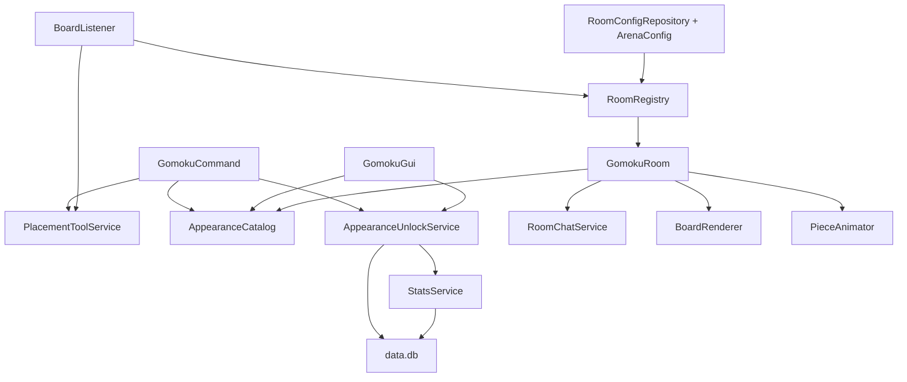
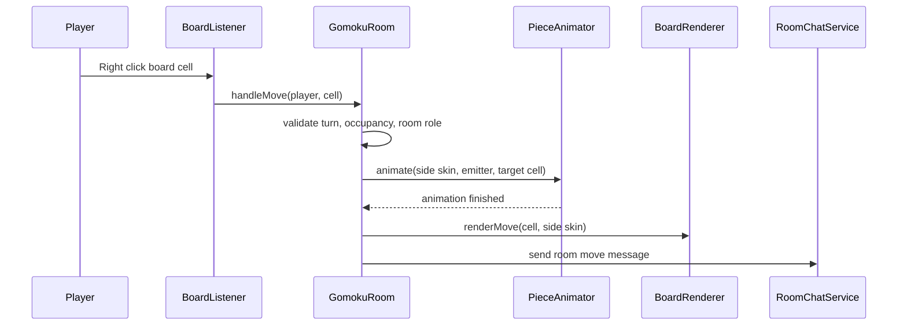

# feat: LeafGomoku v2 appearance and room-channel iteration

## Summary

把当前 `LeafGomoku` 多房间平台推进到 v2：删除大屏预览墙，改用可配置棋盘主题、玩家本局棋子皮肤、部分积分兑换、房间临时聊天频道，以及管理右键锚点创建房间。计划以现有多房间、GUI、统计、变量和权限层为基线，不重做已经完成的房间平台能力。

---

## Problem Frame

当前插件已经支持房间列表、加入、观战、管理创建/删除、统计、排行榜和变量查询，但仍保留了 MVP 时期的几个硬点：棋盘和棋子材料主要是房间固定配置，落子同时写实体棋盘和预览墙，房间事件全服广播，管理创建仍是命令式位置生成而不是右键锚点工具。

v2 的技术目标是把这些硬点拆成可维护层：棋盘主题目录、棋子皮肤目录、玩家解锁/选择状态、本局席位皮肤、房间聊天成员、无预览墙几何与保护边界、以及管理放置工具。每一层都要保持多房间隔离，不能因为一个房间或一个玩家的外观选择污染其他房间。

---

## Requirements

**Room and placement**

- R1. 普通玩家只能加入、观战、选择本局/下一局棋盘主题和自己的棋子皮肤；创建、删除、初始化、刷新、重置、释放仍由 `leafgomoku.admin.*` 权限控制。
- R2. 管理可以用右键锚点/放置工具按当前面朝方向创建房间，且该流程不消耗玩家物品、不读取手持方块作为材料。
- R3. 新房间默认棋盘底材使用 `STRIPPED_BIRCH_LOG` 与 `STRIPPED_SPRUCE_LOG` 搭配，并保留玻璃边界和安全地板。

**Preview removal**

- R4. v2 不再生成、同步或保护独立大屏预览墙；旧 `rooms.yml` 中的 `preview` 字段只能作为兼容遗留字段，不再是开局必需项。
- R5. 合法落子只写实体棋盘格，房间状态由 GUI、状态命令和变量层展示。

**Appearance and points**

- R6. 棋盘主题和棋子皮肤来自可配置目录，基础外观默认开放，高级外观可用五子棋积分兑换。
- R7. 玩家可以选择自己的棋子皮肤，选择资格来自默认开放或积分兑换解锁。
- R8. 同一局黑白双方不能使用相同棋子皮肤；开局后不得切换本局棋子皮肤。
- R9. 棋盘主题选择只作用于当前房间的准备中对局或下一局，不写入物理房间布局配置，且不得影响正在进行或展示结果的对局。

**Move placement**

- R10. 参赛玩家仍通过右键实体棋盘格落子，合法点击后从对应席位发射点把该玩家本局棋子皮肤发射到被点击格，并以服务端规则状态作为最终棋盘真相。
- R11. 非当前回合玩家、观众、非房间玩家、已占用格子和动画中的重复点击都不能触发发射或改变棋盘。

**Room channel and lifecycle**

- R12. 参赛玩家和观众进入房间后临时进入该房间聊天频道，离开、重置、自动释放、删除或插件关闭时恢复原聊天状态。
- R13. 房间系统消息和玩家聊天只发给同房间参赛玩家与观众，不再把每步落子刷到全服公共聊天。
- R14. 胜利、平局、判负、重置和删除必须清理本局皮肤、临时频道成员和房间运行态，同时继续保持统计、排行榜和变量查询正确。

**Data management**

- R15. `config.yml`/`rooms.yml` 只承载配置，`data.db` 承载玩家战绩、排行榜、历史对局、外观解锁和偏好，内存 Map 只承载正在进行的棋局。

---

## Key Technical Decisions

- KTD1. **先剥离预览墙，再接外观:** 预览墙当前深入 `ArenaConfig`、`BoardGeometry`、`BoardRenderer` 和测试。先让棋盘只渲染实体格，能显著减少后续主题/皮肤渲染分支。
- KTD2. **动态数据进入 `data.db`:** 玩家战绩、排行榜读模、历史对局、外观解锁和玩家外观偏好都属于会增长的业务数据，统一进入 `plugins/LeafGomoku/data.db`。`config.yml` 只放插件配置和外观目录，`rooms.yml` 保留房间布局这类服务器配置。
- KTD3. **本局席位皮肤快照:** 玩家偏好只决定入局默认值；开局时把黑白席位皮肤冻结到房间运行态。这样开局后切换偏好不会改变已落棋盘。
- KTD4. **棋子渲染按席位皮肤，不按 `Stone` 固定材料:** `Stone.BLACK/WHITE` 继续代表规则阵营，视觉材料由当前房间的黑/白席位皮肤解析。规则模型不承担外观状态。
- KTD5. **主题切换仅在非活跃局允许:** 房间处于 `OPEN` 或 `WAITING` 时可换主题；`PLAYING`、`ENDED`、`RESETTING` 时拒绝，避免棋盘中途混材。
- KTD6. **积分兑换消耗 `data.db` 中的五子棋积分:** `StatsService` 需要提供可测试的扣点能力；兑换记录和玩家偏好写入 `data.db`，防止房间删除或配置重载误删外观资格。
- KTD7. **房间频道优先用 Paper chat viewers:** 本地 Paper API 提供 `io.papermc.paper.event.player.AsyncChatEvent#viewers()`，计划通过修改 viewers 集合限制接收者；系统消息则走房间成员定向发送。
- KTD8. **右键锚点是管理工具，不是建筑材料:** 用命令发放或设置 pending placement，再监听管理右键选择锚点。工具只提供 room id 和放置动作，不把物品类型当棋盘主题。
- KTD9. **保持当前手写测试体系:** 当前插件用 `scripts/test-leaf-gomoku.sh` 编译并运行 `main` 测试类。v2 增量沿用这个体系，不在本轮引入 Gradle/Maven 迁移。
- KTD10. **SQLite 依赖必须显式打包:** `data.db` 意味着要引入 SQLite JDBC。当前构建脚本是手写 `javac` + `jar`，实施时必须决定把 `sqlite-jdbc` 打进插件包，或作为明确随包依赖复制到服务器插件 classpath，不能只在本机编译时存在。
- KTD11. **玩家选择不写 `rooms.yml`:** `rooms.yml` 是管理层物理布局配置，只由管理创建/删除/修房间时写入。普通玩家选择棋盘主题和棋子皮肤只进入内存中的当前对局快照，玩家默认偏好和解锁资格进入 `data.db`。

---

## High-Level Technical Design

落子仍保持旧手感：`BoardListener` 把右键格子映射到房间和格位，`GomokuRoom` 校验回合和席位，`PieceAnimator` 从席位发射点播放方块展示动画，动画结束后 `BoardRenderer` 写实体棋盘格。变化点是 `BoardRenderer` 不再写预览墙，且落地材料来自本局席位皮肤快照。

### Data Management Model

| Layer | File / Structure | Owns | Notes |
| --- | --- | --- | --- |
| Static plugin config | `plugins/LeafGomoku/config.yml` | 全局开关、默认主题、外观目录、动画参数、积分规则 | 管理员可编辑；不存玩家动态数据 |
| Room config | `plugins/LeafGomoku/rooms.yml` | 房间 id、棋盘锚点、朝向、席位、观众点、边界材料 | 管理层物理布局；普通玩家选择主题不写这里 |
| Persistent dynamic data | `plugins/LeafGomoku/data.db` | 玩家战绩、排行榜数据、历史对局、每步落子、外观解锁、玩家外观偏好、兑换记录 | 服务器运行时读写；迁移包不能覆盖目标服真实库 |
| Runtime state | `Map<String, GomokuRoom>` and room-local maps | 正在进行的棋局、棋盘状态、席位租约、本局棋盘主题、本局皮肤快照、房间频道成员 | 重启后可重置；不作为未完成棋局的历史真相 |
| Derived views | `VariableService` and GUI render data | 房间状态、排行展示、玩家统计展示 | 从内存房间和 `data.db` 读取，不单独持久化 |
 
`data.db` 是 v2 之后的长期动态数据源。排行榜从玩家统计表实时排序，必要时后续再加缓存表。历史对局以 `match_history` 和 `match_moves` 为真相，保证以后要查争议、展示棋谱或做复盘时，不会只剩累计数字。

---

## Implementation Units

### U1. Remove preview wall from geometry, rendering, and protection

- **Goal:** 让 v2 房间不再需要大屏预览墙，同时兼容旧配置文件中已有的 `preview` 字段。
- **Origin coverage:** origin R14, R15, R16, R17, AE9.
- **Files:** `src/LeafGomoku/src/main/java/net/leafmc/gomoku/ArenaConfig.java`, `src/LeafGomoku/src/main/java/net/leafmc/gomoku/BoardGeometry.java`, `src/LeafGomoku/src/main/java/net/leafmc/gomoku/BoardRenderer.java`, `src/LeafGomoku/src/main/java/net/leafmc/gomoku/RoomLayoutFactory.java`, `src/LeafGomoku/src/main/resources/config.yml`, `plugins/LeafGomoku/rooms.yml`, `src/LeafGomoku/src/test/java/net/leafmc/gomoku/BoardGeometryTest.java`, `src/LeafGomoku/src/test/java/net/leafmc/gomoku/RoomLayoutFactoryTest.java`.
- **Approach:** 从运行时几何中移除预览点参与渲染和保护。`ArenaConfig.load` 可以继续容忍旧 `preview` 字段存在，但 `save` 新房间时不再写预览配置。`BoardRenderer.renderEmpty`、`renderBoard`、`renderMove` 只写实体棋盘。`RoomLayoutFactory` 不再计算预览墙偏移。
- **Patterns to follow:** 继续使用 `ArenaConfig.disabled(...)` 的 fail-closed 解析方式；继续让 `BoardGeometry.mapBoardCell(...)` 作为点击映射唯一入口。
- **Test scenarios:**
  - 没有 `preview` 字段的新房间配置可以成功加载。
  - 旧 `rooms.yml` 带 `preview` 字段时仍可加载，但刷新和落子不再写预览墙。
  - `BoardGeometry.protects(...)` 保护棋盘、房间玻璃边界和地板，不再保护预览墙坐标。
  - `/gomoku admin create <room>` 生成的新房间保存文件不包含预览区域。
- **Verification:** `scripts/test-leaf-gomoku.sh` 通过；本地服重启后 `/gomoku admin init testroom` 不生成预览墙。

### U2. Add appearance catalog for board themes and piece skins

- **Goal:** 提供默认开放和可兑换外观目录，替代单个 `materials.empty-board`、`materials.black`、`materials.white` 的硬编码口径。
- **Origin coverage:** origin R10, R11, R18, R23, R24, R26, R27, R28, R30, AE2.
- **Files:** `src/LeafGomoku/src/main/java/net/leafmc/gomoku/AppearanceCatalog.java`, `src/LeafGomoku/src/main/java/net/leafmc/gomoku/BoardTheme.java`, `src/LeafGomoku/src/main/java/net/leafmc/gomoku/PieceSkin.java`, `src/LeafGomoku/src/main/java/net/leafmc/gomoku/ArenaConfig.java`, `src/LeafGomoku/src/main/resources/config.yml`, `src/LeafGomoku/src/test/java/net/leafmc/gomoku/AppearanceCatalogTest.java`.
- **Approach:** 在 `config.yml` 增加外观目录。默认主题使用 `STRIPPED_BIRCH_LOG` 与 `STRIPPED_SPRUCE_LOG` 作为棋盘格底材，并支持按格位交错渲染。棋子皮肤至少提供黑/白默认可读材料。目录项包含 id、展示名、材料、是否默认开放、兑换积分。
- **Patterns to follow:** 复用 `ArenaConfig.material(...)` 的材料解析思路，但把未知材料错误限制在对应外观项，不让整插件因一个高级皮肤配置错而失效。
- **Test scenarios:**
  - 默认配置加载后存在基础棋盘主题和基础棋子皮肤。
  - 默认棋盘主题按行列交错返回 `STRIPPED_BIRCH_LOG` 与 `STRIPPED_SPRUCE_LOG`。
  - 未知材料的外观项被禁用或跳过，并产生日志警告。
  - 高级主题和高级皮肤带有兑换积分，默认开放外观不需要积分。
- **Verification:** `scripts/test-leaf-gomoku.sh` 通过；`/gomoku admin init main` 能用默认主题渲染棋盘底。

### U3. Introduce data.db for stats, history, unlocks, and point spending

- **Goal:** 用 `data.db` 承载玩家战绩、排行榜、历史对局、外观解锁、玩家偏好和积分兑换，替代当前 `stats.yml` 作为长期动态数据源。
- **Origin coverage:** plan R15; origin R24, R25, R27, R30, R41, R50.
- **Files:** `src/LeafGomoku/src/main/java/net/leafmc/gomoku/DataStore.java`, `src/LeafGomoku/src/main/java/net/leafmc/gomoku/SqliteDataStore.java`, `src/LeafGomoku/src/main/java/net/leafmc/gomoku/AppearanceUnlockService.java`, `src/LeafGomoku/src/main/java/net/leafmc/gomoku/PlayerAppearanceState.java`, `src/LeafGomoku/src/main/java/net/leafmc/gomoku/MatchHistoryService.java`, `src/LeafGomoku/src/main/java/net/leafmc/gomoku/StatsService.java`, `src/LeafGomoku/src/main/java/net/leafmc/gomoku/PlayerStats.java`, `scripts/build-leaf-gomoku.sh`, `scripts/test-leaf-gomoku.sh`, `src/LeafGomoku/src/test/java/net/leafmc/gomoku/SqliteDataStoreTest.java`, `src/LeafGomoku/src/test/java/net/leafmc/gomoku/AppearanceUnlockServiceTest.java`, `src/LeafGomoku/src/test/java/net/leafmc/gomoku/StatsServiceTest.java`.
- **Approach:** 新增 SQLite-backed `DataStore`，启动时创建或迁移表：`players`、`match_history`、`match_moves`、`appearance_unlocks`、`appearance_preferences`、`point_ledger`。`StatsService` 从 `data.db` 读写累计统计和排行榜；每局正常结束写一条历史对局和每步落子，再更新玩家统计。`AppearanceUnlockService` 通过 `trySpendPoints(playerId, cost)` 原子扣点后写解锁和流水。保留一次性 `stats.yml` 迁移路径，避免已有测试数据丢失。
- **Patterns to follow:** 保持 `StatsService.record(...)` “只消费 scored match”的语义；数据库写入通过服务方法封装，不让 GUI、命令或房间运行态直接拼 SQL。
- **Test scenarios:**
  - 首次启动创建 `data.db` 和所有必需表。
  - 已有 `stats.yml` 可迁移进 `data.db`，迁移后排行榜数据一致。
  - 正常胜负和平局写入 `match_history` 和 `match_moves`，并只更新一次玩家累计统计。
  - 积分足够时兑换成功、扣除积分、写入解锁和积分流水。
  - 积分不足时兑换失败，积分、解锁和流水不变化。
  - 默认开放皮肤无需兑换即可选择。
  - 重载服务后已兑换皮肤和玩家偏好仍存在。
  - 重置玩家统计不会误删外观解锁，除非后续明确增加外观管理命令。
- **Verification:** `scripts/test-leaf-gomoku.sh` 通过；`/gomoku stats <player>` 能看到兑换后的积分减少。

### U4. Snapshot room theme and per-seat piece skins into match runtime

- **Goal:** 把玩家选择的棋子皮肤应用到旧的“右键格子 -> 发射到对应位置 -> 落地写方块”流程里。
- **Origin coverage:** origin R18, R19, R20, R21, R22, R26, R27, R28, R29, R30, R31, R32, AE3, AE4, AE5, AE8.
- **Files:** `src/LeafGomoku/src/main/java/net/leafmc/gomoku/GomokuRoom.java`, `src/LeafGomoku/src/main/java/net/leafmc/gomoku/MatchAppearance.java`, `src/LeafGomoku/src/main/java/net/leafmc/gomoku/PieceAnimator.java`, `src/LeafGomoku/src/main/java/net/leafmc/gomoku/BoardRenderer.java`, `src/LeafGomoku/src/main/java/net/leafmc/gomoku/MatchController.java`, `src/LeafGomoku/src/test/java/net/leafmc/gomoku/MatchAppearanceTest.java`, `src/LeafGomoku/src/test/java/net/leafmc/gomoku/MatchControllerTest.java`.
- **Approach:** `Stone` 继续表示规则阵营；新增 `MatchAppearance` 存储当前房间主题和黑/白席位皮肤。玩家加入或开局前选择皮肤时，房间校验黑白不同；开局后冻结。`PieceAnimator.animate(...)` 接收具体 `Material`，`BoardRenderer.renderMove(...)` 根据 `MatchAppearance` 写目标格。动画失败时仍执行最终写格回调。
- **Patterns to follow:** 保留现有 `moveInProgress` 防重复点击；保留 `MatchController.play(...)` 的规则纯度，不把视觉材料塞进棋盘规则数组。
- **Test scenarios:**
  - 黑方选择 A 皮肤、白方选择 B 皮肤后，黑方合法落子写 A，白方合法落子写 B。
  - 白方尝试选择黑方已占用皮肤时被拒绝。
  - 开局后玩家切换偏好不影响本局已冻结皮肤。
  - 非当前回合、观众、非参赛玩家和已占用格子不会触发动画或写格。
  - 动画提前失败仍调用最终落地写格逻辑。
- **Verification:** `scripts/test-leaf-gomoku.sh` 通过；本地服两账号落子能看到双方不同方块皮肤。

### U5. Extend GUI and commands for theme, skin, and exchange

- **Goal:** 让普通玩家从五子棋 GUI 完成换主题、换棋子皮肤和积分兑换，不需要记复杂命令。
- **Origin coverage:** origin R1, R2, R3, R4, R18, R21, R24, R25, R33, R34, R35, R36, R37.
- **Files:** `src/LeafGomoku/src/main/java/net/leafmc/gomoku/GomokuGui.java`, `src/LeafGomoku/src/main/java/net/leafmc/gomoku/GomokuCommand.java`, `src/LeafGomoku/src/main/java/net/leafmc/gomoku/GomokuPermission.java`, `src/LeafGomoku/src/main/resources/plugin.yml`, `src/LeafGomoku/src/main/java/net/leafmc/gomoku/VariableService.java`.
- **Approach:** 在房间详情页新增 `棋盘主题`、`棋子皮肤`、`外观兑换` 入口。命令层提供轻量后备命令，GUI 操作仍通过命令或服务校验，不绕过权限。主题切换仅允许房间非活跃时执行；皮肤选择可设置玩家偏好，但本局冻结后拒绝修改。
- **Patterns to follow:** 复用现有 `GomokuGui.MenuHolder` 和 `GuiAction` 方式做分页菜单；继续让 GUI 执行命令或调用同一服务路径，避免 GUI 和命令产生两套规则。
- **Test scenarios:**
  - 默认玩家能打开外观菜单并选择免费皮肤。
  - 未兑换高级皮肤时，选择按钮显示价格并拒绝直接使用。
  - 积分足够时兑换按钮扣点并解锁皮肤。
  - 房间 `PLAYING` 或 `ENDED` 时主题切换按钮拒绝操作。
  - 普通玩家切换主题只影响准备中对局或下一局，不写 `rooms.yml`。
  - 没有 `leafgomoku.admin.*` 的玩家看不到或不能触发管理创建/删除/刷新动作。
- **Verification:** `scripts/test-leaf-gomoku.sh` 编译通过；本地服打开 `/menugomoku`，房间详情能进入外观菜单。

### U6. Add room-scoped chat channel service

- **Goal:** 玩家和观众进入房间后临时进入房间频道，系统播报和玩家聊天都只在同房间成员内传播。
- **Origin coverage:** origin R6, R31, R32, R33, R34, R35, R36, R37, AE4, AE5, AE6, AE7, AE10.
- **Files:** `src/LeafGomoku/src/main/java/net/leafmc/gomoku/RoomChatService.java`, `src/LeafGomoku/src/main/java/net/leafmc/gomoku/BoardListener.java`, `src/LeafGomoku/src/main/java/net/leafmc/gomoku/GomokuRoom.java`, `src/LeafGomoku/src/main/java/net/leafmc/gomoku/RoomRegistry.java`, `src/LeafGomoku/src/main/java/net/leafmc/gomoku/LeafGomokuPlugin.java`, `src/LeafGomoku/src/test/java/net/leafmc/gomoku/RoomChatServiceTest.java`.
- **Approach:** `RoomChatService` 维护 `playerId -> roomId` 映射和房间成员集合。加入参赛、观战时 enter；离开、重置、删除、自动释放、插件关闭时 leave/clear。系统消息替换当前 `Bukkit.broadcastMessage(...)`，改为对房间成员定向发送。玩家聊天通过 `AsyncChatEvent#viewers()` 收窄接收者。
- **Patterns to follow:** 继续由 `RoomRegistry` 提供“玩家在哪个房间”的单一事实；聊天服务只负责通道成员和消息路由，不修改棋局状态。
- **Test scenarios:**
  - A 房间玩家聊天只发送给 A 房间参赛者和观众。
  - B 房间玩家和公共玩家不收到 A 房间落子播报。
  - 观众进入房间后能收到房间系统消息，但点击棋盘仍被拒绝。
  - 玩家离开、房间重置、房间删除和插件关闭都会移除频道成员。
  - 断线玩家恢复时不重复加入多个频道。
- **Verification:** `scripts/test-leaf-gomoku.sh` 编译通过；本地服用两个房间验证聊天不串房。

### U7. Add admin placement tool for right-click room creation

- **Goal:** 把“从当前位置创建房间”升级成管理右键锚点放置，不需要摆实际材料，也不读取玩家手持方块。
- **Origin coverage:** origin R5, R7, R8, R9, R10, R12, R13, AE1.
- **Files:** `src/LeafGomoku/src/main/java/net/leafmc/gomoku/PlacementToolService.java`, `src/LeafGomoku/src/main/java/net/leafmc/gomoku/BoardListener.java`, `src/LeafGomoku/src/main/java/net/leafmc/gomoku/GomokuCommand.java`, `src/LeafGomoku/src/main/java/net/leafmc/gomoku/LeafGomokuPlugin.java`, `src/LeafGomoku/src/main/java/net/leafmc/gomoku/RoomLayoutFactory.java`, `src/LeafGomoku/src/test/java/net/leafmc/gomoku/RoomLayoutFactoryTest.java`.
- **Approach:** 新增管理命令，例如设置一个 pending room id 或发放一个带元数据的放置工具。管理右键目标方块时，使用被点击位置作为房间锚点，使用管理玩家面朝方向作为棋盘正面，调用现有 `RoomLayoutFactory.create(...)`。如果目标房间 id 已存在或权限不足，拒绝且不改变世界。
- **Patterns to follow:** 保留 `/gomoku admin create <room>` 作为兼容后备；新的右键流程复用 `createRoom` 的校验和 `RoomLayoutFactory` 的朝向计算。
- **Test scenarios:**
  - 南、东、西、北四个朝向生成的行列方向符合玩家面朝方向。
  - 右键放置工具不消耗物品，不把工具材料写进主题配置。
  - 房间 id 重复时拒绝创建。
  - 非管理玩家右键工具不会创建房间。
  - 创建后的房间可在 GUI 列表出现并可初始化。
- **Verification:** `scripts/test-leaf-gomoku.sh` 通过；本地服管理右键锚点后 `rooms.yml` 增加新房间。

### U8. Update operations, smoke tests, and migration package notes

- **Goal:** 让服务器迁移和测试步骤覆盖 v2 新行为，避免上线时还按大屏预览墙和全服播报验收。
- **Origin coverage:** origin R38, R39, R40, R41, R42, R43, R44, R45, R46, R47, R48, R49, R50, AE7, AE9, AE10, AE11.
- **Files:** `docs/operations/gomoku/2026-06-10-runtime-smoke-test.md`, `src/LeafGomoku/src/main/resources/config.yml`, `plugins/LeafGomoku/config.yml`, `plugins/LeafGomoku/rooms.yml`, `scripts/build-leaf-gomoku.sh`, `scripts/test-leaf-gomoku.sh`, `copy/leafgomoku-gui-platform-20260610-2028/README.md`.
- **Approach:** 更新 smoke test：删除预览墙断言，新增默认棋盘主题、皮肤选择、积分兑换、房间频道、右键锚点、胜利清理和删除清理验收。构建脚本只在需要时补新依赖；优先沿用当前 Paper API 与 PlaceholderAPI 软依赖方式。
- **Patterns to follow:** 当前 `docs/operations/gomoku/2026-06-10-runtime-smoke-test.md` 已按实际服务器命令组织，继续保持 copy-ready 运维风格。
- **Test scenarios:**
  - `scripts/test-leaf-gomoku.sh` 包含新增测试类并全部通过。
  - `scripts/build-leaf-gomoku.sh` 产出 `plugins/LeafGomoku-0.1.0.jar`。
  - 本地服启动后，GUI、房间创建、落子、聊天频道、胜利烟花和自动释放通过手工 smoke test。
  - copy 包 README 明确不要覆盖目标服真实 `data.db`，除非这是一次有备份的迁移。
- **Verification:** 本地构建、单元测试和服务器 smoke test 都通过后再打迁移包。

---

## System-Wide Impact

- **Config compatibility:** 旧房间配置里的 `preview` 字段要兼容读取，但新保存不再写入。目标服升级前应备份 `plugins/LeafGomoku/config.yml`、`plugins/LeafGomoku/rooms.yml` 和 `plugins/LeafGomoku/data.db`。
- **Database migration:** 当前 `stats.yml` 需要一次性迁移到 `data.db`。迁移成功后可以保留旧文件作备份，但运行时读写以 `data.db` 为准。
- **Room config ownership:** `rooms.yml` 只由管理流程维护。普通玩家换主题和换皮肤不能改物理房间配置，否则会产生跨房间污染和难以追踪的配置漂移。
- **Stats semantics:** 积分兑换会消耗 `data.db` 里的五子棋积分，排行榜会反映扣点后的当前积分。胜负统计仍由正常对局结果写入，不由兑换或主题切换写入。
- **Chat behavior:** 房间成员发言被临时收束到房间频道，这会改变玩家在房间内的公共聊天可见性。离开和清理路径必须可靠，否则会出现玩家“卡在房间频道”的问题。
- **Room footprint:** 删除预览墙会缩小保护范围和布局占用；已有服务器上的旧预览墙方块不会自动判断是否该拆，实施时需要决定是否在 `init/refresh` 中清理旧预览区域或只停止维护它。

---

## Risks and Dependencies

- **External chat plugin interception:** 当前计划基于 Paper `AsyncChatEvent#viewers()`。如果服务器聊天插件更早取消或重写聊天，房间频道可能需要兼容层或优先级调整。
- **SQLite packaging:** `sqlite-jdbc` 不能只存在于构建机缓存里。迁移包必须包含运行时可加载的依赖，或者插件 jar 必须完成打包验证。
- **Point spending disputes:** 积分既是排行榜指标又是兑换货币时，玩家名次会因兑换下降。这符合“积分兑换”的直觉，但上线文案要明确。
- **Appearance readability:** Minecraft 方块很多，部分皮肤可能颜色接近或纹理不清。配置目录应先收窄允许列表，不要让所有材料都可选。
- **Preview wall cleanup:** 旧房间已经生成的预览墙如果不清理，会残留在世界里；如果自动清理，必须避免误删玩家后续改造过的建筑。计划默认停止生成和保护，是否自动拆旧墙留到执行时谨慎处理。
- **Async chat thread safety:** `AsyncChatEvent` 可能异步触发。聊天服务查询成员集合需要使用线程安全快照，不能在异步事件里直接改 Bukkit 世界或玩家状态。

---

## Acceptance Examples

- AE1. Given 管理设置待创建房间 id 并右键锚点，When 管理面朝南方，Then 新房间按南向生成，且工具物品不被消耗。
- AE2. Given v2 默认配置，When 管理初始化新房间，Then 15x15 棋盘使用去皮白桦原木和去皮云杉原木搭配，不生成大屏预览墙。
- AE3. Given 玩家 A 已选择某棋子皮肤，When 玩家 B 在同一局选择相同皮肤，Then 系统拒绝并提示更换。
- AE4. Given 黑方回合且黑方皮肤为 A，When 黑方右键点击空格，Then 发射点发射 A 皮肤棋子并把目标格写为 A。
- AE5. Given 白方或观众点击棋盘空格，When 当前不是合法落子，Then 不发射棋子，不改变棋盘。
- AE6. Given 玩家在 A 房间参赛或观战，When 该玩家聊天，Then 只有 A 房间参赛者和观众收到消息。
- AE7. Given A 房间和 B 房间同时进行，When A 房间发生落子播报，Then B 房间和公共玩家不收到播报。
- AE8. Given 对局已开始，When 玩家切换自己的默认皮肤，Then 本局棋盘和后续本局落子仍使用开局冻结的皮肤。
- AE9. Given 对局胜利，When 自动释放完成，Then 棋盘、席位、观众、房间频道和本局皮肤状态都被清理，统计只写一次。
- AE10. Given 管理删除房间，When 删除完成，Then GUI 不再展示该房间，房间频道成员全部恢复普通聊天状态。
- AE11. Given 服务器重启，When 插件重新加载，Then 未完成棋局从内存消失，但 `data.db` 中的玩家战绩、历史对局和外观解锁仍可查询。
- AE12. Given 普通玩家在房间准备阶段切换棋盘主题，When 主题生效，Then 当前准备中对局使用该主题，但 `rooms.yml` 不发生变化。

---

## Sources and Research

- `docs/brainstorms/2026-06-10-gomoku-v2-iteration-requirements.md` — v2 需求来源。
- `docs/plans/2026-06-10-002-feat-gomoku-room-platform-plan.md` — 已实现的多房间、权限、统计和变量平台计划基线。
- `docs/operations/gomoku/2026-06-10-runtime-smoke-test.md` — 当前运行验收步骤，需要按 v2 更新。
- `src/LeafGomoku/src/main/java/net/leafmc/gomoku/BoardListener.java` — 当前右键格子落子和保护入口。
- `src/LeafGomoku/src/main/java/net/leafmc/gomoku/GomokuRoom.java` — 当前加入、观战、落子、广播、胜利和重置运行态。
- `src/LeafGomoku/src/main/java/net/leafmc/gomoku/BoardRenderer.java` — 当前同时写实体棋盘和预览墙的渲染入口。
- `src/LeafGomoku/src/main/java/net/leafmc/gomoku/PieceAnimator.java` — 当前固定黑白材料的棋子发射动画。
- `src/LeafGomoku/src/main/java/net/leafmc/gomoku/ArenaConfig.java` — 当前房间材料、预览墙和生命周期配置模型。
- `src/LeafGomoku/src/main/java/net/leafmc/gomoku/GomokuGui.java` — 当前大厅和房间详情 GUI 扩展点。
- `src/LeafGomoku/src/main/java/net/leafmc/gomoku/StatsService.java` — 当前五子棋积分与排行榜持久化，v2 迁移到 `data.db`。
- `scripts/test-leaf-gomoku.sh` — 当前手写 Java 测试运行入口。
- `cache/paper-api-1.21.11-R0.1-SNAPSHOT.jar` — 本地 Paper API，确认存在 `AsyncChatEvent#viewers()` 可用于房间频道收件人限制。
