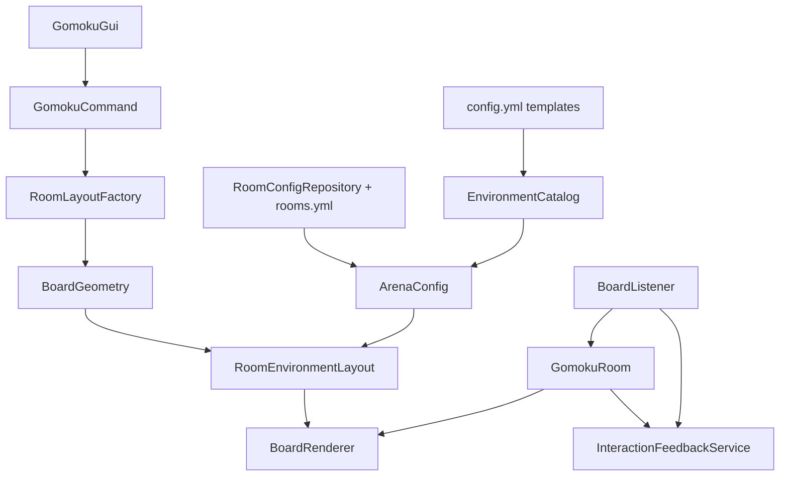

# feat: LeafGomoku environment templates and interaction polish

## Summary

把 `LeafGomoku` 的生成房间从固定矩形地板和玻璃边框，升级成可配置的环境模板系统。模板负责房间壳层、入口、座位、观众区、灯光、装饰和默认反馈 profile；玩家交互增强则集中在服务端可控的 actionbar、粒子、音效、临时高亮和观众提示，不依赖客户端 mod。

本计划是 v2 后续增强，不重写 `docs/plans/2026-06-10-003-feat-gomoku-v2-iteration-plan.md`。范围锁定在用户选择的“模板主题档”方案，不引入 schematic 导入、WorldEdit 依赖或完整游戏内编辑器。

---

## Problem Frame

当前房间生成链路已经能按管理锚点和朝向生成可玩的棋盘区域，但视觉上仍像调试场地：`BoardGeometry` 写死房间范围，`BoardRenderer` 只铺 `floorMaterial` 和 `frameMaterial`，`ArenaConfig` 只保存少量材料字段。管理员想 DIY 棋盘环境时，只能改两种材质，无法表达入口、灯笼、花坛、观众席、边界层次和主题氛围。

玩家交互也偏“能下棋但不够有手感”。`GomokuRoom` 已有加入标题、轮到你标题、落子广播、落子动画和胜利烟花；`BoardListener` 能把右键棋盘格映射成落子。但系统还缺少持续回合提示、非法点击反馈、目标格反馈、观众状态提示、自动重置倒计时和更清晰的胜利线呈现。Minecraft 服务端没有可靠的“鼠标悬停方块事件”，所以本轮不做真正 hover 预览，改做点击前后和状态变化上的反馈增强。

---

## Requirements

**Environment templates**

- R1. 房间环境模板必须独立于现有 `BoardTheme` 和 `PieceSkin`；棋盘格材质、棋子外观和房间壳层不能互相污染。
- R2. 插件必须内置至少 3 个可直接使用的环境模板，例如 `classic`, `garden`, `dojo`，保证管理员不写配置也能生成比默认矩形更完整的房间。
- R3. `config.yml` 必须允许管理员新增或覆盖环境模板，配置内容覆盖地板、边界、入口、灯光、装饰、座位/观众区材料和交互反馈 profile。
- R4. `rooms.yml` 中每个房间必须保存当前 `environment-template` id；旧房间缺失该字段时回退到默认模板。
- R5. 管理创建房间时必须能指定模板，且右键锚点生成仍按玩家面朝方向确定棋盘正面。
- R6. 非活跃房间必须允许切换模板并重新渲染环境；正在对局或展示结果的房间默认拒绝切换，除非管理先重置或使用明确 force 流程。
- R7. 删除、清理、刷新房间必须覆盖模板生成的所有装饰块和模板实体，不能只清理原来的地板、边框和棋子层。
- R8. 模板保护范围必须包含模板生成块、棋盘格、棋子层、发射点和座位/观众区域，避免玩家破坏或放置污染房间。

**Player interaction**

- R9. 当前回合玩家必须获得持续但不刷屏的提示，优先使用 actionbar 或 bossbar，标题只用于开局、胜利和重要状态变化。
- R10. 合法点击空格时，目标格必须有即时反馈，例如粒子脉冲、点击音效或临时高亮，再进入现有落子动画。
- R11. 非当前回合、观众、非参赛玩家、已占用格和动画中重复点击必须有轻量拒绝反馈，例如红色粒子、低音提示和短 actionbar，不改变棋局状态。
- R12. 落子完成后，下一回合提示必须同时更新参赛玩家和观众可见信息。
- R13. 胜利线必须比当前棋子退场动画更可读，至少在胜利展示阶段给五连格增加粒子路径或临时高亮。
- R14. 自动重置等待期必须给房间成员可见倒计时，避免玩家不知道棋盘何时释放。
- R15. 所有交互反馈必须可配置开关和强度，低性能服务器可以关闭高频粒子或 bossbar。

**Operations and compatibility**

- R16. 新模板配置错误不能让整个插件不可用；单个模板材料或实体解析失败时跳过该模板或回退默认模板并记录日志。
- R17. 环境模板渲染必须有明确的 block budget，避免管理员配置过大的装饰列表导致一次刷新卡服。
- R18. 测试和 smoke test 必须覆盖旧房间迁移、模板切换、清理保护、非法点击反馈和胜利展示。

---

## Key Technical Decisions

- KTD1. **Room environment template is a third appearance layer:** `BoardTheme` 继续只管 15x15 棋盘格，`PieceSkin` 继续只管棋子表现，新增 `RoomEnvironmentTemplate` 只管棋盘外的房间环境和交互 profile。这个边界能避免玩家换棋盘主题时意外重刷整个房间。
- KTD2. **Use built-in templates plus config extension:** 先做“模板主题档”，不做 schematic 导入和完整编辑器。模板用相对棋盘坐标描述结构，管理员可以通过 YAML 扩展，插件内置模板保证开箱可用。
- KTD3. **Keep geometry deterministic and anchor-relative:** 模板元素都从 `BoardGeometry.boardPoint(row, column)` 和行/列方向派生，继续沿用 `RoomLayoutFactory` 的锚点和朝向模型。这样同一个模板可以朝东、南、西、北生成，不需要为每个朝向写一份配置。
- KTD4. **Renderer owns environment blocks, room rules ignore them:** `BoardRenderer` 或新的环境渲染协作者负责模板 block layers、装饰实体和清理清单；`GomokuBoard`、`MatchController` 和胜负规则不感知环境模板。
- KTD5. **Feedback is server-side only:** 交互增强使用 Bukkit/Paper 可控的粒子、声音、actionbar、bossbar 和临时方块高亮，不依赖资源包、客户端 mod 或玩家手持物。
- KTD6. **Template changes are lifecycle-gated:** 房间 `OPEN` 和 `READY` 状态可以切换模板；`PLAYING` 和 `ENDED` 默认拒绝。需要强制切换时先走管理重置，避免环境重刷覆盖棋子或打断动画。
- KTD7. **Cleanup is allowlisted by generated points:** 模板渲染必须记录或可重算所有生成点，只清理模板范围内由插件生成的块和实体。不要用大范围立方体清空，避免误删相邻建筑。
- KTD8. **Interaction polish is additive:** 本轮提升手感，不改变五子棋规则，不加入悔棋、读秒、AI、复盘、禁手或玩家自建房。

---

## High-Level Technical Design



模板解析从 `config.yml` 进入 `EnvironmentCatalog`，每个房间在 `ArenaConfig` 保存模板 id。渲染时用 `BoardGeometry` 将模板相对坐标转换成世界坐标，`BoardRenderer` 先渲染环境层，再渲染棋盘格和棋子层。交互反馈从 `GomokuRoom.handleMove(...)` 和 `BoardListener` 的拒绝路径触发，避免 GUI、命令和规则层重复实现效果。

模板配置建议使用相对棋盘坐标，而不是绝对世界坐标：

```yaml
environment-templates:
  garden:
    display-name: "竹林棋亭"
    floor:
      default: "MOSS_BLOCK"
      accents:
        - row-min: -2
          row-max: 16
          column-min: 7
          column-max: 7
          material: "POLISHED_ANDESITE"
    frame:
      material: "OAK_FENCE"
      height: 2
    decor:
      - type: "block"
        row: -5
        column: -2
        y-offset: 1
        material: "LANTERN"
      - type: "column"
        row: -4
        column: -3
        height: 3
        material: "BAMBOO_BLOCK"
    feedback-profile: "soft"
```

这个 YAML 只是方向性配置形状，实施时应按 Bukkit 材料可放置性和清理安全性收紧字段。

---

## Implementation Units

### U1. Add environment template catalog and room config field

- **Goal:** 建立房间环境模板的数据模型、默认模板、配置加载和房间持久化字段。
- **Files:** `src/LeafGomoku/src/main/java/net/leafmc/gomoku/RoomEnvironmentTemplate.java`, `src/LeafGomoku/src/main/java/net/leafmc/gomoku/EnvironmentCatalog.java`, `src/LeafGomoku/src/main/java/net/leafmc/gomoku/EnvironmentFeedbackProfile.java`, `src/LeafGomoku/src/main/java/net/leafmc/gomoku/ArenaConfig.java`, `src/LeafGomoku/src/main/java/net/leafmc/gomoku/RoomConfigRepository.java`, `src/LeafGomoku/src/main/java/net/leafmc/gomoku/LeafGomokuPlugin.java`, `src/LeafGomoku/src/main/resources/config.yml`, `src/LeafGomoku/src/test/java/net/leafmc/gomoku/EnvironmentCatalogTest.java`, `src/LeafGomoku/src/test/java/net/leafmc/gomoku/ArenaConfigTest.java`.
- **Approach:** `EnvironmentCatalog` 模仿 `AppearanceCatalog` 的目录加载方式，但未知材料只跳过对应模板项。`ArenaConfig` 增加 `environmentTemplateId`，保存到 `rooms.yml`。旧房间缺字段时使用 `classic`。内置模板至少包含经典、竹林、道场三类，默认模板尽量复用现有 `SMOOTH_STONE`/`GLASS` 以兼容旧观感。
- **Patterns to follow:** 复用 `AppearanceCatalog.normalizeId(...)` 的 id 规范；继续使用 `ArenaConfig.disabled(...)` 的 fail-closed 口径处理必需房间字段，但环境模板缺失只回退默认模板。
- **Test scenarios:**
  - 默认配置不写 `environment-templates` 时仍加载 3 个内置模板。
  - 配置新增模板可以覆盖内置同 id 模板。
  - 模板引用未知 `Material` 时跳过该模板并记录警告，不禁用所有房间。
  - 旧 `rooms.yml` 没有 `environment-template` 字段时加载为 `classic`。
  - 保存房间时写入 `environment-template` 字段。
- **Verification:** `scripts/test-leaf-gomoku.sh` 通过；`/gomoku admin inspect <room>` 能显示当前环境模板 id。

### U2. Extend geometry for template shell, decor, and protection

- **Goal:** 从固定矩形地板/玻璃边框扩展成可由模板描述的地板层、边界层、入口、座位/观众区和装饰点。
- **Files:** `src/LeafGomoku/src/main/java/net/leafmc/gomoku/BoardGeometry.java`, `src/LeafGomoku/src/main/java/net/leafmc/gomoku/RoomEnvironmentLayout.java`, `src/LeafGomoku/src/main/java/net/leafmc/gomoku/EnvironmentElement.java`, `src/LeafGomoku/src/main/java/net/leafmc/gomoku/RoomLayoutFactory.java`, `src/LeafGomoku/src/main/java/net/leafmc/gomoku/RoomRegistry.java`, `src/LeafGomoku/src/test/java/net/leafmc/gomoku/RoomEnvironmentLayoutTest.java`, `src/LeafGomoku/src/test/java/net/leafmc/gomoku/BoardGeometryTest.java`, `src/LeafGomoku/src/test/java/net/leafmc/gomoku/RoomLayoutFactoryTest.java`.
- **Approach:** 保留 `BoardGeometry.boardPoint(...)`、`piecePoint(...)` 和点击映射语义，新增 `RoomEnvironmentLayout` 负责把模板相对元素转换为 `BlockPoint` 列表。`BoardGeometry.protects(...)` 增加模板生成点保护，或由 `RoomRegistry` 合并棋盘保护点和环境保护点。入口区域可以在模板中定义为边界缺口，而不是硬编码玻璃全闭合。
- **Patterns to follow:** 当前 `roomFloorPoints()` 和 `roomFramePoints()` 是可重算清单；模板布局也应可重算，避免只靠运行时缓存导致重启后无法清理。
- **Test scenarios:**
  - 同一模板在四个朝向生成时，入口始终位于棋盘正面。
  - 模板地板、边界、装饰点不会覆盖 15x15 棋盘格和棋子层，除非该元素明确是棋盘下方地板。
  - 观众区和座位区域进入保护范围。
  - 模板 block budget 超限时加载或渲染被拒绝，并给出清晰错误。
  - 删除房间后重算布局能找到所有模板生成点。
- **Verification:** `scripts/test-leaf-gomoku.sh` 通过；临时打印或 inspect 输出能看到模板生成点数量。

### U3. Render and clear environment templates safely

- **Goal:** 让房间初始化、刷新、重置、删除都正确处理环境模板，不留下装饰残留，也不覆盖正在进行的棋子层。
- **Files:** `src/LeafGomoku/src/main/java/net/leafmc/gomoku/BoardRenderer.java`, `src/LeafGomoku/src/main/java/net/leafmc/gomoku/EnvironmentRenderer.java`, `src/LeafGomoku/src/main/java/net/leafmc/gomoku/GomokuEntityTags.java`, `src/LeafGomoku/src/main/java/net/leafmc/gomoku/GomokuRoom.java`, `src/LeafGomoku/src/test/java/net/leafmc/gomoku/EnvironmentRendererTest.java`, `src/LeafGomoku/src/test/java/net/leafmc/gomoku/BoardRendererTest.java`.
- **Approach:** 从 `BoardRenderer.renderRoomFloor()` 和 `renderRoomFrame()` 抽出环境渲染协作者。渲染顺序固定为环境地板、边界/装饰、棋盘主题、棋子层。清理顺序反过来，先取消动画和实体，再清模板实体、装饰块、边界和地板。模板装饰如果需要实体展示，必须打上房间 tag，沿用 `GomokuEntityTags` 的清理模式。
- **Patterns to follow:** 继续让 `clearRoom()` 只清插件生成内容；继续让棋子实体和动画实体通过 scoreboard tag 管理。
- **Test scenarios:**
  - `renderEmpty(...)` 会渲染环境层和空棋盘。
  - `renderBoard(...)` 刷新时不会把已有棋子覆盖成环境装饰。
  - `clearRoom()` 会清理模板装饰块、模板实体、原有地板/边界和发射点。
  - 模板切换时先清旧环境再渲染新环境，棋局非活跃时棋盘主题保持当前房间选择。
  - 渲染缺失世界或禁用房间时直接 no-op，不抛运行时异常。
- **Verification:** `scripts/test-leaf-gomoku.sh` 通过；手工 `admin init/refresh/delete` 后检查房间区域无旧模板残留。

### U4. Add admin template selection flow

- **Goal:** 管理可以在创建、GUI 或命令中选择环境模板，普通玩家仍只能选择棋盘主题和棋子皮肤。
- **Files:** `src/LeafGomoku/src/main/java/net/leafmc/gomoku/GomokuCommand.java`, `src/LeafGomoku/src/main/java/net/leafmc/gomoku/GomokuGui.java`, `src/LeafGomoku/src/main/java/net/leafmc/gomoku/GomokuPermission.java`, `src/LeafGomoku/src/main/java/net/leafmc/gomoku/PlacementToolService.java`, `src/LeafGomoku/src/main/java/net/leafmc/gomoku/LeafGomokuPlugin.java`, `src/LeafGomoku/src/main/resources/plugin.yml`.
- **Approach:** 增加命令形状，例如 `/gomoku admin place <room> [template]`、`/gomoku admin create <room> [template]`、`/gomoku admin environment <room> <template> [force]`。GUI 的房间详情页对管理显示“环境模板”入口，普通玩家不显示。模板切换走同一服务校验：房间不存在、模板不存在、权限不足、活跃对局都拒绝。
- **Patterns to follow:** 继续让 GUI 调用命令或插件服务的同一规则路径；复用现有 `forceFlag(...)` 和管理权限分层。
- **Test scenarios:**
  - 管理用 `place <room> garden` 右键锚点后，房间保存并渲染 `garden` 模板。
  - 缺省模板参数时使用默认模板。
  - 非管理玩家不能创建或切换环境模板。
  - `PLAYING` 或 `ENDED` 房间切换模板被拒绝。
  - force 切换必须先清理运行态或要求管理确认，不直接覆盖活跃棋局。
  - `/gomoku admin inspect <room>` 输出环境模板 id 和模板显示名。
- **Verification:** `scripts/test-leaf-gomoku.sh` 编译通过；本地服命令 tab complete 包含可用模板 id。

### U5. Add interaction feedback service

- **Goal:** 提升下棋手感，让玩家和观众更清楚当前该谁下、点了哪里、为什么不能下、什么时候重置。
- **Files:** `src/LeafGomoku/src/main/java/net/leafmc/gomoku/InteractionFeedbackService.java`, `src/LeafGomoku/src/main/java/net/leafmc/gomoku/EnvironmentFeedbackProfile.java`, `src/LeafGomoku/src/main/java/net/leafmc/gomoku/GomokuRoom.java`, `src/LeafGomoku/src/main/java/net/leafmc/gomoku/BoardListener.java`, `src/LeafGomoku/src/main/java/net/leafmc/gomoku/PieceAnimator.java`, `src/LeafGomoku/src/main/resources/config.yml`, `src/LeafGomoku/src/test/java/net/leafmc/gomoku/InteractionFeedbackServiceTest.java`.
- **Approach:** 新服务封装 `turnChanged`、`moveAccepted`、`moveRejected`、`moveLanded`、`matchEnded`、`resetCountdown` 等事件。`GomokuRoom.handleMove(...)` 在规则结果出来后触发反馈；`BoardListener` 在非棋盘权限拒绝时触发轻量拒绝。当前回合提示优先 actionbar，bossbar 作为可选配置。目标格反馈用短粒子和音效，不做真正 hover 事件。临时高亮需要限制 tick 数，并在重置、落子和插件关闭时清理。
- **Patterns to follow:** 不把反馈逻辑塞进 `MatchController`；继续让规则状态以 `MoveResult` 为准，反馈失败不能影响落子。
- **Test scenarios:**
  - 当前回合切换后，当前玩家收到 actionbar 和声音，非当前玩家收到等待提示。
  - 合法点击空格时，目标格播放接受粒子和音效，再启动现有落子动画。
  - 错误回合点击时，不触发动画，不改变棋盘，玩家收到拒绝 actionbar/音效。
  - 观众点击棋盘时得到观战拒绝反馈，不改变棋局。
  - 已占用格点击时目标格出现短拒绝粒子，不覆盖原棋子。
  - 胜利后五连格有可读的粒子线或临时高亮，并在自动重置前清理。
  - 关闭 `feedback.particles.enabled` 后不生成粒子，但消息和规则仍正常。
- **Verification:** `scripts/test-leaf-gomoku.sh` 通过；手工双玩家落子时能明显区分合法、非法、回合切换和胜利反馈。

### U6. Update tests, docs, and smoke checklist

- **Goal:** 给环境模板和交互增强留下可重复验收路径，避免上线时只看能否编译。
- **Files:** `scripts/test-leaf-gomoku.sh`, `scripts/build-leaf-gomoku.sh`, `docs/operations/gomoku/2026-06-11-environment-template-smoke-test.md`, `docs/plans/2026-06-10-003-feat-gomoku-v2-iteration-plan.md`, `src/LeafGomoku/src/main/resources/config.yml`, `plugins/LeafGomoku/config.yml`.
- **Approach:** 增加测试类到现有手写测试脚本。运维 smoke test 覆盖创建三种模板房间、切换非活跃房间模板、删除清理、玩家合法/非法点击反馈、观众体验、胜利线展示和自动重置倒计时。已有 v2 计划不需要重写，只在必要时补一行“环境模板增强见本计划”的交叉引用。
- **Patterns to follow:** 延续当前 `docs/operations/gomoku/*` 的 copy-ready 风格；构建脚本只做必要更新，不引入 Gradle/Maven 迁移。
- **Test scenarios:**
  - `scripts/test-leaf-gomoku.sh` 包含新增环境模板和反馈测试类。
  - `scripts/build-leaf-gomoku.sh` 仍产出 `plugins/LeafGomoku-0.1.0.jar`。
  - 新 `config.yml` 示例包含内置模板说明和一个自定义模板示例。
  - smoke test 明确要求不要在活跃对局中切换模板。
  - smoke test 验证删除房间后模板装饰和模板实体都消失。
- **Verification:** 文档检查通过；本地构建和测试通过后再交付插件 jar。

---

## Scope Boundaries

**Included**

- 内置环境模板和 YAML 可扩展模板。
- 管理创建房间时选择模板。
- 管理切换非活跃房间模板。
- 模板地板、边界、入口、灯光、座位/观众区和装饰点。
- 模板生成内容的保护和清理。
- 服务端 actionbar、粒子、音效、临时高亮、胜利线展示和重置倒计时。

**Deferred for later**

- schematic 或 NBT 结构导入。
- WorldEdit、FAWE 或外部建筑插件集成。
- 完整游戏内逐块编辑器。
- 玩家自己购买或装备房间环境模板。
- 棋谱复盘、读秒、悔棋、禁手、AI 对战和赛事系统。

**Outside this feature**

- 消耗玩家背包材料来生成房间。
- 依赖客户端 mod 或强制资源包。
- 用大范围立方体清空房间周围建筑。
- 让普通玩家绕过管理权限创建、删除或切换房间环境。

---

## Acceptance Examples

- AE1. Given 管理执行 `/gomoku admin place bamboo garden` 并右键地面锚点，When 房间生成完成，Then `rooms.yml` 保存 `environment-template: garden`，世界中出现竹林/灯笼/入口/观众区风格的棋盘房间。
- AE2. Given 旧房间配置没有 `environment-template` 字段，When 插件加载房间，Then 房间使用默认 `classic` 模板，不影响加入、观战和落子。
- AE3. Given 房间处于 `OPEN` 状态，When 管理切换到 `dojo` 模板，Then 插件清理旧模板装饰并渲染新模板，棋盘主题和棋子皮肤选择不被重置。
- AE4. Given 房间处于 `PLAYING` 状态，When 管理尝试普通切换环境模板，Then 系统拒绝并提示先重置或使用明确 force 流程。
- AE5. Given 当前回合玩家点击空棋盘格，When 规则接受落子，Then 目标格立即播放接受反馈，随后棋子动画落到同一格。
- AE6. Given 非当前回合玩家点击空棋盘格，When 规则拒绝落子，Then 玩家收到短 actionbar 和拒绝音效，棋盘状态不改变。
- AE7. Given 观众点击棋盘，When 系统识别其为观众，Then 只显示观战拒绝反馈，不触发动画和棋局写入。
- AE8. Given 出现五连，When 胜利展示开始，Then 五连格有清晰粒子线或临时高亮，房间成员能看到自动重置倒计时。
- AE9. Given 管理删除带装饰实体的房间，When 删除完成，Then 模板装饰块、模板实体、棋盘块、棋子实体和房间频道状态全部清理。

---

## Risks & Dependencies

| Risk | Impact | Mitigation |
| --- | --- | --- |
| 模板清理误删相邻建筑 | 高 | 只清理模板可重算点和带房间 tag 的实体，不做大范围 fill/clear |
| 装饰过多导致刷新卡顿 | 中 | 给模板设置 block budget 和 entity budget，超限拒绝加载或降级 |
| YAML 材料配置错误 | 中 | 单模板跳过或回退默认模板，记录警告，不禁用整个插件 |
| 临时高亮覆盖棋子层 | 中 | 高亮只能作用于空格或使用粒子方案，所有临时块必须登记并按 tick 清理 |
| bossbar/actionbar 过吵 | 低 | 通过 `feedback` profile 控制频率、强度和开关 |
| 旧房间缺新字段 | 低 | `ArenaConfig.load(...)` 默认 `classic`，保存时补字段 |

---

## Sources / Research

- `docs/brainstorms/2026-06-10-gomoku-v2-iteration-requirements.md` establishes the v2 boundary: multi-room GUI, admin placement, no preview wall, room chat, configurable appearance, and no player-owned room creation.
- `docs/plans/2026-06-10-003-feat-gomoku-v2-iteration-plan.md` defines the current v2 implementation baseline and should remain the main v2 plan.
- `src/LeafGomoku/src/main/java/net/leafmc/gomoku/ArenaConfig.java` currently owns room materials, seats, emitters, lifecycle, animation and celebration config.
- `src/LeafGomoku/src/main/java/net/leafmc/gomoku/BoardGeometry.java` currently hardcodes room floor and frame ranges.
- `src/LeafGomoku/src/main/java/net/leafmc/gomoku/BoardRenderer.java` currently renders only floor, frame, board cells, pieces and win-line effects.
- `src/LeafGomoku/src/main/java/net/leafmc/gomoku/GomokuRoom.java` currently owns join/spectate titles, turn notification, move rejection, move animation orchestration, win celebration and reset timing.
- `src/LeafGomoku/src/main/java/net/leafmc/gomoku/BoardListener.java` currently maps right-clicked board blocks into `GomokuRoom.handleMove(...)`, which is the right hook for click-driven feedback.
- `src/LeafGomoku/src/main/java/net/leafmc/gomoku/AppearanceCatalog.java` is the closest existing pattern for id-normalized built-in plus config-extended catalogs.
