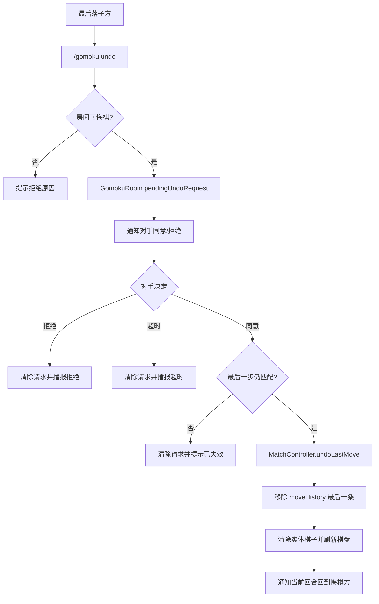

# feat: LeafGomoku consent-based undo

## Summary

给 `LeafGomoku` 增加对局内悔棋机制：只允许撤销最后一步，发起者必须是最后落子方，且必须由对手同意后才生效。悔棋请求是房间内临时状态，有超时、拒绝和自动取消规则；同意后清除最后一枚棋子、回滚最后一条落子历史，并把回合交还给被撤销的一方。

这项增强把 v2 需求中 deferred 的“悔棋”提升为当前功能，但不扩大到棋谱复盘、多步回滚、读秒、禁手或赛事裁判系统。

---

## Problem Frame

当前棋局规则链路已经能稳定处理加入、落子、胜负、平局、观战、统计和自动重置。`MatchController` 负责棋盘规则和回合状态，`GomokuRoom` 负责玩家席位、动画、房间消息、`moveHistory` 和统计写入。缺口是玩家误点后没有协商式修正路径，只能靠管理重置或中止，代价过高。

悔棋不能做成单方按钮。五子棋的最后一步会改变对手判断，单方撤销会破坏公平性；所以本计划把悔棋设计成“最后落子方申请，对手同意后撤销”的房间内协商流程。统计层不需要历史回滚，因为当前 `StatsService.record(...)` 只在 `finishScored(...)` 后写最终对局记录和 `moveHistory` 快照。

---

## Requirements

**Undo rules**

- R1. 悔棋只能发生在 `PLAYING` 对局中；`WAITING`、`IDLE`、`ENDED`、自动重置展示期和管理中止后都不能悔棋。
- R2. 每次悔棋只能撤销最后一步，不支持一次撤销多步。
- R3. 只有最后一步的落子玩家可以发起悔棋请求。
- R4. 对手必须明确同意后，悔棋才会生效。
- R5. 发起者不能批准自己的悔棋请求，观众和非房间玩家也不能批准或拒绝。
- R6. 同意悔棋后，最后一步棋子必须从规则棋盘和实体棋盘中消失。
- R7. 同意悔棋后，最后一步必须从 `moveHistory` 中移除，下一步落子序号继续从当前历史长度递增。
- R8. 同意悔棋后，当前回合必须回到被撤销的落子方。
- R9. 已经形成胜负或平局的最后一步不允许再悔棋；如果以后要支持赛后争议处理，需要另开裁判机制。

**Consent workflow**

- R10. 每个房间最多只能有一个待处理悔棋请求。
- R11. 悔棋请求必须有超时，默认建议 15 秒，并可通过 `config.yml` 配置。
- R12. 对手拒绝或请求超时后，请求关闭，棋局继续保持原状态。
- R13. 任一玩家继续落子、离开、掉线判负、管理重置、管理中止、删除房间、插件关闭或对局结束时，待处理请求必须取消。
- R14. 同意、拒绝、超时和取消都必须只通知房间内参赛玩家与观众，不能刷公共聊天。
- R15. 请求发起后应给对手明确的同意/拒绝入口，命令和 GUI 至少覆盖其一，最好两者都可用。

**Operations and safety**

- R16. 悔棋不能改变棋盘主题、棋子皮肤、房间环境模板、席位和观众状态。
- R17. 悔棋不能写胜负统计，也不能产生新的积分流水。
- R18. 落子动画进行中不能发起或同意悔棋，避免动画回调再把已撤销棋子写回棋盘。
- R19. 配置缺失时必须使用安全默认值；配置非法时回退默认并记录日志。
- R20. 测试必须覆盖规则层撤销、同意流、拒绝流、超时取消和生命周期取消。

---

## Key Technical Decisions

- KTD1. **Undo targets the last persisted move:** 以 `GomokuRoom.moveHistory` 的最后一条 `MatchMove` 作为唯一可撤销对象。这样不用扫描棋盘，也不会出现请求期间又变成另一手棋的歧义。
- KTD2. **Consent state belongs to the room:** `MatchController` 不认识 Bukkit 玩家、房间消息或超时任务；`GomokuRoom` 持有 `pendingUndoRequest`，负责发起人、同意人、超时任务、房间广播和生命周期取消。
- KTD3. **Rules rollback stays in the controller:** `MatchController` 增加撤销最后一步的规则入口，校验当前状态、棋盘坐标和棋子颜色，再清除格子并恢复 `currentTurn`。房间层不直接改 `currentTurn`。
- KTD4. **No undo after terminal move:** 当前 `play(...)` 在胜利或平局后立即进入 `GameState.ENDED` 并触发统计/重置流程。为了避免撤销已经写入或即将写入的对局结果，本轮不支持赛后悔棋。
- KTD5. **Pending request is invalidated by board progress:** 请求创建时记录最后一步的 `moveIndex`、玩家、阵营、坐标和时间。处理同意时再次比对当前 `moveHistory` 最后一条，避免请求期间状态漂移。
- KTD6. **Interaction is command-first with GUI affordance:** 先用 `/gomoku undo`、`/gomoku undo accept`、`/gomoku undo deny` 打通完整能力，再在房间详情页给有待处理请求的对手显示同意/拒绝按钮。
- KTD7. **Undo is unscored operationally neutral:** 悔棋只改变当前未结束对局的棋盘和历史，不调用 `StatsService`，也不触碰玩家积分或胜负统计。

---

## High-Level Technical Design

房间层处理“谁能申请、谁能同意、什么时候失效”；规则层处理“棋盘能不能撤、撤完轮到谁”。实体棋盘建议优先增加 `BoardRenderer.clearMove(...)` 或 `renderEmptyCell(...)`，只清一个格子的棋子表现；如果当前渲染 API 不适合局部清理，再退回 `renderer.renderBoard(match.board(), appearance)` 做整盘刷新。

---

## Implementation Units

### U1. Add board and controller undo primitives

- **Goal:** 让规则层可以安全撤销最后一步，并保持棋盘状态、回合状态和测试可验证。
- **Files:** `src/LeafGomoku/src/main/java/net/leafmc/gomoku/GomokuBoard.java`, `src/LeafGomoku/src/main/java/net/leafmc/gomoku/MatchController.java`, `src/LeafGomoku/src/main/java/net/leafmc/gomoku/UndoResult.java`, `src/LeafGomoku/src/main/java/net/leafmc/gomoku/UndoStatus.java`, `src/LeafGomoku/src/test/java/net/leafmc/gomoku/MatchControllerTest.java`.
- **Approach:** 给 `GomokuBoard` 增加清除单格的方法，例如 `clearCell(row, column)`。`MatchController` 增加撤销入口，参数包含阵营、行列和预期当前状态；只有 `GameState.PLAYING`、目标格在棋盘内且目标格是对应阵营棋子时才清除，并把 `currentTurn` 设回该阵营。
- **Patterns to follow:** 延续 `MoveResult` / `MoveStatus` 的结果对象风格，避免用异常表达可预期拒绝。`GomokuBoard.place(...)` 仍只负责放置非空棋子，清除走单独方法。
- **Test scenarios:**
  - 黑方第一手后撤销，目标格变空，当前回合回到黑方。
  - 白方落子后撤销，目标格变空，当前回合回到白方。
  - 撤销坐标越界时返回拒绝，不改变当前回合。
  - 撤销空格或颜色不匹配格时返回拒绝，不改变棋盘。
  - `IDLE`、`WAITING_FOR_WHITE`、`ENDED` 状态撤销被拒绝。

### U2. Model pending undo request in `GomokuRoom`

- **Goal:** 建立房间内待处理悔棋请求，覆盖发起、同意、拒绝、超时和取消。
- **Files:** `src/LeafGomoku/src/main/java/net/leafmc/gomoku/GomokuRoom.java`, `src/LeafGomoku/src/main/java/net/leafmc/gomoku/UndoRequest.java`, `src/LeafGomoku/src/main/java/net/leafmc/gomoku/UndoDecisionResult.java`, `src/LeafGomoku/src/main/java/net/leafmc/gomoku/ArenaConfig.java`, `src/LeafGomoku/src/main/resources/config.yml`.
- **Approach:** `UndoRequest` 记录房间 id、请求 id、发起玩家、目标对手、阵营、坐标、`moveIndex`、创建时间和过期 tick。`GomokuRoom.requestUndo(Player)` 读取 `moveHistory` 最后一条，校验发起者、状态和动画；成功后安排超时任务并通知双方。`acceptUndo(Player)` 和 `denyUndo(Player)` 只允许目标对手调用。
- **Patterns to follow:** 参照 `pendingReset` 的 `BukkitTask` 生命周期管理，提供 `cancelPendingUndo(reason, announce)`，并在 `reset(...)`、`purgeBlocks()`、`shutdown()`、`leave(...)`、`forfeit(...)`、`stopUnscored(...)` 等路径调用。
- **Test scenarios:**
  - 非最后落子方申请悔棋被拒绝。
  - 最后落子方申请后，房间产生一个 pending request。
  - 同房间已有 pending request 时再次申请被拒绝。
  - 发起者尝试同意自己的请求被拒绝。
  - 对手拒绝后 pending request 清空，棋盘和历史不变。
  - 超时后 pending request 清空，棋盘和历史不变。
  - 重置、离开、判负、删除房间会取消 pending request。

### U3. Apply accepted undo to history, renderer, and feedback

- **Goal:** 对手同意后，原子化撤销最后一步，并让双方看到明确反馈。
- **Files:** `src/LeafGomoku/src/main/java/net/leafmc/gomoku/GomokuRoom.java`, `src/LeafGomoku/src/main/java/net/leafmc/gomoku/BoardRenderer.java`, `src/LeafGomoku/src/main/java/net/leafmc/gomoku/InteractionFeedbackService.java`, `src/LeafGomoku/src/main/java/net/leafmc/gomoku/MatchMove.java`.
- **Approach:** 同意时先校验 pending request 仍匹配 `moveHistory` 最后一条，再调用 `match.undoLastMove(...)`。规则层成功后移除最后一条历史，清除对应实体棋子或整盘刷新，广播“对手已同意悔棋”，并调用现有 `notifyTurn()` 提醒轮到悔棋方重新落子。
- **Patterns to follow:** 保持 `moveInProgress` 作为动画互斥锁。悔棋过程中不启动棋子动画，只做清除和轻量粒子/音效反馈。`moveHistory.size() + 1` 的现有落子编号逻辑可继续使用，撤销后下一手自然复用被撤销编号。
- **Test scenarios:**
  - 同意悔棋后，最后一步从 `moveHistory` 消失。
  - 同意悔棋后，实体棋盘对应格清空，其他格不变。
  - 同意悔棋后，当前回合通知回到被撤销的阵营。
  - pending request 与当前最后一步不匹配时，同意失败并清空请求。
  - `moveInProgress` 为 true 时申请和同意都被拒绝，不触发渲染。

### U4. Add command and GUI entry points

- **Goal:** 玩家可以用命令完成申请、同意和拒绝；房间 GUI 给对手清晰入口。
- **Files:** `src/LeafGomoku/src/main/java/net/leafmc/gomoku/GomokuCommand.java`, `src/LeafGomoku/src/main/java/net/leafmc/gomoku/LeafGomokuPlugin.java`, `src/LeafGomoku/src/main/java/net/leafmc/gomoku/GomokuGui.java`, `src/LeafGomoku/src/main/resources/plugin.yml`.
- **Approach:** 增加普通玩家命令：`/gomoku undo [room]` 发起，`/gomoku undo accept [room]` 同意，`/gomoku undo deny [room]` 拒绝。`room` 缺省时解析玩家当前参赛房间。GUI 房间详情页在有 pending request 且当前玩家是目标对手时显示同意/拒绝按钮；发起者看到等待状态。
- **Patterns to follow:** 命令权限使用现有 `GomokuPermission.PLAY`，不新增管理权限。`LeafGomokuPlugin` 提供 `requestUndo(...)`、`acceptUndo(...)`、`denyUndo(...)` 门面，和 `join/spectate/leave` 一样先解析房间再委托 `GomokuRoom`。
- **Test scenarios:**
  - 参赛玩家可执行 `/gomoku undo` 发起请求。
  - 非参赛玩家、观众和控制台执行玩家悔棋命令时得到清晰拒绝。
  - 对手可执行 `/gomoku undo accept` 生效悔棋。
  - 对手可执行 `/gomoku undo deny` 拒绝悔棋。
  - tab complete 包含 `undo`、`accept`、`deny` 和房间 id。
  - GUI 只对目标对手显示同意/拒绝按钮。

### U5. Configure timeout and document smoke coverage

- **Goal:** 让悔棋默认可用、可控，并留下上线前验收口径。
- **Files:** `src/LeafGomoku/src/main/resources/config.yml`, `plugins/LeafGomoku/config.yml`, `scripts/test-leaf-gomoku.sh`, `docs/operations/gomoku/2026-06-11-consent-undo-smoke-test.md`.
- **Approach:** 在 `arena.gameplay` 或独立 `undo` 节点下增加 `request-timeout-ticks` 和可选 `cooldown-ticks`。测试脚本纳入新增规则测试类。运维 smoke test 覆盖双玩家开局、误点申请、对手同意、对手拒绝、超时、离开取消、胜负后不可悔棋。
- **Patterns to follow:** 继续用当前手写 `javac` 测试脚本，不引入 Gradle/Maven 迁移。`plugins/LeafGomoku/config.yml` 与资源配置保持一致，便于直接复制到服务器。
- **Test scenarios:**
  - 配置缺失时默认 15 秒超时。
  - 配置负数或非法值时回退默认值并记录日志。
  - smoke test 明确验证“必须对方同意”，不能只测申请命令。
  - smoke test 验证房间频道内有请求、同意、拒绝、过期提示。
  - smoke test 验证胜利后 `/gomoku undo` 被拒绝。

---

## Acceptance Examples

- AE1. Given 黑方刚在 `H8` 落子且未形成胜负，When 黑方执行 `/gomoku undo`，Then 白方收到同意/拒绝提示，棋盘暂不改变。
- AE2. Given AE1 的请求仍未超时，When 白方执行 `/gomoku undo accept`，Then `H8` 清空，最后一步历史移除，当前回合回到黑方。
- AE3. Given AE1 的请求仍未超时，When 白方执行 `/gomoku undo deny`，Then 棋盘和历史保持不变，双方收到拒绝提示。
- AE4. Given 黑方发起悔棋请求，When 黑方自己执行 `/gomoku undo accept`，Then 系统拒绝，pending request 保持等待白方处理。
- AE5. Given 白方是当前回合但最后一步由黑方落下，When 白方执行 `/gomoku undo`，Then 系统拒绝，因为白方不是最后落子方。
- AE6. Given 悔棋请求已经创建，When 超过配置超时，Then 请求自动取消，棋盘和历史保持不变。
- AE7. Given 悔棋请求已经创建，When 任一参赛玩家离开导致判负或房间重置，Then 请求取消，后续同意命令提示没有待处理请求。
- AE8. Given 黑方最后一步形成五连且房间进入 `ENDED`，When 黑方执行 `/gomoku undo`，Then 系统拒绝，统计和自动重置流程不回滚。

---

## Scope Boundaries

**Included**

- 最后一步悔棋申请。
- 对手同意或拒绝。
- 请求超时和生命周期取消。
- 规则棋盘、实体棋盘、回合和 `moveHistory` 同步回滚。
- 命令入口和房间 GUI 提示。
- 基础配置和 smoke 文档。

**Deferred for later**

- 多步悔棋。
- 赛后争议撤销。
- 棋谱复盘 UI。
- 读秒、禁手、裁判确认和赛事系统。
- AI 对局或自动分析建议。

**Outside this feature**

- 管理强制替玩家悔棋并改写统计。
- 已结束对局的胜负记录回滚。
- 因悔棋返还或扣除积分。
- 允许观众参与投票决定悔棋。

---

## Risks & Dependencies

- **Animation race:** 当前落子在动画回调后才渲染棋子并触发胜负处理。悔棋必须在 `moveInProgress` 时拒绝，避免回调把被撤销的棋子重新写回。
- **Terminal move timing:** 最后一手如果已经进入 `ENDED`，可能已经开始统计和自动重置倒计时。本轮禁止赛后悔棋，避免统计一致性风险。
- **Disconnected opponent:** 如果对手掉线但仍在席位恢复窗口内，请求可以创建但可能超时；不应让发起者绕过同意。
- **Renderer granularity:** 如果 `BoardRenderer` 当前没有局部清空棋子的 API，实施时可以先整盘刷新保证正确，再补局部清理优化。
- **Dirty workspace:** 当前仓库已有环境模板相关未提交改动。实施悔棋时需要基于当前工作区继续，不要回退这些文件。

---

## Sources / Research

- `docs/brainstorms/2026-06-10-gomoku-v2-iteration-requirements.md` — v2 需求来源，其中悔棋原本列为 deferred。
- `docs/plans/2026-06-11-001-feat-gomoku-environment-templates-plan.md` — 上一份增强计划明确未包含悔棋，本计划补上独立范围。
- `src/LeafGomoku/src/main/java/net/leafmc/gomoku/MatchController.java` — 当前规则状态、落子校验、胜负和平局入口。
- `src/LeafGomoku/src/main/java/net/leafmc/gomoku/GomokuBoard.java` — 当前棋盘只支持整盘清空和落子，缺少单格清除。
- `src/LeafGomoku/src/main/java/net/leafmc/gomoku/GomokuRoom.java` — 当前房间持有 `moveHistory`、动画状态、统计写入和房间广播。
- `src/LeafGomoku/src/main/java/net/leafmc/gomoku/GomokuCommand.java` — 当前玩家命令、管理命令和 tab complete 入口。
- `src/LeafGomoku/src/main/java/net/leafmc/gomoku/GomokuGui.java` — 当前大厅和房间详情 GUI，可加入同意/拒绝 affordance。
- `scripts/test-leaf-gomoku.sh` — 当前 LeafGomoku 手写 Java 测试入口。
