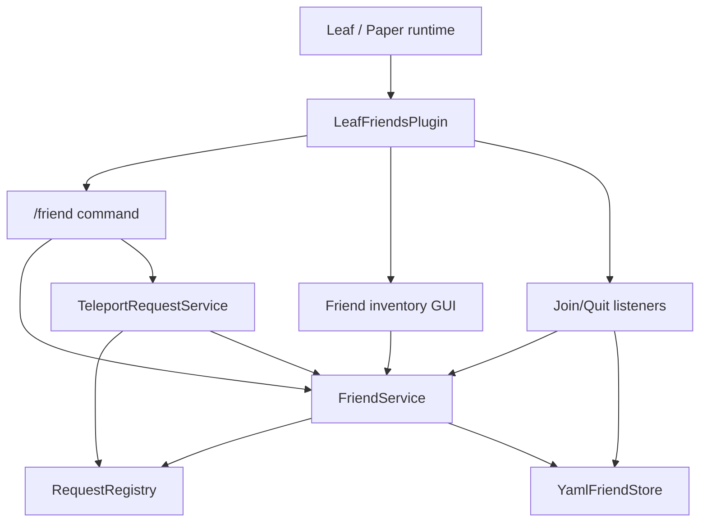
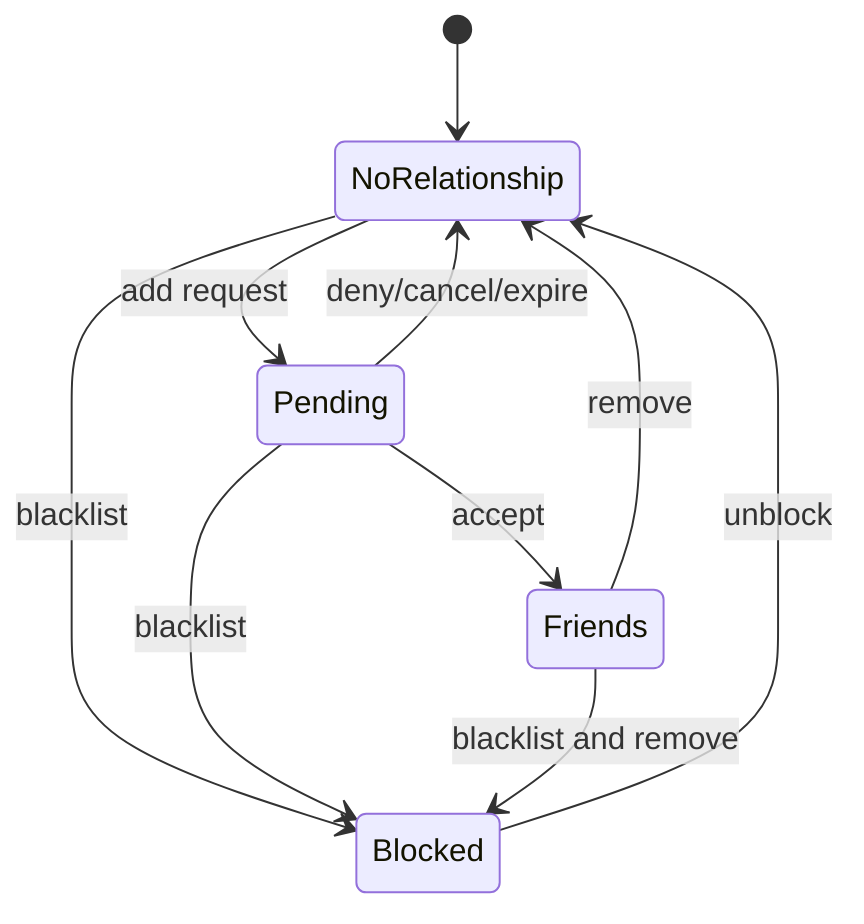

# feat: Add LeafFriends system

## Summary

Implement a standalone Leaf/Paper plugin named `LeafFriends` that gives YuHua players a light social layer: friend requests, friend list, private friend chat, online notifications, teleport requests, privacy toggles, blacklist, and a GUI/menu entry. The feature should make it easier for survival players to find and cooperate with people without adding combat power, ranks, intimacy stats, or reward grinding.

---

## Problem Frame

The server already has CMI private messaging, `/tpa`, Residence land claims, DeluxeMenus, and a custom plugin pattern under `src/LeafGomoku`. What is missing is a durable relationship layer that answers "who do I play with often?" and turns that relationship into safer, clearer shortcuts.

Prior-art review points in the same direction: official Java friends focus on lightweight friend presence and invites; common server implementations add friend commands, friend chat, last-seen status, and jump/teleport affordances; larger server networks separate durable friends from temporary parties. YuHua should borrow the relationship and convenience pieces, not heavy party/guild progression.

---

## Requirements

**Friend relationship**

- R1. Players can send, accept, deny, cancel, and remove friend relationships by player name.
- R2. The system stores friends by UUID and remembers the latest known player name for display.
- R3. Friend requests expire after a configurable time and cannot be spammed faster than a configurable cooldown.
- R4. A friendship is mutual; deleting it from either side removes it for both players.
- R5. Players can list friends with online/offline state and last-seen time.

**Communication and presence**

- R6. Players can send private messages through a friend-only command.
- R7. Players receive configurable online/offline notifications for friends.
- R8. Players can toggle whether they receive friend requests, teleport requests, friend messages, and online notifications.
- R9. Players can blacklist another player so requests, friend messages, and friend teleport requests from that player are rejected.

**Teleport and safety**

- R10. Friends can send teleport requests that require the target to accept before any teleport occurs.
- R11. Teleport requests expire and have a cooldown.
- R12. The plugin never bypasses basic player safety: the sender and target must both be online, alive enough for Bukkit teleport handling, and in an allowed world.
- R13. Teleport behavior remains independent of combat power, flight, economy, and item rewards.

**UI, permissions, and operations**

- R14. Provide a `/friend` command with aliases that are easy for players to discover.
- R15. Provide a GUI friend menu and wire `/menufriends` into the existing social/menu pattern.
- R16. Provide player permissions enabled by default and admin permissions for reload/inspect maintenance.
- R17. Build and test the plugin with the repository's lightweight Java 21 script pattern.
- R18. Update README, version manifest, and copy/deploy notes so the server operator can install it predictably.

---

## Scope Boundaries

**Deferred for later**

- Residence friend-permission automation. v1 can document the expected flow, but automatic claim trust should wait until the relationship model is proven.
- Cross-server friends or network-wide parties. This is a single Leaf/Paper server package.
- Friend groups, favorites, and remarks. These are useful, but the first version should keep data migration simple.
- Offline mail. CMI already provides mail; LeafFriends should not duplicate it in v1.

**Outside this product's identity**

- Combat bonuses, damage buffs, protection buffs, free flight, item multipliers, intimacy ranks, or grindable social rewards.
- Public friend leaderboards.
- Auto-sharing all homes, chests, or land permissions with friends.
- Direct teleport without target consent.

---

## Key Technical Decisions

- **KTD1. Standalone plugin:** Add `LeafFriends` under `src/LeafFriends` instead of extending CMI, DeluxeMenus, or LeafGomoku. The relationship layer should be independently buildable, testable, and removable.
- **KTD2. YAML persistence for v1:** Store relationship data in `plugins/LeafFriends/friends.yml` and config in `plugins/LeafFriends/config.yml`. The expected player count is small enough for simple YAML, and this avoids shipping a new database dependency.
- **KTD3. UUID primary key:** Persist UUIDs as canonical IDs and update latest known names on join/command use, because this server is offline-mode and player names may drift.
- **KTD4. Pure service core:** Keep relationship, request expiry, blacklist, privacy, and display ordering logic in Java classes without Bukkit dependencies where practical. Bukkit-specific command, GUI, and event layers should call the core.
- **KTD5. Consent-only teleport:** Model friend teleport as a request/accept flow, not direct teleport. This matches player expectations and avoids surprise movement.
- **KTD6. Lightweight GUI:** Implement an inventory GUI inside the plugin for the friend list and pending requests, while DeluxeMenus only provides the entry button. Dynamic friend data does not belong in static DeluxeMenus YAML.
- **KTD7. No runtime server launch in pipeline tests:** Unit and script tests validate the plugin without starting the Minecraft server. Runtime smoke testing can be documented for the target server after deploy.

---

## High-Level Technical Design



`FriendService` owns durable relationships, privacy settings, blacklist, request lifecycle, and display state. Bukkit-facing classes translate commands, clicks, and join/quit events into service calls.



---

## Output Structure

```text
src/LeafFriends/
  src/main/java/net/leafmc/friends/
    LeafFriendsPlugin.java
    FriendCommand.java
    FriendGui.java
    FriendListener.java
    FriendService.java
    FriendStore.java
    YamlFriendStore.java
    FriendProfile.java
    FriendSettings.java
    FriendRequest.java
    TeleportRequestService.java
    TimeSource.java
  src/main/resources/
    config.yml
    plugin.yml
  src/test/java/net/leafmc/friends/
    FriendServiceTest.java
    TeleportRequestServiceTest.java
scripts/
  build-leaf-friends.sh
  test-leaf-friends.sh
plugins/
  LeafFriends-0.1.0.jar
copy/
  leaf-friends-<timestamp>/
```

The exact class split can change if implementation reveals a simpler shape, but the plan assumes a separate persistence adapter, pure service core, Bukkit command/listener layer, and deployment package.

---

## Implementation Units

### U1. Scaffold LeafFriends plugin and build/test scripts

- **Goal:** Create the plugin directory, resource metadata, default config, and lightweight scripts.
- **Requirements:** R14, R16, R17
- **Dependencies:** None
- **Files:** `src/LeafFriends/src/main/resources/plugin.yml`, `src/LeafFriends/src/main/resources/config.yml`, `src/LeafFriends/src/main/java/net/leafmc/friends/LeafFriendsPlugin.java`, `scripts/build-leaf-friends.sh`, `scripts/test-leaf-friends.sh`, `plugins/LeafFriends-0.1.0.jar`
- **Approach:** Mirror `scripts/build-leaf-gomoku.sh` without SQLite dependencies: download/use the cached Paper API, compile with `javac --release 21`, copy resources, and create a deterministic jar in `plugins/`.
- **Patterns to follow:** `scripts/build-leaf-gomoku.sh`, `src/LeafGomoku/src/main/resources/plugin.yml`, `src/LeafGomoku/src/main/java/net/leafmc/gomoku/LeafGomokuPlugin.java`
- **Test scenarios:**
  - Running the build script creates `plugins/LeafFriends-0.1.0.jar`.
  - Jar inspection shows `plugin.yml`, `config.yml`, and `net/leafmc/friends/LeafFriendsPlugin.class`.
  - The test script compiles main and test sources without starting Leaf.
- **Verification:** Build/test scripts are executable and produce only `src/LeafFriends/build*` generated output plus the plugin jar.

### U2. Implement relationship, privacy, blacklist, and request core

- **Goal:** Add the pure Java service model that enforces friend lifecycle rules.
- **Requirements:** R1, R2, R3, R4, R5, R8, R9
- **Dependencies:** U1
- **Files:** `src/LeafFriends/src/main/java/net/leafmc/friends/FriendService.java`, `src/LeafFriends/src/main/java/net/leafmc/friends/FriendProfile.java`, `src/LeafFriends/src/main/java/net/leafmc/friends/FriendSettings.java`, `src/LeafFriends/src/main/java/net/leafmc/friends/FriendRequest.java`, `src/LeafFriends/src/main/java/net/leafmc/friends/TimeSource.java`, `src/LeafFriends/src/test/java/net/leafmc/friends/FriendServiceTest.java`
- **Approach:** Represent profiles by UUID, latest name, friend UUID set, incoming/outgoing request state, blacklist set, settings, and last-seen timestamp. Return explicit result enums/messages for all operations so commands and GUI can present consistent Chinese feedback.
- **Execution note:** Build this unit test-first because it carries most of the state invariants.
- **Patterns to follow:** Pure model and service tests under `src/LeafGomoku/src/test/java/net/leafmc/gomoku/`.
- **Test scenarios:**
  - Sending a request creates outgoing state for sender and incoming state for target.
  - Accepting a request creates a mutual friendship and clears pending request state.
  - Denying, canceling, and expiring a request clear pending state without creating friendship.
  - Removing a friend deletes the relationship from both profiles.
  - A blocked player cannot send friend requests or friend messages.
  - Disabling friend requests rejects new requests but does not delete existing friends.
  - Listing friends sorts online friends before offline friends and uses latest known names.
- **Verification:** Tests prove mutuality, request expiry, privacy, blacklist, and list ordering without Bukkit.

### U3. Implement YAML persistence and lifecycle loading

- **Goal:** Persist friend profiles and settings safely across restarts.
- **Requirements:** R2, R5, R8, R9, R17
- **Dependencies:** U2
- **Files:** `src/LeafFriends/src/main/java/net/leafmc/friends/FriendStore.java`, `src/LeafFriends/src/main/java/net/leafmc/friends/YamlFriendStore.java`, `src/LeafFriends/src/main/java/net/leafmc/friends/LeafFriendsPlugin.java`, `src/LeafFriends/src/test/java/net/leafmc/friends/YamlFriendStoreTest.java`, `src/LeafFriends/src/main/resources/config.yml`
- **Approach:** Use Bukkit's YAML configuration classes in the adapter, but keep the stored shape simple: `profiles.<uuid>.name`, `friends`, `blacklist`, `settings`, and `lastSeen`. Save after mutations and on disable.
- **Patterns to follow:** Existing plugin config loading in `LeafGomokuPlugin` and file ownership under `plugins/<PluginName>/`.
- **Test scenarios:**
  - A profile with friends, blacklist, settings, and last-seen timestamp round-trips through YAML.
  - Missing optional fields load with safe defaults.
  - Invalid UUID entries are skipped without aborting the whole data file.
- **Verification:** Store tests write to a temp directory and reload equivalent profile data.

### U4. Add player commands and tab completion

- **Goal:** Expose friend operations through a player-friendly `/friend` command.
- **Requirements:** R1, R5, R6, R8, R9, R10, R11, R14, R16
- **Dependencies:** U2, U3
- **Files:** `src/LeafFriends/src/main/java/net/leafmc/friends/FriendCommand.java`, `src/LeafFriends/src/main/resources/plugin.yml`, `src/LeafFriends/src/main/resources/config.yml`, `src/LeafFriends/src/test/java/net/leafmc/friends/FriendCommandFormatTest.java`
- **Approach:** Support subcommands: `add`, `accept`, `deny`, `cancel`, `remove`, `list`, `msg`, `tp`, `tpaccept`, `tpdeny`, `toggle`, `block`, `unblock`, `gui`, `reload`. Resolve online targets through Bukkit and offline targets through known profiles when possible.
- **Patterns to follow:** `src/LeafGomoku/src/main/java/net/leafmc/gomoku/GomokuCommand.java` for command executor/tab completer structure and Chinese feedback tone.
- **Test scenarios:**
  - Help text includes all player subcommands and hides admin reload from non-admin command senders.
  - Toggle parsing accepts the documented setting names and rejects unknown names.
  - Tab completion returns subcommands and known friend names based on command position.
- **Verification:** Command formatting tests cover parser/usage helpers; build catches Bukkit API integration errors.

### U5. Add friend teleport request flow

- **Goal:** Implement consent-based friend teleport requests and acceptance.
- **Requirements:** R10, R11, R12, R13
- **Dependencies:** U2, U4
- **Files:** `src/LeafFriends/src/main/java/net/leafmc/friends/TeleportRequestService.java`, `src/LeafFriends/src/main/java/net/leafmc/friends/FriendCommand.java`, `src/LeafFriends/src/test/java/net/leafmc/friends/TeleportRequestServiceTest.java`, `src/LeafFriends/src/main/resources/config.yml`
- **Approach:** Reuse the request expiry/cooldown pattern from friend requests, but keep teleport requests separate. The service validates friendship, privacy settings, block state, online state, allowed worlds, expiry, and cooldown before the command layer calls Bukkit teleport.
- **Test scenarios:**
  - Non-friends cannot create teleport requests.
  - A target with teleport requests disabled rejects the request.
  - Accepting before expiry returns the sender/target pair and clears the request.
  - Accepting after expiry fails and clears stale state.
  - Repeated requests inside cooldown fail without replacing the active request.
- **Verification:** Unit tests cover request lifecycle; build proves Bukkit teleport call compiles against the current API.

### U6. Add GUI and join/quit presence behavior

- **Goal:** Provide a usable in-game friend surface and presence notifications.
- **Requirements:** R5, R7, R8, R9, R14, R15
- **Dependencies:** U2, U3, U4
- **Files:** `src/LeafFriends/src/main/java/net/leafmc/friends/FriendGui.java`, `src/LeafFriends/src/main/java/net/leafmc/friends/FriendListener.java`, `src/LeafFriends/src/main/java/net/leafmc/friends/LeafFriendsPlugin.java`, `src/LeafFriends/src/main/resources/plugin.yml`, `src/LeafFriends/src/main/resources/config.yml`
- **Approach:** Use a Bukkit inventory GUI with stable slots for pending requests, online friends, offline friends, privacy toggles, and close/back actions. On join, update latest name and notify online friends who have notifications enabled; on quit, update last-seen and optionally notify.
- **Patterns to follow:** `src/LeafGomoku/src/main/java/net/leafmc/gomoku/GomokuGui.java` for inventory holder and click handling patterns.
- **Test scenarios:**
  - Test expectation: GUI click behavior is verified by compile-time coverage and runtime smoke steps because Bukkit inventory events are not practical to unit test in this repo.
  - Presence notification text is generated only for friends with notification settings enabled.
- **Verification:** Build succeeds and runtime smoke notes cover opening `/friend gui`, accepting a request through GUI, and seeing online/offline state.

### U7. Wire menu, documentation, permissions, and copy-ready package

- **Goal:** Integrate the plugin into the existing server operations package.
- **Requirements:** R15, R16, R18
- **Dependencies:** U1, U4, U6
- **Files:** `README.md`, `VERSION_MANIFEST.md`, `plugins/DeluxeMenus/gui_menus/social.yml`, `plugins/LuckPerms/yaml-storage/groups/default.yml`, `copy/leaf-friends-<timestamp>/README.md`, `copy/leaf-friends-<timestamp>/plugins/LeafFriends-0.1.0.jar`, `copy/leaf-friends-<timestamp>/plugins/DeluxeMenus/gui_menus/social.yml`, `copy/leaf-friends-<timestamp>/plugins/LuckPerms/yaml-storage/groups/default.yml`
- **Approach:** Add `/menufriends` and the social menu entry without disrupting existing `/menusocial`. Grant default player permissions for core friend commands, keep admin reload permission op/admin-only, and produce a copy folder matching the repo's existing deployment style.
- **Patterns to follow:** Existing `copy/residence-*` and `copy/menu-*` packages; README sections for LeafGomoku and player menus; LuckPerms default group command list.
- **Test scenarios:**
  - Static YAML validation confirms DeluxeMenus and LuckPerms files parse.
  - Jar and config checksums are recorded in the copy package.
  - README documents player commands, admin command, and rollout requirement to stop the server before replacing jars/config.
- **Verification:** Copy package contains only the deployable files and an operator README with test commands.

---

## Acceptance Examples

- AE1. Given Alice and Bob are online and not friends, When Alice runs `/friend add Bob` and Bob runs `/friend accept Alice`, Then both players see each other in `/friend list`.
- AE2. Given Bob has disabled friend requests, When Alice runs `/friend add Bob`, Then Alice receives a rejection and Bob receives no pending request.
- AE3. Given Alice blacklists Bob, When Bob sends a friend request, friend message, or friend teleport request, Then the action is rejected.
- AE4. Given Alice and Bob are friends, When Bob comes online, Then Alice receives an online notification if Alice has notifications enabled.
- AE5. Given Alice and Bob are friends, When Alice runs `/friend tp Bob`, Then Bob must accept before Alice is teleported.
- AE6. Given Alice sends a teleport request and the expiry passes, When Bob runs `/friend tpaccept Alice`, Then no teleport happens and the request is cleared.

---

## System-Wide Impact

- The change adds one active plugin jar and one plugin data folder.
- The change adds default player commands and permissions, so README and LuckPerms must stay aligned.
- The feature overlaps with existing CMI `/msg`, `/reply`, and `/tpa`, but should not replace them. LeafFriends adds friend-only shortcuts and relationship state; generic CMI commands remain available.
- The feature should not re-enable BetterTeams or alter the paused guild system.

---

## Risks & Dependencies

- **Offline-mode identity drift:** UUID handling depends on the server's offline UUID behavior. Persisting UUID plus latest known name reduces display breakage, but name changes can still confuse players.
- **YAML write corruption:** Saving on every mutation is simple but must avoid partial writes. The implementation should write through Bukkit's config save path or a temp-file replacement if needed.
- **Command overlap:** `/friend` may conflict with an installed plugin if one is added later. `plugin.yml` should include aliases but keep `/friend` as the canonical command.
- **GUI dynamic state:** Inventory GUIs can become stale if a friend comes online while the menu is open. v1 can refresh on click/open; live ticking refresh is deferred.
- **Deploy discipline:** Replacing jars and permissions should follow the repo's existing stop-server, backup, pull/copy, start, and console `Done` checks.

---

## Documentation / Operational Notes

- Add a README section for player commands, privacy toggles, and admin reload.
- Add `LeafFriends` to `VERSION_MANIFEST.md` with plugin version and runtime policy.
- Add a runtime smoke-test checklist in the copy package:
  - Start server and confirm `LeafFriends` enables.
  - Use two test accounts to add, accept, list, message, teleport request, accept teleport, block, and remove.
  - Open `/friend gui` and `/menufriends`.
  - Confirm default players have player permissions but not admin reload.

---

## Sources & Research

- `README.md` — server positioning, menu model, player permissions, and existing social commands.
- `VERSION_MANIFEST.md` — Leaf 1.21.11, Java 21, runtime policy, active plugin list, and disabled BetterTeams status.
- `scripts/build-leaf-gomoku.sh` and `scripts/test-leaf-gomoku.sh` — current custom plugin build/test convention.
- `src/LeafGomoku/src/main/java/net/leafmc/gomoku/GomokuCommand.java` and `src/LeafGomoku/src/main/java/net/leafmc/gomoku/GomokuGui.java` — command and inventory GUI patterns to follow.
- `docs/brainstorms/2026-06-09-guild-project-daily-activity-requirements.md` — product boundary against combat-power/social-grind progression.
- [Minecraft Java Friends List](https://www.minecraft.net/en-us/article/friends-list-for-java-edition) — official lightweight friend presence/invite direction.
- [Hypixel Party guide](https://support.hypixel.net/hc/en-us/articles/360019551320-How-to-Create-a-Party-on-Hypixel) — larger-network distinction between durable friends and temporary parties.
- [AdvancedFriends plugin listing](https://www.spigotmc.org/resources/%E2%AD%90-advancedfriends-full-friends-system-built-in-party-gui-%E2%80%A2-teleport-%E2%80%A2-private-chat-1-20.133339/) — common plugin-market feature set: GUI, friend chat, teleport, and privacy.
