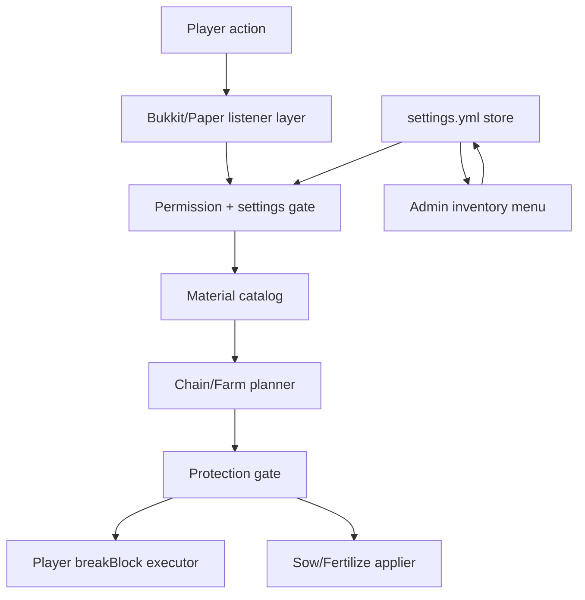
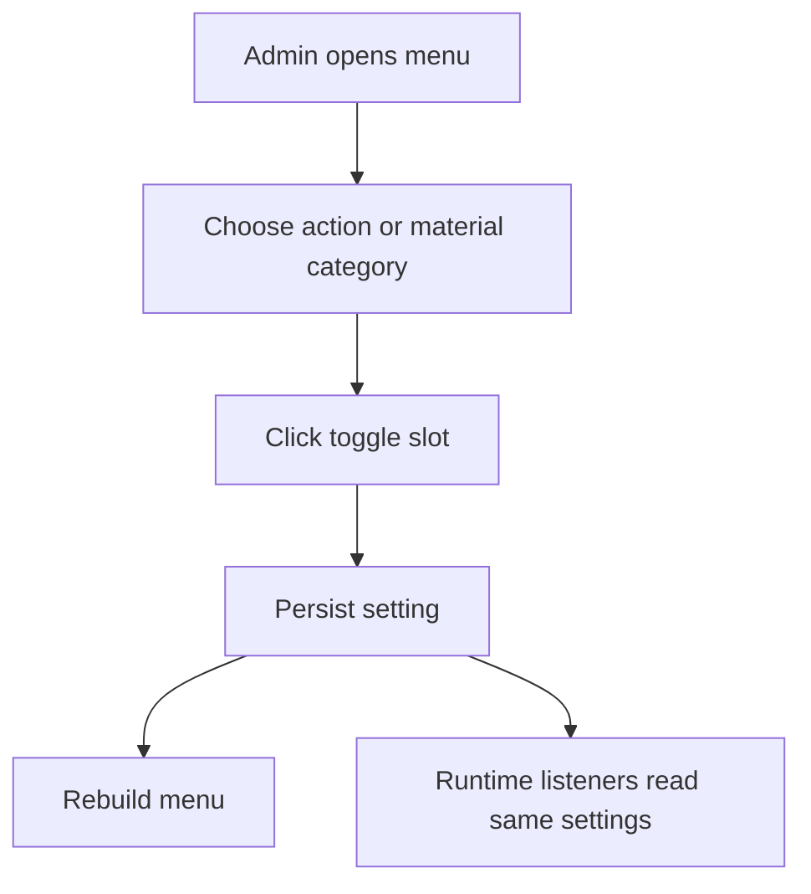

# feat: Add LeafChainHarvest Kotlin chain tools

## Summary

Build `LeafChainHarvest` as a Kotlin Leaf/Paper plugin for chain farming, chain wood cutting, and chain ore mining. The plugin should replace the current Java half-product, expose an admin inventory menu where highlighted entries mean "allowed", and ship with conservative material defaults that exclude stone, deepslate, dirt, and other base blocks.

---

## Problem Frame

Players need less repetitive survival collection without turning the server into an automated farm or bypassing claim protection. The requested first version covers crop right-click harvest with auto-replant, farming actions for sowing, fertilizing, and collecting, chain wood cutting, and chain ore mining.

The current repository already contains a partial Java `LeafChainHarvest` under `src/LeafChainHarvest`. That work proves several useful directions, but it does not match the requested Kotlin direction or the built-in menu requirement. Implementation should treat that Java code as reference material to replace, not as a second runtime path to keep.

---

## Requirements

**Kotlin plugin baseline**

- R1. `LeafChainHarvest` is implemented as a Kotlin plugin under the existing Gradle Kotlin DSL / Kotlin JVM build baseline.
- R2. The existing Java half-product is removed or replaced so the plugin has one source of truth for runtime behavior.
- R3. The plugin registers player-facing usage permissions and admin maintenance permissions without relying on direct LuckPerms YAML edits.

**Material catalog and chain scope**

- R4. The default material catalog includes crops, logs/wood/stems, and ores, but excludes stone, deepslate, netherrack, dirt, sand, gravel, leaves, planks, and other base or building blocks.
- R5. Chain wood cutting works for configured log, wood, stem, and hyphae families with an axe and a configurable max-block limit.
- R6. Chain ore mining works for configured ore blocks and ancient debris with a pickaxe and a configurable max-block limit.
- R7. Chain behavior can be enabled or disabled globally by category and by individual configured material/group.

**Farming actions**

- R8. Right-clicking a mature standard crop can harvest it and replant the same crop at age 0 after a short delay.
- R9. Vertical crops such as sugar cane, bamboo, and cactus can collect only the harvestable upper stack while leaving the base block intact.
- R10. Full-block crops such as melon and pumpkin can be collected through the same player-caused break path as other collection actions.
- R11. Sowing can plant configured seeds/crops into valid nearby farmland or substrate when the player has seed items and the action is enabled.
- R12. Fertilizing can apply bone meal to configured nearby growable blocks when the player has bone meal and the action is enabled.
- R13. Survival-mode sowing and fertilizing consume the required item per successful extra action; creative or explicit bypass behavior must be permission-gated.

**Admin menu and commands**

- R14. Admins can open a built-in inventory menu for chain settings instead of editing YAML for common toggles.
- R15. Menu entries use a clear highlighted state for enabled items and a muted state for disabled items, following the existing `LIME_DYE` / `RED_DYE` inventory pattern.
- R16. The menu covers action toggles for collect, sow, and fertilize, plus material/group toggles for crops, wood, and ores.
- R17. Commands cover menu open, reload, and concise help; player use should not require an admin menu permission.

**Compatibility and operations**

- R18. Extra block breaking uses the player action path so Bukkit/Paper events, drops, experience, enchantments, durability, Residence, and CoreProtect can participate.
- R19. Placement and growth fan-out is protected by an explicit compatibility gate, with Residence support treated as required for safe rollout on this server.
- R20. The implementation keeps logic testable without starting the Minecraft server, then documents targeted runtime and in-game smoke tests for the server boundary.
- R21. Delivery includes build/test scripts, README updates, a copy-ready package shape, and LuckPerms console commands.

---

## Key Technical Decisions

- KTD1. **Kotlin rewrite over Java extension:** Replace the current Java `LeafChainHarvest` classes with Kotlin sources. Keeping both would make event ownership, settings persistence, and menu state harder to reason about.
- KTD2. **Runtime settings file seeded from config:** Keep `config.yml` for defaults, messages, limits, and menu labels; write admin toggles to `plugins/LeafChainHarvest/settings.yml`. This avoids modifying the shipped resource config every time an admin clicks the menu.
- KTD3. **Conservative catalog only:** The v1 menu shows only curated materials and groups. Basic terrain blocks are not hidden disabled entries; they are out of the v1 catalog so an accidental click cannot enable them.
- KTD4. **Player-caused destruction:** Use `Player#breakBlock` for every extra harvested, mined, or chopped block. Paper documents that this respects tool behavior, drops, experience, third-party cancellation, and can recurse if used carelessly, so the implementation needs a reentry guard.
- KTD5. **Protection gate for non-break actions:** Sowing and fertilizing cannot rely on `Player#breakBlock`, so they go through a `ProtectionGate` abstraction before changing additional blocks. On this server, the first adapter should soft-hook Residence and check build/use permission at each target location; if no protection adapter is available, extra sow/fertilize fan-out should fail closed unless an admin explicitly enables an unsafe fallback.
- KTD6. **Inventory GUI follows local patterns:** Implement the admin menu with a custom `InventoryHolder`, per-slot action map, cancelled clicks, and immediate refresh after toggles, mirroring `FriendGui` and `RecycleGui`.
- KTD7. **Layered verification:** Core planners, settings, and menu models get script/main tests first. MockBukkit can be added only where it reduces risk; local server or in-game tests are documented but not run by default during implementation.

---

## Default Catalog

| Catalog area | Default included | Default excluded |
| --- | --- | --- |
| Standard crops | wheat, carrots, potatoes, beetroot, nether wart, cocoa | unripe crops, decorative plants |
| Vertical crops | sugar cane, bamboo, cactus | base block of the stack |
| Full-block crops | melon, pumpkin | carved pumpkin unless explicitly added later |
| Wood chain | overworld logs/wood, stripped variants, pale oak, mangrove, cherry, crimson/warped stems and hyphae | leaves, planks, slabs, fences |
| Ore chain | coal, iron, copper, gold, redstone, lapis, diamond, emerald, quartz, nether gold, ancient debris, and deepslate ore variants | stone, deepslate, tuff, netherrack, end stone |

---

## High-Level Technical Design





---

## Output Structure

```text
src/LeafChainHarvest/
  build.gradle.kts
  src/main/kotlin/net/leafmc/chainharvest/
    LeafChainHarvestPlugin.kt
    ChainCommand.kt
    ChainAdminGui.kt
    ChainSettings.kt
    SettingsStore.kt
    MaterialCatalog.kt
    ProtectionGate.kt
    ResidenceProtectionGate.kt
    ChainBreakListener.kt
    ChainPlanner.kt
    FarmActionListener.kt
    FarmPlanner.kt
  src/main/resources/
    config.yml
    plugin.yml
  src/test/kotlin/net/leafmc/chainharvest/
    ChainSettingsTest.kt
    MaterialCatalogTest.kt
    ChainPlannerTest.kt
    FarmPlannerTest.kt
    AdminMenuModelTest.kt
scripts/
  test-leaf-chain-harvest.sh
  build-leaf-chain-harvest.sh
docs/operations/
  leaf-chain-harvest-smoke-test.md
copy/
  leaf-chain-harvest-<timestamp>/
```

The exact class split can change during implementation if a smaller shape emerges, but the plan assumes a single Kotlin runtime path with pure planners separated from Bukkit listeners.

---

## Implementation Units

### U1. Replace half-product with Kotlin plugin shell

- **Goal:** Convert `LeafChainHarvest` into a Kotlin plugin module with one runtime entry point.
- **Requirements:** R1, R2, R3
- **Dependencies:** None
- **Files:** `src/LeafChainHarvest/build.gradle.kts`, `src/LeafChainHarvest/src/main/java/net/leafmc/chainharvest/*.java`, `src/LeafChainHarvest/src/main/kotlin/net/leafmc/chainharvest/LeafChainHarvestPlugin.kt`, `src/LeafChainHarvest/src/main/resources/plugin.yml`, `src/LeafChainHarvest/src/main/resources/config.yml`, `src/LeafChainHarvest/src/test/kotlin/net/leafmc/chainharvest/KotlinToolchainSmokeTest.kt`, `scripts/test-leaf-chain-harvest.sh`, `scripts/build-leaf-chain-harvest.sh`
- **Approach:** Keep the existing Gradle module and scripts, but move production code to `src/main/kotlin`. Update `plugin.yml` to point at the Kotlin plugin class and declare aliases, permissions, and soft dependencies needed later.
- **Patterns to follow:** `docs/development/minecraft-kotlin-dev.md`, `src/LeafFriends/build.gradle.kts`, `src/LeafFriends/src/test/kotlin/net/leafmc/friends/KotlinToolchainSmokeTest.kt`
- **Test scenarios:**
  - The Kotlin smoke test proves the module compiles and the test task discovers Kotlin main-method tests.
  - `plugin.yml` names one Kotlin main class and no longer references removed Java classes.
  - Permission declarations include default player nodes and admin child nodes.
- **Verification:** The module has no production Java chain-harvest classes left, and the existing test/build scripts still target `:LeafChainHarvest`.

### U2. Build settings store and safe material catalog

- **Goal:** Create the settings model, persistent admin toggles, and curated material catalog used by listeners and menu.
- **Requirements:** R4, R7, R14, R16
- **Dependencies:** U1
- **Files:** `src/LeafChainHarvest/src/main/kotlin/net/leafmc/chainharvest/ChainSettings.kt`, `src/LeafChainHarvest/src/main/kotlin/net/leafmc/chainharvest/SettingsStore.kt`, `src/LeafChainHarvest/src/main/kotlin/net/leafmc/chainharvest/MaterialCatalog.kt`, `src/LeafChainHarvest/src/main/resources/config.yml`, `src/LeafChainHarvest/src/test/kotlin/net/leafmc/chainharvest/ChainSettingsTest.kt`, `src/LeafChainHarvest/src/test/kotlin/net/leafmc/chainharvest/MaterialCatalogTest.kt`
- **Approach:** Model actions, categories, material groups, limits, tool lists, and per-entry enabled state explicitly. Seed `settings.yml` from config defaults on first run, then persist admin menu changes there.
- **Execution note:** Add catalog tests before touching listeners so base-block exclusions are locked down early.
- **Patterns to follow:** `src/LeafChainHarvest/src/main/java/net/leafmc/chainharvest/MaterialCatalog.java`, `src/LeafChainHarvest/src/main/java/net/leafmc/chainharvest/ChainHarvestSettings.java`, `src/LeafFriends/src/main/java/net/leafmc/friends/YamlFriendStore.java`
- **Test scenarios:**
  - Material parsing accepts uppercase, lowercase, and namespaced values.
  - Default ore catalog contains `DIAMOND_ORE` and `ANCIENT_DEBRIS`, but not `STONE`, `DEEPSLATE`, or `NETHERRACK`.
  - Default wood catalog contains logs, wood, stems, hyphae, and stripped variants, but not leaves or planks.
  - Toggling a material or action persists to `settings.yml` and survives reload.
  - Unknown configured materials are skipped with a warning and do not disable the whole plugin.
- **Verification:** The catalog and settings tests prove menu-visible entries and runtime gates use the same enabled state.

### U3. Add protection and action gating

- **Goal:** Centralize permission, mode, world, tool, durability, limit, and protection checks before any fan-out action runs.
- **Requirements:** R13, R18, R19
- **Dependencies:** U2
- **Files:** `src/LeafChainHarvest/src/main/kotlin/net/leafmc/chainharvest/ProtectionGate.kt`, `src/LeafChainHarvest/src/main/kotlin/net/leafmc/chainharvest/ResidenceProtectionGate.kt`, `src/LeafChainHarvest/src/main/kotlin/net/leafmc/chainharvest/LeafChainHarvestPlugin.kt`, `src/LeafChainHarvest/build.gradle.kts`, `src/LeafChainHarvest/src/main/resources/plugin.yml`, `src/LeafChainHarvest/src/test/kotlin/net/leafmc/chainharvest/ProtectionGateTest.kt`
- **Approach:** Put all "may this action touch this block?" logic behind a small gate. Break actions rely on `Player#breakBlock` plus pre-checks; sow and fertilize require the protection gate before every extra target. Residence should be a soft dependency so the plugin still loads if the jar is absent, but the gate should fail closed for extra sow/fertilize targets without a supported adapter.
- **Patterns to follow:** Bukkit listener permission checks in `src/LeafRecycle/src/main/java/net/leafmc/recycle/RecycleGui.java`; Residence API guidance for location permission checks.
- **Test scenarios:**
  - A player without the category permission cannot plan chain actions.
  - Sneaking bypasses chain behavior when the category has sneak-disable enabled.
  - Tool mismatch rejects ore, wood, and crop actions.
  - Low durability stops extra breaking before the configured minimum is crossed.
  - A denied protection result removes that target from sow/fertilize planning without aborting the whole click.
  - Missing Residence adapter rejects extra sow/fertilize targets by default.
- **Verification:** Runtime listeners can call one gate before executing actions, and protection-sensitive farm fan-out has no direct block mutation path around the gate.

### U4. Implement wood and ore chain breaking

- **Goal:** Add bounded chain breaking for wood and ores through player-caused block breaks.
- **Requirements:** R5, R6, R7, R18
- **Dependencies:** U2, U3
- **Files:** `src/LeafChainHarvest/src/main/kotlin/net/leafmc/chainharvest/ChainBreakListener.kt`, `src/LeafChainHarvest/src/main/kotlin/net/leafmc/chainharvest/ChainPlanner.kt`, `src/LeafChainHarvest/src/main/kotlin/net/leafmc/chainharvest/MaterialCatalog.kt`, `src/LeafChainHarvest/src/test/kotlin/net/leafmc/chainharvest/ChainPlannerTest.kt`
- **Approach:** Listen for non-cancelled `BlockBreakEvent`, identify the enabled material group, plan adjacent targets with a BFS-style queue, and execute extra targets with `Player#breakBlock` behind a reentry guard. Default to six-direction adjacency and bounded max counts.
- **Patterns to follow:** `src/LeafChainHarvest/src/main/java/net/leafmc/chainharvest/ChainHarvestListener.java`
- **Test scenarios:**
  - Breaking one enabled ore plans only adjacent enabled ores and stops at the max-block limit.
  - Breaking `STONE`, `DEEPSLATE`, logs disabled in settings, or ores disabled in settings plans no extra blocks.
  - Breaking an oak log can include configured oak-family aliases if the group is enabled, but never includes planks or leaves.
  - Reentry guard prevents `Player#breakBlock` calls from recursively starting a second chain.
  - The planner avoids revisiting the same coordinate in loops or dense clusters.
- **Verification:** The listener executes only planned extra blocks and lets cancellation from another plugin stop individual extra breaks.

### U5. Implement farming collect, sow, and fertilize actions

- **Goal:** Add right-click crop collection with auto-replant, plus enabled sowing and fertilizing actions.
- **Requirements:** R8, R9, R10, R11, R12, R13, R19
- **Dependencies:** U2, U3
- **Files:** `src/LeafChainHarvest/src/main/kotlin/net/leafmc/chainharvest/FarmActionListener.kt`, `src/LeafChainHarvest/src/main/kotlin/net/leafmc/chainharvest/FarmPlanner.kt`, `src/LeafChainHarvest/src/main/kotlin/net/leafmc/chainharvest/MaterialCatalog.kt`, `src/LeafChainHarvest/src/main/resources/config.yml`, `src/LeafChainHarvest/src/test/kotlin/net/leafmc/chainharvest/FarmPlannerTest.kt`
- **Approach:** Use main-hand `PlayerInteractEvent` for right-click actions. Collect mature `Ageable` crops with `Player#breakBlock` and schedule age-0 replant. Sow only into valid target blocks after item and protection checks. Fertilize with Paper/Bukkit bone-meal simulation on allowed targets and consume bone meal per success.
- **Execution note:** Keep the planner pure enough to test crop maturity, radius, item consumption counts, and target filtering without a running server.
- **Patterns to follow:** Existing Java crop logic in `ChainHarvestListener`; Scythe and YetAnotherHarvest prior art for right-click harvest/replant scope.
- **Test scenarios:**
  - Right-clicking mature wheat collects drops and schedules the same crop to replant at age 0.
  - Right-clicking unripe wheat does nothing and does not cancel vanilla behavior.
  - Sugar cane, bamboo, and cactus collection leaves the bottom block and breaks only upper blocks.
  - Melon and pumpkin collection uses the break path and respects disabled material settings.
  - Sowing consumes one seed per successfully planted target and stops when inventory seeds run out.
  - Fertilizing consumes one bone meal per successful target and skips fully grown or disabled crops.
  - Residence-denied targets are skipped for sow and fertilize, while allowed targets still proceed.
- **Verification:** Farm actions remain bounded by configured radius/max count and cannot mutate extra protected blocks without a positive gate result.

### U6. Add admin menu and command surface

- **Goal:** Let admins manage allowed actions and materials in game with highlighted toggles.
- **Requirements:** R14, R15, R16, R17
- **Dependencies:** U2
- **Files:** `src/LeafChainHarvest/src/main/kotlin/net/leafmc/chainharvest/ChainAdminGui.kt`, `src/LeafChainHarvest/src/main/kotlin/net/leafmc/chainharvest/ChainCommand.kt`, `src/LeafChainHarvest/src/main/kotlin/net/leafmc/chainharvest/LeafChainHarvestPlugin.kt`, `src/LeafChainHarvest/src/main/resources/plugin.yml`, `src/LeafChainHarvest/src/main/resources/config.yml`, `src/LeafChainHarvest/src/test/kotlin/net/leafmc/chainharvest/AdminMenuModelTest.kt`, `src/LeafChainHarvest/src/test/kotlin/net/leafmc/chainharvest/ChainCommandFormatTest.kt`
- **Approach:** Provide `/leafchain menu`, `/leafchain reload`, and aliases such as `/lch`. The GUI should have top-level sections for farming actions, crop materials, wood materials, and ore materials; enabled entries render highlighted, disabled entries render muted, and each click persists then refreshes.
- **Patterns to follow:** `src/LeafFriends/src/main/java/net/leafmc/friends/FriendGui.java`, `src/LeafRecycle/src/main/java/net/leafmc/recycle/RecycleGui.java`, `src/LeafFriends/src/main/resources/plugin.yml`
- **Test scenarios:**
  - A non-admin player cannot open the admin menu and receives a configured no-permission message.
  - Clicking collect, sow, or fertilize toggles the corresponding action and refreshes the menu state.
  - Clicking a material/group toggles the same runtime setting the listeners read.
  - Reload reloads config defaults and settings without wiping menu changes.
  - Tab completion suggests only commands the sender has permission to use.
- **Verification:** The GUI is the normal admin path for toggles, while YAML remains a fallback for advanced edits.

### U7. Package, document, and define smoke tests

- **Goal:** Ship the plugin in the server's existing operator-friendly format.
- **Requirements:** R20, R21
- **Dependencies:** U1, U2, U3, U4, U5, U6
- **Files:** `README.md`, `docs/operations/leaf-chain-harvest-smoke-test.md`, `copy/plugin-packages/leaf-chain-harvest-<timestamp>/README.md`, `copy/plugin-packages/leaf-chain-harvest-<timestamp>/LUCKPERMS-COMMANDS.txt`, `copy/plugin-packages/leaf-chain-harvest-<timestamp>/PACKAGE_CHECKSUMS.txt`, `copy/plugin-packages/leaf-chain-harvest-<timestamp>/plugins/LeafChainHarvest-0.1.0.jar`, `copy/plugin-packages/leaf-chain-harvest-<timestamp>/plugins/LeafChainHarvest/config.yml`, `scripts/test-leaf-chain-harvest.sh`, `scripts/build-leaf-chain-harvest.sh`
- **Approach:** Extend the current README plugin section, add a focused smoke-test doc, and create a copy-ready folder whose internal paths mirror the server root. LuckPerms should be delivered as console commands, not by overwriting group YAML.
- **Patterns to follow:** `copy/plugin-packages/leaf-recycle-20260612-162142/README.md`, `copy/plugin-packages/leaf-soulbind-20260612-173142/README.md`, `docs/solutions/workflow-issues/minecraft-plugin-layered-testing-workflow.md`
- **Test scenarios:**
  - The copy package contains the plugin jar, default config, README, LuckPerms commands, and checksums.
  - LuckPerms commands grant default players use nodes and admins menu/reload/bypass nodes.
  - The smoke test covers `/leafchain menu`, mature wheat harvest/replant, chain ore mining, chain log cutting, sowing, fertilizing, and a Residence-denied location.
  - Documentation warns to stop the server before replacing the jar and to avoid copying runtime `settings.yml` over a live server unless intended.
- **Verification:** An operator can install from `copy/plugin-packages/leaf-chain-harvest-<timestamp>/` and run the smoke test without reading source code.

---

## Acceptance Examples

- AE1. Given ore chain is enabled for diamond ore, when a player with a pickaxe breaks a diamond ore touching other diamond ores, then the nearby enabled ore blocks break through the player break path and adjacent stone remains untouched.
- AE2. Given crop collect is enabled, when a player right-clicks mature wheat, then drops are produced normally and wheat is replanted at age 0.
- AE3. Given crop collect is enabled, when a player right-clicks unripe wheat, then the plugin performs no collection and does not consume items.
- AE4. Given sow is enabled and the player has seeds, when the player uses the sow action near valid farmland, then only allowed and unprotected targets are planted and seeds are consumed per target.
- AE5. Given fertilize is enabled and the player has bone meal, when the player uses the fertilize action near enabled crops, then only growable targets receive bone meal and bone meal is consumed per success.
- AE6. Given an admin disables `ANCIENT_DEBRIS` in the menu, when a player mines ancient debris, then no chain mining occurs for that material until it is re-enabled.

---

## Scope Boundaries

### Deferred to Follow-Up Work

- Per-player personal allowlists or player-specific material preferences. v1 uses global admin settings.
- Client-side keybinds, wireframe previews, or companion mods.
- Item-to-inventory collection, drop pooling at the source block, economy costs, job rewards, or custom XP logic.
- WorldGuard or GriefPrevention adapters unless they become part of this server again.

### Outside This Version

- Stone, deepslate, netherrack, dirt, sand, gravel, end stone, leaves, planks, and other base/building blocks.
- Offline automation, timed farm bots, chunk-wide harvesting, or large autonomous farms.
- Replacing Residence, LuckPerms, CoreProtect, CMI, or DeluxeMenus.
- Directly editing LuckPerms group YAML as the primary permission delivery path.

---

## System-Wide Impact

This plugin changes player-caused block behavior in survival worlds. The high-risk surfaces are claim protection, audit logs, tool durability, item consumption, and performance on dense ore or tree clusters. The plan keeps these bounded through `Player#breakBlock`, Residence-aware protection checks for non-break changes, max block limits, curated catalogs, and copy-ready operator docs.

---

## Risks & Dependencies

- **Residence compatibility:** Sowing and fertilizing change blocks without a vanilla player placement path. A Residence soft hook and in-game protected-area smoke test are needed before rollout.
- **Event recursion:** `Player#breakBlock` fires `BlockBreakEvent`; the listener must guard its own extra breaks to avoid recursive chain explosions.
- **Performance spikes:** Large connected wood or ore groups need max-block limits and visited-coordinate tracking.
- **Tool and item fairness:** Survival-mode extra actions must consume durability, seeds, and bone meal in predictable ways; bypasses should be explicit admin permissions.
- **Runtime settings overwrite:** Copy packages should not overwrite a live `settings.yml` unless the operator intentionally wants to reset menu toggles.

---

## Documentation / Operational Notes

Expected LuckPerms console commands should follow this shape:

```text
lp group default permission set leafchain.use true
lp group default permission set leafchain.crop.collect true
lp group default permission set leafchain.crop.sow true
lp group default permission set leafchain.crop.fertilize true
lp group default permission set leafchain.tree true
lp group default permission set leafchain.ore true
lp group admin permission set leafchain.admin true
lp group admin permission set leafchain.reload true
lp group admin permission set leafchain.bypass-limit true
```

The exact node names can still be tightened during implementation, but the delivery format should remain command-first.

---

## Sources / Research

| Source | Plan impact |
| --- | --- |
| `docs/development/minecraft-kotlin-dev.md` | Confirms Kotlin JVM 2.4.0, Java 21, Paper API 1.21.11, Shadow packaging, and the preferred new plugin layout. |
| `docs/solutions/workflow-issues/minecraft-plugin-layered-testing-workflow.md` | Sets the verification posture: script tests first, no default local server start, runtime/in-game smoke only when needed. |
| `src/LeafFriends/src/main/java/net/leafmc/friends/FriendGui.java` and `src/LeafRecycle/src/main/java/net/leafmc/recycle/RecycleGui.java` | Provide the local inventory GUI holder/action-map/toggle pattern. |
| `src/LeafChainHarvest/src/main/java/net/leafmc/chainharvest/*` | Provides half-product reference logic for material defaults, BFS chain breaking, replant delay, and `Player#breakBlock` usage. |
| Paper 1.21.11 `Player#breakBlock` Javadocs, https://jd.papermc.io/paper/1.21.11/org/bukkit/entity/Player.html | Confirms player-caused breaking respects tools, drops, experience, cancellation, and warns about recursion. |
| Paper 1.21.11 `PlayerInteractEvent` Javadocs, https://jd.papermc.io/paper/1.21.11/org/bukkit/event/player/PlayerInteractEvent.html | Confirms right-click interactions can fire once per hand, so the listener must gate on the intended hand. |
| Paper 1.21.11 `Block#applyBoneMeal` Javadocs, https://jd.papermc.io/paper/1.21.11/org/bukkit/block/Block.html | Confirms Paper/Bukkit has a block-level bone-meal simulation path for fertilizing enabled targets. |
| VeinMiner resource page, https://www.spigotmc.org/resources/veinminer.12038/ | Informs category-based tool/block lists, max vein size, activation strategy, and what to avoid in v1 such as client mod features and economy costs. |
| Scythe GitHub README, https://github.com/Simplexity-Development/Scythe | Informs right-click harvest, auto-replant, crouch bypass, tool requirement, and replant delay options. |
| YetAnotherHarvest GitHub README, https://github.com/xfl03/YetAnotherHarvest | Informs crop coverage beyond `Ageable` field crops, including sugar cane, bamboo, melon, pumpkin, cocoa, and nether wart. |
| Residence API notes, https://www.zrips.net/residence/api/ | Informs the soft-hook design for checking build permissions at target locations before non-break block changes. |
