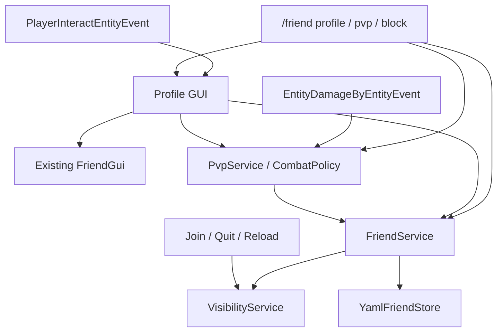
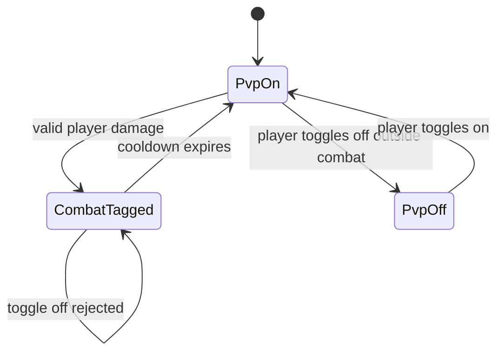

# feat: Upgrade LeafFriends profile controls

## Summary

升级 `LeafFriends`，把现有好友系统扩成玩家个人信息与隐私控制入口：右键玩家打开资料菜单，玩家可以关闭自己的 PVP，被屏蔽玩家会从屏蔽者视野中隐藏，并继续沿用现有黑名单对好友申请、好友私聊和好友传送的拦截。

本计划不重写 `LeafFriends`。它以当前 `friends.yml`、`FriendService`、`FriendGui`、`FriendListener` 和 Gradle 测试脚本为基线，补齐右键交互、PVP 策略、可见性同步、资料展示和交付说明。

---

## Problem Frame

当前 `LeafFriends` 已经有好友请求、好友列表、私聊提示、传送请求、黑名单、隐私开关、可信好友直传和库存 GUI。缺口是玩家仍缺少一个“对着某个人操作”的入口，也不能通过好友系统管理自己的 PVP 接受状态或把被屏蔽的人从视野里移除。

这台服的社交功能定位仍然是轻量便利，不走战力、经济、亲密度或排行榜。个人信息菜单应该降低指令记忆成本，避免成为新的复杂社交成长系统。

---

## Requirements

**Profile menu**

- R1. 默认玩家右键另一名玩家时，可以打开该玩家的个人信息菜单。
- R2. 个人信息菜单显示目标玩家名、在线状态、好友关系、屏蔽状态、PVP 状态和基础统计信息。
- R3. 个人信息菜单提供与当前关系匹配的操作：加好友、申请传送、好友私聊提示、屏蔽、取消屏蔽、查看好友详情。
- R4. 右键菜单必须只响应主手交互，避免副手事件打开两次。

**PVP controls**

- R5. 玩家可以通过 GUI 或命令开启/关闭自己的 PVP 接受状态，默认保持开启，避免升级后改变全服现有体验。
- R6. 玩家对玩家伤害发生时，只要攻击方或受击方任一方关闭 PVP，就取消这次伤害。
- R7. 玩家进入有效 PVP 战斗后，在配置的冷却时间内不能关闭 PVP，防止战斗中秒关逃避。
- R8. PVP 拦截覆盖直接近战和可归因到玩家的远程/投掷伤害；环境伤害、怪物伤害和复杂连锁归因不在第一版强行接管。

**Blocking and visibility**

- R9. 现有黑名单继续作为“屏蔽玩家”的唯一持久状态，不新增第二套屏蔽关系。
- R10. 玩家屏蔽另一名玩家后，系统立即让屏蔽者看不见被屏蔽者。
- R11. 玩家取消屏蔽后，系统只解除 `LeafFriends` 自己设置的隐藏状态，不干扰其他插件可能设置的隐藏。
- R12. 玩家上线、重载、屏蔽和取消屏蔽后，可见性状态必须重新同步。

**Operations and compatibility**

- R13. 新能力继续通过 `leaffriends.use` 默认开放，必要时新增细粒度权限但默认不增加运维负担。
- R14. `friends.yml` 必须兼容旧数据，缺失的新字段使用安全默认值。
- R15. 构建和测试继续走当前 Gradle 模块与 `scripts/test-leaf-friends.sh` / `scripts/build-leaf-friends.sh`。
- R16. 交付包继续产出 `copy/` 目录、README、校验文件和 LuckPerms 后台命令说明。

---

## Scope Boundaries

### In Scope

- 在 `LeafFriends` 内扩展右键玩家菜单、资料 GUI、PVP 开关、战斗冷却、黑名单隐藏同步。
- 继续使用 Bukkit/Paper API：`PlayerInteractEntityEvent`、`EntityDamageByEntityEvent`、`Player#hidePlayer(plugin, player)`、`Player#showPlayer(plugin, player)`。
- 资料统计只展示 Paper/Bukkit 能稳定读取的基础数据，例如首次进入、上次在线、游玩时长、死亡数、玩家击杀数。

### Deferred to Follow-Up Work

- 分页资料、备注、好友分组、收藏玩家。
- 更细的资料隐私设置，例如只允许好友查看统计。
- Residence 自动信任、跨服好友、离线留言。
- ProtocolLib 级别的完全互相隐身、聊天全局屏蔽、TAB 全面隐藏策略。

### Outside This Product's Identity

- PVP 战力加成、保护 Buff、经济奖励、亲密度等级、社交排行榜。
- 管理强制替玩家开关 PVP 或绕过玩家屏蔽关系。
- 用好友系统替代 CMI 的全局 `/msg`、`/mail`、`/tpa`。

---

## Key Technical Decisions

- **KTD1. 升级现有 `LeafFriends`，不新建 `LeafProfile` 插件:** 当前关系、黑名单、隐私设置、GUI 和持久化都已经在 `LeafFriends` 内，继续扩展可以避免两套玩家状态互相同步。
- **KTD2. 黑名单即屏蔽:** 现有 `blacklist` 已经拦截好友申请、好友私聊和好友传送。把可见性隐藏挂在同一关系上，玩家理解成本最低，也避免“拉黑了但还能看见”的割裂。
- **KTD3. PVP 状态进 `FriendSettings`:** PVP 开关是个人隐私/安全偏好，和 `receiveMessages`、`showOnlineStatus` 同类。新增 `pvpEnabled` 默认 `true`，旧数据加载时不改变现有 PVP 行为。
- **KTD4. 战斗冷却单独用内存服务:** 战斗冷却只影响“现在能否关闭 PVP”，不需要跨重启保留。用内存 `CombatPolicy` / `PvpService` 记录 `playerId -> combatUntilMillis` 即可。
- **KTD5. 可见性同步只使用插件作用域 hide/show:** 使用 `hidePlayer(plugin, target)` 和 `showPlayer(plugin, target)`，这样解除屏蔽时只撤销 `LeafFriends` 自己造成的隐藏，不会破坏管理员隐身或其他插件的隐藏状态。
- **KTD6. 右键菜单是玩家入口，命令是兜底:** 右键打开资料菜单满足自然交互；命令如 `/friend profile <玩家>` 和 `/friend pvp [on|off]` 保证目标不在面前时仍可操作。
- **KTD7. 第一版不做真实安全隐身:** Bukkit `hidePlayer` 是客户端可见性控制，不是完整的安全隔离。社交层仍要通过 `FriendService` 拦截 LeafFriends 自己的消息、传送和申请。

---

## High-Level Technical Design

PVP 判定流程保持单向：事件层解析攻击者和受击者是否都是玩家；服务层判断任一方是否关闭 PVP；事件层取消伤害并给攻击者提示。只有双方都开启且伤害未被其他插件取消时，才进入战斗冷却。

---

## Implementation Units

### U1. Extend profile settings and YAML persistence

- **Goal:** 给玩家资料增加 PVP 开关，并保持旧 `friends.yml` 数据兼容。
- **Requirements:** R5, R13, R14, R15
- **Dependencies:** None
- **Files:** `src/LeafFriends/src/main/java/net/leafmc/friends/FriendSettings.java`, `src/LeafFriends/src/main/java/net/leafmc/friends/FriendService.java`, `src/LeafFriends/src/main/java/net/leafmc/friends/YamlFriendStore.java`, `src/LeafFriends/src/test/java/net/leafmc/friends/YamlFriendStoreTest.java`, `src/LeafFriends/src/test/java/net/leafmc/friends/FriendServiceTest.java`, `src/LeafFriends/src/main/resources/config.yml`
- **Approach:** 在 `FriendSettings` 增加 `pvpEnabled`，默认 `true`。在 `SettingKey` 或独立 PVP 方法中暴露开关，YAML 读写路径使用 `profiles.<uuid>.settings.pvpEnabled`。旧文件缺字段时加载为开启。
- **Patterns to follow:** 现有 `showOnlineStatus`、`receiveTeleports` 的读写和默认值处理。
- **Test scenarios:**
  - 旧 YAML 缺少 `settings.pvpEnabled` 时加载为 `true`。
  - 新资料关闭 PVP 后保存再加载仍为关闭。
  - `FriendService` 能更新 PVP 设置并返回一致的中文结果信息。
- **Verification:** `scripts/test-leaf-friends.sh` 通过，旧 `friends.yml` 样例不需要迁移脚本。

### U2. Add PVP combat policy and damage listener

- **Goal:** 在玩家伤害玩家时执行 PVP 开关和战斗冷却规则。
- **Requirements:** R5, R6, R7, R8, R15
- **Dependencies:** U1
- **Files:** `src/LeafFriends/src/main/java/net/leafmc/friends/PvpService.java`, `src/LeafFriends/src/main/java/net/leafmc/friends/FriendListener.java`, `src/LeafFriends/src/main/java/net/leafmc/friends/LeafFriendsPlugin.java`, `src/LeafFriends/src/test/java/net/leafmc/friends/PvpServiceTest.java`, `src/LeafFriends/build.gradle.kts`, `src/LeafFriends/src/main/resources/config.yml`
- **Approach:** 新增纯 Java `PvpService` 处理开关、冷却和玩家 ID 归因。Bukkit 监听器只负责从 `EntityDamageByEntityEvent` 中解析受击玩家和攻击玩家，包含直接玩家攻击和 `Projectile` / 可追溯 shooter 的玩家攻击。事件若已取消则不重复处理。
- **Execution note:** 先写 `PvpServiceTest` 覆盖状态机，再接事件监听。
- **Patterns to follow:** `TeleportRequestService` 的纯服务测试方式；`FriendListener` 的事件入口。
- **Test scenarios:**
  - 双方 PVP 开启时，服务允许伤害并给双方打战斗冷却。
  - 攻击者关闭 PVP 时，服务拒绝伤害。
  - 受击者关闭 PVP 时，服务拒绝伤害。
  - 玩家在冷却内尝试关闭 PVP 时失败。
  - 冷却过期后玩家可以关闭 PVP。
  - 非玩家伤害或无法归因到玩家的伤害不进入 PVP 策略。
- **Verification:** 单元测试覆盖核心策略；编译通过证明事件 API 和 projectile 归因代码可用。

### U3. Add visibility sync for blocked players

- **Goal:** 让现有黑名单具备“屏蔽后看不见对方”的玩家体验。
- **Requirements:** R9, R10, R11, R12, R15
- **Dependencies:** U1
- **Files:** `src/LeafFriends/src/main/java/net/leafmc/friends/VisibilityService.java`, `src/LeafFriends/src/main/java/net/leafmc/friends/FriendService.java`, `src/LeafFriends/src/main/java/net/leafmc/friends/FriendCommand.java`, `src/LeafFriends/src/main/java/net/leafmc/friends/FriendGui.java`, `src/LeafFriends/src/main/java/net/leafmc/friends/FriendListener.java`, `src/LeafFriends/src/main/java/net/leafmc/friends/LeafFriendsPlugin.java`, `src/LeafFriends/src/test/java/net/leafmc/friends/FriendServiceTest.java`
- **Approach:** `FriendService` 继续只维护黑名单状态。`VisibilityService` 遍历在线玩家，根据 `viewer.blacklist().contains(target)` 调用 `viewer.hidePlayer(plugin, target)`，取消屏蔽时调用 `viewer.showPlayer(plugin, target)`。上线、重载、block、unblock 后同步相关玩家。
- **Patterns to follow:** 现有 `block` / `unblock` 命令和 GUI 操作后保存数据的路径。
- **Test scenarios:**
  - 屏蔽仍会删除好友关系和可信传送授权。
  - 取消屏蔽只移除当前玩家黑名单，不恢复好友关系。
  - `VisibilityService` 的纯决策方法能列出某 viewer 应隐藏的 target IDs。
  - Bukkit `hidePlayer/showPlayer` 具体效果通过运行 smoke test 验证。
- **Verification:** 编译通过；运行 smoke checklist 覆盖 A 屏蔽 B 后 A 客户端看不见 B、取消屏蔽后重新可见。

### U4. Add right-click player profile menu

- **Goal:** 玩家对着他人右键即可进入个人信息和关系操作。
- **Requirements:** R1, R2, R3, R4, R13, R15
- **Dependencies:** U1, U2, U3
- **Files:** `src/LeafFriends/src/main/java/net/leafmc/friends/ProfileGui.java`, `src/LeafFriends/src/main/java/net/leafmc/friends/FriendGui.java`, `src/LeafFriends/src/main/java/net/leafmc/friends/FriendListener.java`, `src/LeafFriends/src/main/java/net/leafmc/friends/LeafFriendsPlugin.java`, `src/LeafFriends/src/main/resources/config.yml`
- **Approach:** 新增 `ProfileGui` 或在 `FriendGui` 中增加 `openProfile(viewer, target)`；建议单独类，避免现有好友列表菜单继续膨胀。监听 `PlayerInteractEntityEvent`，当 `getRightClicked()` 是 `Player` 且 `getHand()` 是主手时打开菜单。资料展示从 `FriendService`、`PvpService`、`Bukkit.getOfflinePlayer(UUID)` 和 `Statistic` 读取。
- **Patterns to follow:** `FriendGui.MenuHolder`、`GuiAction`、稳定 slot 和 `InventoryClickEvent` action map。
- **Test scenarios:**
  - 非好友资料菜单显示“添加好友”和“屏蔽玩家”。
  - 好友资料菜单显示“申请传送”“好友私聊”“查看好友详情”“屏蔽玩家”。
  - 已屏蔽玩家资料菜单显示“取消屏蔽”，并隐藏好友/传送类动作。
  - 查看自己资料时显示 PVP 开关，不显示添加好友或屏蔽自己。
  - 副手事件不会重复打开菜单。
- **Verification:** 构建通过；运行 smoke checklist 使用两个在线账号验证右键打开、按钮状态和返回路径。

### U5. Add profile and PVP command fallbacks

- **Goal:** 让玩家不依赖右键也能打开资料和管理 PVP。
- **Requirements:** R3, R5, R7, R13, R15
- **Dependencies:** U1, U2, U4
- **Files:** `src/LeafFriends/src/main/java/net/leafmc/friends/FriendCommand.java`, `src/LeafFriends/src/main/resources/plugin.yml`, `src/LeafFriends/src/test/java/net/leafmc/friends/FriendCommandFormatTest.java`
- **Approach:** 在 `/friend` 下新增 `profile <玩家>`、`pvp [on|off|status]`，并更新 tab completion 与 help 文案。`profile` 复用右键菜单逻辑，`pvp off` 走 `PvpService` 冷却校验，`pvp on` 可随时开启。
- **Patterns to follow:** 现有 `toggle`、`block`、`gui` 的命令解析和中文反馈。
- **Test scenarios:**
  - Help 文案包含 `profile` 和 `pvp`。
  - `pvp on/off/status` 解析成功，未知值返回用法提示。
  - 非玩家 sender 执行资料和 PVP 命令时得到玩家限定提示。
  - Tab completion 在第二参数补全已知玩家名，在 PVP 参数补全 `on`、`off`、`status`。
- **Verification:** 命令格式测试和 Gradle check 通过。

### U6. Ship docs, smoke checklist, and copy-ready package

- **Goal:** 给服务器运维交付可复制包和最短验证路径。
- **Requirements:** R13, R15, R16
- **Dependencies:** U1, U2, U3, U4, U5
- **Files:** `README.md`, `VERSION_MANIFEST.md`, `copy/plugin-packages/leaf-friends-profile-controls-<timestamp>/README.md`, `copy/plugin-packages/leaf-friends-profile-controls-<timestamp>/LUCKPERMS-COMMANDS.txt`, `copy/plugin-packages/leaf-friends-profile-controls-<timestamp>/PACKAGE_CHECKSUMS.txt`, `copy/plugin-packages/leaf-friends-profile-controls-<timestamp>/plugins/LeafFriends-0.1.0.jar`, `copy/plugin-packages/leaf-friends-profile-controls-<timestamp>/plugins/LeafFriends/config.yml`
- **Approach:** 交付包保持服务器根目录同构。默认权限如果已经由 `plugin.yml` 给 default，不强制要求 LuckPerms 命令；仍提供 `lp group default permission set leaffriends.use true` 和 admin reload 命令作为后台兜底。
- **Patterns to follow:** `copy/plugin-packages/leaf-friends-click-gui-*`、`copy/plugin-packages/leaf-chain-harvest-*`、`copy/plugin-packages/leaf-soulbind-*` 的 README、校验和、LuckPerms 命令交付方式。
- **Test scenarios:**
  - copy 包包含 jar、默认配置、README、LuckPerms 命令和校验文件。
  - README 写清停服、复制、启动、控制台确认、双账号 smoke test。
  - smoke checklist 覆盖右键资料、PVP 关闭拦截、战斗冷却、屏蔽隐藏、取消屏蔽恢复。
- **Verification:** 构建脚本产出 jar；校验文件能被 `shasum -a 256 -c` 验证。

---

## Acceptance Examples

- AE1. Given Alice 和 Bob 都在线且不是好友，When Alice 右键 Bob，Then Alice 打开 Bob 的资料菜单，并看到“添加好友”和“屏蔽玩家”操作。
- AE2. Given Alice 已关闭 PVP，When Bob 用近战或弓箭攻击 Alice，Then 伤害被取消，Bob 收到 PVP 已关闭的提示。
- AE3. Given Alice 和 Bob 都开启 PVP，When Bob 成功伤害 Alice，Then 双方进入战斗冷却；在冷却结束前任一方执行 `/friend pvp off` 会失败。
- AE4. Given Alice 屏蔽 Bob，When 两人仍在线，Then Alice 客户端不再显示 Bob，Bob 对 Alice 的好友申请、好友私聊和好友传送请求继续被拒绝。
- AE5. Given Alice 取消屏蔽 Bob，When 两人仍在线，Then `LeafFriends` 解除 Alice 对 Bob 的隐藏，双方不会自动恢复好友关系。
- AE6. Given 旧版 `friends.yml` 没有 PVP 字段，When 新版插件加载，Then 所有玩家默认 PVP 开启，旧好友、黑名单、可信传送和隐私设置保持不变。

---

## System-Wide Impact

- 新增事件监听会影响玩家右键玩家、玩家间伤害、玩家上线/重载后的可见性同步。
- `friends.yml` 增加一个向后兼容字段，不需要迁移脚本，但上线前要备份。
- PVP 行为从全服统一配置变成“玩家双方任一关闭即拒绝伤害”的附加规则。
- 黑名单从纯社交拦截升级为社交拦截加客户端可见性隐藏。

---

## Risks & Dependencies

| Risk | Impact | Mitigation |
| --- | --- | --- |
| `hidePlayer` 被误解成完整安全隐身 | 玩家仍可能通过聊天、第三方插件或管理工具感知对方 | README 明确第一版是客户端可见性和 LeafFriends 社交屏蔽，不是全服安全隔离 |
| PVP 归因不完整 | TNT、火焰、药水云等复杂来源可能绕过第一版策略 | 第一版只承诺直接玩家和可归因投掷/远程伤害，复杂环境归因列为后续 |
| 右键菜单干扰玩家常规交互 | 玩家可能误触菜单 | 配置保留 `right-click-profile.enabled` 和可选 `require-sneak`，必要时可切到潜行右键 |
| 旧数据加载字段缺失 | 升级后 PVP 状态异常 | `pvpEnabled` 默认 `true`，YAML 测试覆盖缺字段加载 |
| 战斗中关 PVP 规避 | 打架时玩家秒关保护自己 | `combat-cooldown-seconds` 拦截冷却内关闭 |

---

## Documentation / Operational Notes

- `config.yml` 建议新增：
  - `profile-right-click.enabled: true`
  - `profile-right-click.require-sneak: false`
  - `pvp.default-enabled: true`
  - `pvp.combat-cooldown-seconds: 30`
  - `pvp.block-projectiles: true`
  - `visibility.hide-blocked-players: true`
- README 要写给玩家的短说明：右键玩家看资料，`/friend pvp off` 关闭 PVP，`/friend pvp on` 开启 PVP，屏蔽后你将看不见对方。
- 运维 smoke test 需要两个普通测试号，至少验证右键菜单、PVP 拦截、冷却拒绝、屏蔽隐藏和取消屏蔽恢复。

---

## Sources & Research

- `docs/plans/2026-06-11-003-feat-leaf-friends-system-plan.md` — `LeafFriends` v1 的稳定边界、轻社交定位、YAML 持久化和 GUI 决策。
- `src/LeafFriends/src/main/java/net/leafmc/friends/FriendService.java` — 当前好友关系、黑名单、隐私开关和可信传送状态。
- `src/LeafFriends/src/main/java/net/leafmc/friends/FriendGui.java` — 当前库存 GUI holder/action-map 模式。
- `src/LeafFriends/src/main/java/net/leafmc/friends/FriendListener.java` — 当前 join/quit 事件入口，后续扩展右键、伤害和可见性同步。
- `src/LeafFriends/src/main/java/net/leafmc/friends/YamlFriendStore.java` — 当前 `friends.yml` 读写结构。
- `src/LeafFriends/src/test/java/net/leafmc/friends/*` — 当前主函数式服务测试、YAML round-trip 测试和命令格式测试。
- `docs/development/minecraft-kotlin-dev.md` — 当前 Leaf 1.21.11、Paper API 1.21.11、Java 21、Gradle 9.5.1 构建基线。
- Local Paper API jar `paper-api-1.21.11-R0.1-SNAPSHOT.jar` — 已核对 `PlayerInteractEntityEvent`、`EntityDamageByEntityEvent`、`Player#hidePlayer(plugin, player)` 和 `Player#showPlayer(plugin, player)` 方法存在。
